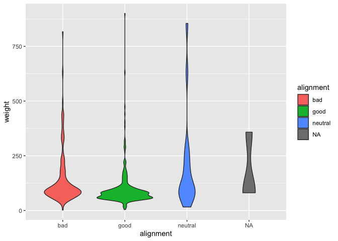

### Load the Libraries

```r
library(tidyverse)
```

```
## ── Attaching packages ─────────────────────────────────────── tidyverse 1.3.1 ──
```

```
## ✓ ggplot2 3.3.5     ✓ purrr   0.3.4
## ✓ tibble  3.1.6     ✓ dplyr   1.0.8
## ✓ tidyr   1.2.0     ✓ stringr 1.4.0
## ✓ readr   2.1.2     ✓ forcats 0.5.1
```

```
## ── Conflicts ────────────────────────────────────────── tidyverse_conflicts() ──
## x dplyr::filter() masks stats::filter()
## x dplyr::lag()    masks stats::lag()
```

```r
library(janitor)
```

```
## 
## Attaching package: 'janitor'
```

```
## The following objects are masked from 'package:stats':
## 
##     chisq.test, fisher.test
```

```r
library("palmerpenguins")

#install.packages("ggVennDiagram")
library(ggVennDiagram)
library(RColorBrewer)

#install.packages("ggworldcloud")
library(ggwordcloud)


options(scipen=999) #cancels the use of scientific notation for the session
```


### Data

```r
superhero_info <- readr::read_csv("data/heroes_information.csv", na = c("", "-99", "-"))
```

```
## Rows: 734 Columns: 10
## ── Column specification ────────────────────────────────────────────────────────
## Delimiter: ","
## chr (8): name, Gender, Eye color, Race, Hair color, Publisher, Skin color, A...
## dbl (2): Height, Weight
## 
## ℹ Use `spec()` to retrieve the full column specification for this data.
## ℹ Specify the column types or set `show_col_types = FALSE` to quiet this message.
```

```r
superhero_powers <- readr::read_csv("data/super_hero_powers.csv", na = c("", "-99", "-"))
```

```
## Rows: 667 Columns: 168
## ── Column specification ────────────────────────────────────────────────────────
## Delimiter: ","
## chr   (1): hero_names
## lgl (167): Agility, Accelerated Healing, Lantern Power Ring, Dimensional Awa...
## 
## ℹ Use `spec()` to retrieve the full column specification for this data.
## ℹ Specify the column types or set `show_col_types = FALSE` to quiet this message.
```

```r
beachbugs_long <- readr::read_csv("data/beachbugs_long.csv")
```

```
## Rows: 66 Columns: 3
## ── Column specification ────────────────────────────────────────────────────────
## Delimiter: ","
## chr (1): site
## dbl (2): year, buglevels
## 
## ℹ Use `spec()` to retrieve the full column specification for this data.
## ℹ Specify the column types or set `show_col_types = FALSE` to quiet this message.
```

### 1. 
Clean up the column names (no capitals, not spaces) of `superhero_info`, then use 2 functions to remind yourself of structure of the `superhero_info` data set.


```r
superhero_info <- superhero_info%>%
  clean_names()
superhero_info
```

```
## # A tibble: 734 × 10
##    name  gender eye_color race  hair_color height publisher skin_color alignment
##    <chr> <chr>  <chr>     <chr> <chr>       <dbl> <chr>     <chr>      <chr>    
##  1 A-Bo… Male   yellow    Human No Hair       203 Marvel C… <NA>       good     
##  2 Abe … Male   blue      Icth… No Hair       191 Dark Hor… blue       good     
##  3 Abin… Male   blue      Unga… No Hair       185 DC Comics red        good     
##  4 Abom… Male   green     Huma… No Hair       203 Marvel C… <NA>       bad      
##  5 Abra… Male   blue      Cosm… Black          NA Marvel C… <NA>       bad      
##  6 Abso… Male   blue      Human No Hair       193 Marvel C… <NA>       bad      
##  7 Adam… Male   blue      <NA>  Blond          NA NBC - He… <NA>       good     
##  8 Adam… Male   blue      Human Blond         185 DC Comics <NA>       good     
##  9 Agen… Female blue      <NA>  Blond         173 Marvel C… <NA>       good     
## 10 Agen… Male   brown     Human Brown         178 Marvel C… <NA>       good     
## # … with 724 more rows, and 1 more variable: weight <dbl>
```

```r
glimpse(superhero_info)
```

```
## Rows: 734
## Columns: 10
## $ name       <chr> "A-Bomb", "Abe Sapien", "Abin Sur", "Abomination", "Abraxas…
## $ gender     <chr> "Male", "Male", "Male", "Male", "Male", "Male", "Male", "Ma…
## $ eye_color  <chr> "yellow", "blue", "blue", "green", "blue", "blue", "blue", …
## $ race       <chr> "Human", "Icthyo Sapien", "Ungaran", "Human / Radiation", "…
## $ hair_color <chr> "No Hair", "No Hair", "No Hair", "No Hair", "Black", "No Ha…
## $ height     <dbl> 203, 191, 185, 203, NA, 193, NA, 185, 173, 178, 191, 188, 1…
## $ publisher  <chr> "Marvel Comics", "Dark Horse Comics", "DC Comics", "Marvel …
## $ skin_color <chr> NA, "blue", "red", NA, NA, NA, NA, NA, NA, NA, NA, NA, NA, …
## $ alignment  <chr> "good", "good", "good", "bad", "bad", "bad", "good", "good"…
## $ weight     <dbl> 441, 65, 90, 441, NA, 122, NA, 88, 61, 81, 104, 108, 90, 90…
```

```r
str(superhero_info)
```

```
## spec_tbl_df [734 × 10] (S3: spec_tbl_df/tbl_df/tbl/data.frame)
##  $ name      : chr [1:734] "A-Bomb" "Abe Sapien" "Abin Sur" "Abomination" ...
##  $ gender    : chr [1:734] "Male" "Male" "Male" "Male" ...
##  $ eye_color : chr [1:734] "yellow" "blue" "blue" "green" ...
##  $ race      : chr [1:734] "Human" "Icthyo Sapien" "Ungaran" "Human / Radiation" ...
##  $ hair_color: chr [1:734] "No Hair" "No Hair" "No Hair" "No Hair" ...
##  $ height    : num [1:734] 203 191 185 203 NA 193 NA 185 173 178 ...
##  $ publisher : chr [1:734] "Marvel Comics" "Dark Horse Comics" "DC Comics" "Marvel Comics" ...
##  $ skin_color: chr [1:734] NA "blue" "red" NA ...
##  $ alignment : chr [1:734] "good" "good" "good" "bad" ...
##  $ weight    : num [1:734] 441 65 90 441 NA 122 NA 88 61 81 ...
##  - attr(*, "spec")=
##   .. cols(
##   ..   name = col_character(),
##   ..   Gender = col_character(),
##   ..   `Eye color` = col_character(),
##   ..   Race = col_character(),
##   ..   `Hair color` = col_character(),
##   ..   Height = col_double(),
##   ..   Publisher = col_character(),
##   ..   `Skin color` = col_character(),
##   ..   Alignment = col_character(),
##   ..   Weight = col_double()
##   .. )
##  - attr(*, "problems")=<externalptr>
```

### 2.
Are bad guys bigger? Make box-plots of weight by `alignment` (alignment on the x-axis).

```r
superhero_info%>%
  ggplot(aes(x=alignment, y=weight, fill=alignment)) + geom_boxplot()
```

```
## Warning: Removed 239 rows containing non-finite values (stat_boxplot).
```

<!-- -->

### 3. 
Now, make a violin plot of weight by `alignment` (alignment on the x-axis). Add some color!
  What information can you observe in the violin plot that was not visible in the boxplot?

```r
superhero_info%>%
  ggplot(aes(x=alignment, y=weight, fill=alignment)) + geom_violin()
```

```
## Warning: Removed 239 rows containing non-finite values (stat_ydensity).
```

<!-- -->


### 4. 
Use `alpha = .5` in `geom_boxplot()` and `geom_violin()` to layer both plots on top of one another. What does this tell you about the distribution of weight in "`bad`" guys?

```r
superhero_info%>%
  ggplot(aes(x=alignment, y=weight, fill=alignment)) + geom_boxplot(alpha = .3) + geom_violin(alpha=.7)
```

```
## Warning: Removed 239 rows containing non-finite values (stat_boxplot).
```

```
## Warning: Removed 239 rows containing non-finite values (stat_ydensity).
```

<!-- -->

### 5. 
Box plots are great for showing how the distribution of a numeric variable (e.g. weight) varies among a categorical variable (e.g. alignment).
  Make your own violin plot with the superhero data. 
  What is your numeric data? Height
  What is your categorical variable? Gender


```r
superhero_info%>%
  ggplot(aes(x=gender, y=height, fill= gender)) + geom_violin()
```

```
## Warning: Removed 217 rows containing non-finite values (stat_ydensity).
```

<!-- -->

### 6. 
Remind yourself what `beachbugs` looks like. Then generate a heatmap of buglevels by site and year. 
color it with `scale_fill_gradient(low="yellow", high="red")` or colors of your choice. you may find it looks best with one color!
(dont forget, `coord_flip()` is a quick way to improve the look of your plot if you dont like the default orientation)


```r
beachbugs_long
```

```
## # A tibble: 66 × 3
##     year site                    buglevels
##    <dbl> <chr>                       <dbl>
##  1  2013 Bondi Beach                 32.2 
##  2  2013 Bronte Beach                26.8 
##  3  2013 Clovelly Beach               9.28
##  4  2013 Coogee Beach                39.7 
##  5  2013 Gordons Bay (East)          24.8 
##  6  2013 Little Bay Beach           122.  
##  7  2013 Malabar Beach              101.  
##  8  2013 Maroubra Beach              47.1 
##  9  2013 South Maroubra Beach        39.3 
## 10  2013 South Maroubra Rockpool     96.4 
## # … with 56 more rows
```


```r
beachbugs_long%>%
  ggplot(aes(year, site, fill=buglevels)) + geom_tile() + scale_fill_gradient(low="blue", high="pink")
```

<!-- -->

### 7.  
Use the provided code to normalize the beachbug data set. 
Then make a heatmap with the `beachbugs_normalized` data, and use the same color choices as above. Which heatmap do you think is more informative? why?


```r
#makes a new column of the highest buglevel observed at each site
beachbugs_w_max <- beachbugs_long %>% 
  group_by(site) %>% 
  mutate(max_buglevel = max(buglevels, na.rm=T)) %>% 
  arrange(site)
beachbugs_w_max
```

```
## # A tibble: 66 × 4
## # Groups:   site [11]
##     year site         buglevels max_buglevel
##    <dbl> <chr>            <dbl>        <dbl>
##  1  2013 Bondi Beach       32.2         32.2
##  2  2014 Bondi Beach       11.1         32.2
##  3  2015 Bondi Beach       14.3         32.2
##  4  2016 Bondi Beach       19.4         32.2
##  5  2017 Bondi Beach       13.2         32.2
##  6  2018 Bondi Beach       22.9         32.2
##  7  2013 Bronte Beach      26.8         61.3
##  8  2014 Bronte Beach      17.5         61.3
##  9  2015 Bronte Beach      23.6         61.3
## 10  2016 Bronte Beach      61.3         61.3
## # … with 56 more rows
```

```r
#makes a new table where the buglevels are normalized to the max_buglevel
beachbugs_normalized <- beachbugs_w_max %>% 
  group_by(site) %>% 
  mutate(norm_buglevel = buglevels/max_buglevel) %>% 
  arrange(site,year) %>%
  select(site, year, norm_buglevel)   # you dont have to select(), but I think its a clearer looking table
beachbugs_normalized
```

```
## # A tibble: 66 × 3
## # Groups:   site [11]
##    site          year norm_buglevel
##    <chr>        <dbl>         <dbl>
##  1 Bondi Beach   2013         1    
##  2 Bondi Beach   2014         0.344
##  3 Bondi Beach   2015         0.445
##  4 Bondi Beach   2016         0.601
##  5 Bondi Beach   2017         0.409
##  6 Bondi Beach   2018         0.710
##  7 Bronte Beach  2013         0.436
##  8 Bronte Beach  2014         0.285
##  9 Bronte Beach  2015         0.385
## 10 Bronte Beach  2016         1    
## # … with 56 more rows
```
 

```r
beachbugs_normalized%>%
  ggplot(aes(year, site, fill=norm_buglevel)) + geom_tile() + scale_fill_gradient(low="blue", high="pink")
```

<!-- -->

### 8.
Let's make a venn diagram of `superhero_info`, from 4 questions:
Is their alignment evil? 
Are their eyes red?
Are they male?
Are they bald?

Start by making the 4 vectors, then the list of vectors. The vector for alignment is provided:
### super heros venn

```r
# evil

evil_vec <- superhero_info %>%
  filter(alignment == "bad")%>%
  pull(name)


# red eyes
red_eyes_vec <- superhero_info%>%
  filter(eye_color=="red")%>%
  pull(name)


# male
male_vec <- superhero_info%>%
  filter(gender=="Male")%>%
  pull(name)


# bald
bald_vec <- superhero_info%>%
  filter(hair_color=="No Hair")%>%
  pull(name)
```

Your list of vectors will look something like this:

```r
superhero_list <- list(evil_vec, red_eyes_vec, male_vec, bald_vec)
superhero_list
```

```
## [[1]]
##   [1] "Abomination"       "Abraxas"           "Absorbing Man"    
##   [4] "Air-Walker"        "Ajax"              "Alex Mercer"      
##   [7] "Alien"             "Amazo"             "Ammo"             
##  [10] "Angela"            "Annihilus"         "Anti-Monitor"     
##  [13] "Anti-Spawn"        "Apocalypse"        "Arclight"         
##  [16] "Atlas"             "Azazel"            "Bane"             
##  [19] "Beetle"            "Big Barda"         "Big Man"          
##  [22] "Billy Kincaid"     "Bird-Man"          "Bird-Man II"      
##  [25] "Black Abbott"      "Black Adam"        "Black Mamba"      
##  [28] "Black Manta"       "Blackout"          "Blackwing"        
##  [31] "Blizzard"          "Blizzard"          "Blizzard II"      
##  [34] "Blob"              "Bloodaxe"          "Bloodwraith"      
##  [37] "Boba Fett"         "Bomb Queen"        "Brainiac"         
##  [40] "Bullseye"          "Callisto"          "Carnage"          
##  [43] "Chameleon"         "Changeling"        "Cheetah"          
##  [46] "Cheetah II"        "Cheetah III"       "Chromos"          
##  [49] "Clock King"        "Cogliostro"        "Cottonmouth"      
##  [52] "Curse"             "Cy-Gor"            "Cyborg Superman"  
##  [55] "Darkseid"          "Darkside"          "Darth Maul"       
##  [58] "Darth Vader"       "Deadshot"          "Demogoblin"       
##  [61] "Destroyer"         "Diamondback"       "Doctor Doom"      
##  [64] "Doctor Doom II"    "Doctor Octopus"    "Doomsday"         
##  [67] "Doppelganger"      "Dormammu"          "Ego"              
##  [70] "Electro"           "Elle Bishop"       "Evil Deadpool"    
##  [73] "Evilhawk"          "Exodus"            "Fabian Cortez"    
##  [76] "Fallen One II"     "Faora"             "Fixer"            
##  [79] "Frenzy"            "General Zod"       "Giganta"          
##  [82] "Goblin Queen"      "Godzilla"          "Gog"              
##  [85] "Gorilla Grodd"     "Granny Goodness"   "Greedo"           
##  [88] "Green Goblin"      "Green Goblin II"   "Harley Quinn"     
##  [91] "Heat Wave"         "Hela"              "Hobgoblin"        
##  [94] "Hydro-Man"         "Iron Monger"       "Jigsaw"           
##  [97] "Joker"             "Junkpile"          "Kang"             
## [100] "Killer Croc"       "Killer Frost"      "King Shark"       
## [103] "Kingpin"           "Klaw"              "Kraven II"        
## [106] "Kraven the Hunter" "Kylo Ren"          "Lady Bullseye"    
## [109] "Lady Deathstrike"  "Leader"            "Lex Luthor"       
## [112] "Lightning Lord"    "Living Brain"      "Lizard"           
## [115] "Loki"              "Luke Campbell"     "Mach-IV"          
## [118] "Magneto"           "Magus"             "Mandarin"         
## [121] "Match"             "Maxima"            "Mephisto"         
## [124] "Metallo"           "Mister Freeze"     "Mister Knife"     
## [127] "Mister Mxyzptlk"   "Mister Sinister"   "Mister Zsasz"     
## [130] "MODOK"             "Moloch"            "Molten Man"       
## [133] "Moonstone"         "Morlun"            "Moses Magnum"     
## [136] "Mysterio"          "Mystique"          "Nebula"           
## [139] "Omega Red"         "Onslaught"         "Overtkill"        
## [142] "Ozymandias"        "Parademon"         "Penguin"          
## [145] "Plantman"          "Plastique"         "Poison Ivy"       
## [148] "Predator"          "Professor Zoom"    "Proto-Goblin"     
## [151] "Purple Man"        "Pyro"              "Ra's Al Ghul"     
## [154] "Razor-Fist II"     "Red Mist"          "Red Skull"        
## [157] "Redeemer II"       "Redeemer III"      "Rhino"            
## [160] "Rick Flag"         "Riddler"           "Sabretooth"       
## [163] "Sauron"            "Scarecrow"         "Scarlet Witch"    
## [166] "Scorpia"           "Scorpion"          "Sebastian Shaw"   
## [169] "Shocker"           "Siren"             "Siren II"         
## [172] "Siryn"             "Snake-Eyes"        "Solomon Grundy"   
## [175] "Spider-Carnage"    "Spider-Woman IV"   "Steppenwolf"      
## [178] "Stormtrooper"      "Superboy-Prime"    "Swamp Thing"      
## [181] "Swarm"             "Sylar"             "T-1000"           
## [184] "T-800"             "T-850"             "T-X"              
## [187] "Taskmaster"        "Thanos"            "Tiger Shark"      
## [190] "Tinkerer"          "Trigon"            "Two-Face"         
## [193] "Ultron"            "Utgard-Loki"       "Vanisher"         
## [196] "Vegeta"            "Venom"             "Venom II"         
## [199] "Venom III"         "Violator"          "Vulture"          
## [202] "Walrus"            "Warp"              "Weapon XI"        
## [205] "White Canary"      "Yellow Claw"       "Zoom"             
## 
## [[2]]
##  [1] "Amazo"              "Apocalypse"         "Black Abbott"      
##  [4] "Blackout"           "Blackwulf"          "Captain Planet"    
##  [7] "Copycat"            "Darkseid"           "Demogoblin"        
## [10] "Doomsday"           "Drax the Destroyer" "Etrigan"           
## [13] "Evilhawk"           "Fin Fang Foom"      "Fixer"             
## [16] "Gambit"             "Ghost Rider"        "Hawk"              
## [19] "Hellstorm"          "Jubilee"            "Killer Croc"       
## [22] "Kilowog"            "Klaw"               "Lizard"            
## [25] "Lobo"               "Machine Man"        "Man-Thing"         
## [28] "Martian Manhunter"  "Miss Martian"       "Mister Sinister"   
## [31] "Omega Red"          "Onslaught"          "Sasquatch"         
## [34] "Shadow King"        "Spider-Man"         "Spider-Woman IV"   
## [37] "Steppenwolf"        "Swamp Thing"        "T-800"             
## [40] "T-850"              "Thanos"             "Ultron"            
## [43] "Vision II"          "Warlock"            "Wonder Man"        
## [46] "Zoom"              
## 
## [[3]]
##   [1] "A-Bomb"             "Abe Sapien"         "Abin Sur"          
##   [4] "Abomination"        "Abraxas"            "Absorbing Man"     
##   [7] "Adam Monroe"        "Adam Strange"       "Agent Bob"         
##  [10] "Agent Zero"         "Air-Walker"         "Ajax"              
##  [13] "Alan Scott"         "Alex Mercer"        "Alex Woolsly"      
##  [16] "Alfred Pennyworth"  "Alien"              "Allan Quatermain"  
##  [19] "Amazo"              "Ammo"               "Ando Masahashi"    
##  [22] "Angel"              "Angel"              "Animal Man"        
##  [25] "Annihilus"          "Ant-Man"            "Ant-Man II"        
##  [28] "Anti-Monitor"       "Anti-Spawn"         "Anti-Venom"        
##  [31] "Apocalypse"         "Aquababy"           "Aqualad"           
##  [34] "Aquaman"            "Archangel"          "Ares"              
##  [37] "Arsenal"            "Astro Boy"          "Atlas"             
##  [40] "Atlas"              "Atom"               "Atom"              
##  [43] "Atom II"            "Atom III"           "Atom IV"           
##  [46] "Azazel"             "Azrael"             "Aztar"             
##  [49] "Bane"               "Banshee"            "Bantam"            
##  [52] "Batman"             "Batman"             "Batman II"         
##  [55] "Battlestar"         "Beak"               "Beast"             
##  [58] "Beast Boy"          "Beetle"             "Ben 10"            
##  [61] "Beta Ray Bill"      "Beyonder"           "Big Daddy"         
##  [64] "Big Man"            "Bill Harken"        "Billy Kincaid"     
##  [67] "Bird-Man"           "Bird-Man II"        "Birdman"           
##  [70] "Bishop"             "Bizarro"            "Black Abbott"      
##  [73] "Black Adam"         "Black Bolt"         "Black Flash"       
##  [76] "Black Goliath"      "Black Knight III"   "Black Lightning"   
##  [79] "Black Manta"        "Black Panther"      "Blackout"          
##  [82] "Blackwing"          "Blackwulf"          "Blade"             
##  [85] "Blizzard"           "Blizzard"           "Blizzard II"       
##  [88] "Blob"               "Bloodhawk"          "Bloodwraith"       
##  [91] "Blue Beetle"        "Blue Beetle"        "Blue Beetle II"    
##  [94] "Blue Beetle III"    "Boba Fett"          "Bolt"              
##  [97] "Booster Gold"       "Box"                "Brainiac"          
## [100] "Brainiac 5"         "Brother Voodoo"     "Brundlefly"        
## [103] "Bullseye"           "Bumbleboy"          "Bushido"           
## [106] "Cable"              "Cameron Hicks"      "Cannonball"        
## [109] "Captain America"    "Captain Atom"       "Captain Britain"   
## [112] "Captain Cold"       "Captain Epic"       "Captain Hindsight" 
## [115] "Captain Mar-vell"   "Captain Marvel"     "Captain Marvel II" 
## [118] "Captain Midnight"   "Captain Planet"     "Carnage"           
## [121] "Century"            "Chamber"            "Chameleon"         
## [124] "Changeling"         "Chromos"            "Chuck Norris"      
## [127] "Citizen Steel"      "Cloak"              "Clock King"        
## [130] "Cogliostro"         "Colin Wagner"       "Colossal Boy"      
## [133] "Colossus"           "Corsair"            "Cottonmouth"       
## [136] "Crimson Crusader"   "Crimson Dynamo"     "Curse"             
## [139] "Cy-Gor"             "Cyborg"             "Cyborg Superman"   
## [142] "Cyclops"            "Danny Cooper"       "Daredevil"         
## [145] "Darkhawk"           "Darkman"            "Darkseid"          
## [148] "Darth Maul"         "Darth Vader"        "Dash"              
## [151] "Data"               "Deadman"            "Deadpool"          
## [154] "Deadshot"           "Deathlok"           "Deathstroke"       
## [157] "Demogoblin"         "Destroyer"          "Diamondback"       
## [160] "DL Hawkins"         "Doc Samson"         "Doctor Doom"       
## [163] "Doctor Doom II"     "Doctor Fate"        "Doctor Octopus"    
## [166] "Doctor Strange"     "Donatello"          "Doomsday"          
## [169] "Doppelganger"       "Dormammu"           "Dr Manhattan"      
## [172] "Drax the Destroyer" "Electro"            "Elongated Man"     
## [175] "ERG-1"              "Ethan Hunt"         "Etrigan"           
## [178] "Evil Deadpool"      "Evilhawk"           "Exodus"            
## [181] "Falcon"             "Fallen One II"      "Fin Fang Foom"     
## [184] "Firestorm"          "Firestorm"          "Flash"             
## [187] "Flash Gordon"       "Flash II"           "Flash III"         
## [190] "Flash IV"           "Franklin Richards"  "Galactus"          
## [193] "Gambit"             "Garbage Man"        "Gary Bell"         
## [196] "General Zod"        "Genesis"            "Ghost Rider"       
## [199] "Giant-Man"          "Giant-Man II"       "Gladiator"         
## [202] "Gog"                "Goku"               "Goliath"           
## [205] "Goliath"            "Goliath"            "Goliath IV"        
## [208] "Gorilla Grodd"      "Gravity"            "Greedo"            
## [211] "Green Arrow"        "Green Goblin"       "Green Goblin II"   
## [214] "Green Goblin III"   "Green Goblin IV"    "Groot"             
## [217] "Guardian"           "Guy Gardner"        "Hal Jordan"        
## [220] "Han Solo"           "Hancock"            "Harry Potter"      
## [223] "Havok"              "Hawk"               "Hawkeye"           
## [226] "Hawkman"            "Heat Wave"          "Hellboy"           
## [229] "Hellstorm"          "Hercules"           "Hiro Nakamura"     
## [232] "Hobgoblin"          "Howard the Duck"    "Hulk"              
## [235] "Human Torch"        "Hybrid"             "Hydro-Man"         
## [238] "Hyperion"           "Iceman"             "Impulse"           
## [241] "Indiana Jones"      "Ink"                "Iron Fist"         
## [244] "Iron Man"           "Iron Monger"        "Jack Bauer"        
## [247] "Jack of Hearts"     "Jack-Jack"          "James Bond"        
## [250] "James T. Kirk"      "Jar Jar Binks"      "Jason Bourne"      
## [253] "Jean-Luc Picard"    "Jigsaw"             "Jim Powell"        
## [256] "JJ Powell"          "Johann Krauss"      "John Constantine"  
## [259] "John Stewart"       "John Wraith"        "Joker"             
## [262] "Judge Dredd"        "Juggernaut"         "Junkpile"          
## [265] "Justice"            "K-2SO"              "Kang"              
## [268] "Karate Kid"         "Kevin 11"           "Kick-Ass"          
## [271] "Kid Flash"          "Kid Flash II"       "Killer Croc"       
## [274] "Kilowog"            "King Kong"          "King Shark"        
## [277] "Kingpin"            "Klaw"               "Kool-Aid Man"      
## [280] "Kraven II"          "Kraven the Hunter"  "Krypto"            
## [283] "Kyle Rayner"        "Kylo Ren"           "Leader"            
## [286] "Leech"              "Legion"             "Leonardo"          
## [289] "Lex Luthor"         "Lightning Lad"      "Lightning Lord"    
## [292] "Lizard"             "Lobo"               "Loki"              
## [295] "Longshot"           "Luke Cage"          "Luke Campbell"     
## [298] "Luke Skywalker"     "Mach-IV"            "Magneto"           
## [301] "Magog"              "Magus"              "Man-Bat"           
## [304] "Man-Thing"          "Man-Wolf"           "Mandarin"          
## [307] "Martian Manhunter"  "Master Brood"       "Master Chief"      
## [310] "Match"              "Matt Parkman"       "Maverick"          
## [313] "Mephisto"           "Metallo"            "Metamorpho"        
## [316] "Metron"             "Micah Sanders"      "Michelangelo"      
## [319] "Micro Lad"          "Mimic"              "Mister Fantastic"  
## [322] "Mister Freeze"      "Mister Knife"       "Mister Mxyzptlk"   
## [325] "Mister Sinister"    "Mister Zsasz"       "MODOK"             
## [328] "Mogo"               "Mohinder Suresh"    "Moloch"            
## [331] "Molten Man"         "Monarch"            "Moon Knight"       
## [334] "Morlun"             "Morph"              "Moses Magnum"      
## [337] "Mr Immortal"        "Mr Incredible"      "Multiple Man"      
## [340] "Mysterio"           "Namor"              "Namor"             
## [343] "Naruto Uzumaki"     "Nathan Petrelli"    "Nick Fury"         
## [346] "Nightcrawler"       "Nightwing"          "Nite Owl II"       
## [349] "Northstar"          "Nova"               "Odin"              
## [352] "Offspring"          "Omega Red"          "Omniscient"        
## [355] "One Punch Man"      "Onslaught"          "Osiris"            
## [358] "Overtkill"          "Ozymandias"         "Paul Blart"        
## [361] "Penance II"         "Penguin"            "Peter Petrelli"    
## [364] "Phantom"            "Plantman"           "Plastic Lad"       
## [367] "Plastic Man"        "Power Man"          "Predator"          
## [370] "Professor X"        "Professor Zoom"     "Proto-Goblin"      
## [373] "Punisher"           "Purple Man"         "Pyro"              
## [376] "Q"                  "Quantum"            "Question"          
## [379] "Quicksilver"        "Quill"              "Ra's Al Ghul"      
## [382] "Rambo"              "Raphael"            "Ray"               
## [385] "Razor-Fist II"      "Red Arrow"          "Red Hood"          
## [388] "Red Hulk"           "Red Mist"           "Red Robin"         
## [391] "Red Skull"          "Red Tornado"        "Redeemer II"       
## [394] "Redeemer III"       "Rhino"              "Rick Flag"         
## [397] "Riddler"            "Rip Hunter"         "Robin"             
## [400] "Robin II"           "Robin III"          "Robin V"           
## [403] "Rocket Raccoon"     "Ronin"              "Rorschach"         
## [406] "Sabretooth"         "Sandman"            "Sasquatch"         
## [409] "Sauron"             "Savage Dragon"      "Scarecrow"         
## [412] "Scarlet Spider"     "Scarlet Spider II"  "Scorpion"          
## [415] "Sebastian Shaw"     "Sentry"             "Shang-Chi"         
## [418] "Shatterstar"        "Shocker"            "Silver Surfer"     
## [421] "Simon Baz"          "Sinestro"           "Skaar"             
## [424] "Snake-Eyes"         "Sobek"              "Solomon Grundy"    
## [427] "Space Ghost"        "Spawn"              "Spectre"           
## [430] "Speedball"          "Speedy"             "Spider-Carnage"    
## [433] "Spider-Man"         "Spider-Man"         "Spock"             
## [436] "Spyke"              "Star-Lord"          "Stardust"          
## [439] "Static"             "Steel"              "Steppenwolf"       
## [442] "Stormtrooper"       "Sunspot"            "Superboy"          
## [445] "Superboy-Prime"     "Superman"           "Swamp Thing"       
## [448] "Swarm"              "Sylar"              "Synch"             
## [451] "T-1000"             "T-800"              "T-850"             
## [454] "Taskmaster"         "Thanos"             "The Cape"          
## [457] "The Comedian"       "Thing"              "Thor"              
## [460] "Thunderbird"        "Thunderbird II"     "Thunderbird III"   
## [463] "Thunderstrike"      "Tiger Shark"        "Tinkerer"          
## [466] "Titan"              "Toad"               "Toxin"             
## [469] "Toxin"              "Trickster"          "Trigon"            
## [472] "Triton"             "Two-Face"           "Ultron"            
## [475] "Utgard-Loki"        "Vanisher"           "Vegeta"            
## [478] "Venom"              "Venom II"           "Venom III"         
## [481] "Venompool"          "Vibe"               "Vindicator"        
## [484] "Violator"           "Vision"             "Vulcan"            
## [487] "Vulture"            "Walrus"             "War Machine"       
## [490] "Warlock"            "Warp"               "Warpath"           
## [493] "Watcher"            "Weapon XI"          "Wildfire"          
## [496] "Winter Soldier"     "Wolverine"          "Wonder Man"        
## [499] "Wyatt Wingfoot"     "X-Man"              "Yellow Claw"       
## [502] "Yellowjacket"       "Ymir"               "Yoda"              
## [505] "Zoom"              
## 
## [[4]]
##  [1] "A-Bomb"             "Abe Sapien"         "Abin Sur"          
##  [4] "Abomination"        "Absorbing Man"      "Alien"             
##  [7] "Annihilus"          "Anti-Monitor"       "Beta Ray Bill"     
## [10] "Bishop"             "Black Lightning"    "Black Manta"       
## [13] "Blaquesmith"        "Bloodhawk"          "Bloodwraith"       
## [16] "Brainiac"           "Crimson Dynamo"     "Darkseid"          
## [19] "Darth Vader"        "Deadpool"           "Demogoblin"        
## [22] "Donatello"          "Doppelganger"       "Dormammu"          
## [25] "Dr Manhattan"       "Drax the Destroyer" "Etrigan"           
## [28] "Fin Fang Foom"      "Fixer"              "Ghost Rider"       
## [31] "Heat Wave"          "Ink"                "Iron Monger"       
## [34] "K-2SO"              "Killer Croc"        "Kilowog"           
## [37] "King Shark"         "Kingpin"            "Klaw"              
## [40] "Kool-Aid Man"       "Leader"             "Leonardo"          
## [43] "Lex Luthor"         "Living Tribunal"    "Lizard"            
## [46] "Man-Thing"          "Martian Manhunter"  "Metamorpho"        
## [49] "Morph"              "Mysterio"           "Nebula"            
## [52] "One Punch Man"      "Onslaught"          "Professor X"       
## [55] "Raphael"            "Razor-Fist II"      "Red Skull"         
## [58] "Red Tornado"        "She-Thing"          "Silver Surfer"     
## [61] "Sobek"              "Spectre"            "Steel"             
## [64] "Swamp Thing"        "Swarm"              "Thanos"            
## [67] "Thing"              "Tiger Shark"        "Triton"            
## [70] "Vanisher"           "Vision"             "Vision II"         
## [73] "Vulture"            "Yellow Claw"        "Ymir"
```

### 9. 
Let's make the venn diagram! use the code from lab as a reference. 

```r
# something like:
# ggVennDiagram( list, category.names = c("name", "name", "name", "name"))

ggVennDiagram(superhero_list, category.names = c("Evil", "Red Eyes", "Male", "Bald"))
```

<!-- -->


### 10. Choose one intersection of the venn diagram that is interesting to you. Use dplyr to find the names of the superheros in that intersection. 


```r
superhero_info%>%
  filter(eye_color=="red")%>%
  filter(alignment!="bad")%>%
  filter(hair_color!="No Hair")%>%
  filter(gender!="Male")
```

```
## # A tibble: 3 × 10
##   name   gender eye_color race  hair_color height publisher skin_color alignment
##   <chr>  <chr>  <chr>     <chr> <chr>       <dbl> <chr>     <chr>      <chr>    
## 1 Copyc… Female red       Muta… White         183 Marvel C… blue       neutral  
## 2 Jubil… Female red       Muta… Black         165 Marvel C… <NA>       good     
## 3 Miss … Female red       <NA>  Red           178 DC Comics <NA>       good     
## # … with 1 more variable: weight <dbl>
```


### 11. Make another venn diagram with the `superhero_info` data. What are your questions? ( At least 2!) 


```r
marvel_vec <- superhero_info%>%
  filter(publisher=="Marvel Comics")%>%
  pull(name)

female_vec<- superhero_info%>%
  filter(gender=="Female")%>%
  pull(name)
```

```r
superhero_list_2 <- list(marvel_vec, female_vec, evil_vec)
superhero_list_2
```

```
## [[1]]
##   [1] "A-Bomb"                    "Abomination"              
##   [3] "Abraxas"                   "Absorbing Man"            
##   [5] "Agent 13"                  "Agent Bob"                
##   [7] "Agent Zero"                "Air-Walker"               
##   [9] "Ajax"                      "Ammo"                     
##  [11] "Angel"                     "Angel Dust"               
##  [13] "Angel Salvadore"           "Annihilus"                
##  [15] "Ant-Man"                   "Ant-Man II"               
##  [17] "Anti-Venom"                "Apocalypse"               
##  [19] "Arachne"                   "Archangel"                
##  [21] "Arclight"                  "Ardina"                   
##  [23] "Ares"                      "Ariel"                    
##  [25] "Armor"                     "Atlas"                    
##  [27] "Aurora"                    "Azazel"                   
##  [29] "Banshee"                   "Bantam"                   
##  [31] "Battlestar"                "Beak"                     
##  [33] "Beast"                     "Beetle"                   
##  [35] "Beta Ray Bill"             "Beyonder"                 
##  [37] "Big Man"                   "Binary"                   
##  [39] "Bird-Brain"                "Bird-Man"                 
##  [41] "Bird-Man II"               "Bishop"                   
##  [43] "Black Abbott"              "Black Bolt"               
##  [45] "Black Cat"                 "Black Goliath"            
##  [47] "Black Knight III"          "Black Mamba"              
##  [49] "Black Panther"             "Black Widow"              
##  [51] "Black Widow II"            "Blackout"                 
##  [53] "Blackwing"                 "Blackwulf"                
##  [55] "Blade"                     "Blaquesmith"              
##  [57] "Bling!"                    "Blink"                    
##  [59] "Blizzard"                  "Blizzard"                 
##  [61] "Blizzard II"               "Blob"                     
##  [63] "Bloodaxe"                  "Bloodhawk"                
##  [65] "Bloodwraith"               "Bolt"                     
##  [67] "Boom-Boom"                 "Boomer"                   
##  [69] "Box"                       "Box III"                  
##  [71] "Box IV"                    "Brother Voodoo"           
##  [73] "Bullseye"                  "Bumbleboy"                
##  [75] "Cable"                     "Callisto"                 
##  [77] "Cannonball"                "Captain America"          
##  [79] "Captain Britain"           "Captain Mar-vell"         
##  [81] "Captain Marvel"            "Captain Planet"           
##  [83] "Captain Universe"          "Carnage"                  
##  [85] "Cat"                       "Cat II"                   
##  [87] "Cecilia Reyes"             "Century"                  
##  [89] "Cerebra"                   "Chamber"                  
##  [91] "Changeling"                "Clea"                     
##  [93] "Cloak"                     "Colossus"                 
##  [95] "Copycat"                   "Corsair"                  
##  [97] "Cottonmouth"               "Crimson Crusader"         
##  [99] "Crimson Dynamo"            "Crystal"                  
## [101] "Cyclops"                   "Cypher"                   
## [103] "Dagger"                    "Daredevil"                
## [105] "Darkhawk"                  "Darkstar"                 
## [107] "Dazzler"                   "Deadpool"                 
## [109] "Deathlok"                  "Demogoblin"               
## [111] "Destroyer"                 "Diamondback"              
## [113] "Doc Samson"                "Doctor Doom"              
## [115] "Doctor Doom II"            "Doctor Octopus"           
## [117] "Doctor Strange"            "Domino"                   
## [119] "Doppelganger"              "Dormammu"                 
## [121] "Drax the Destroyer"        "Ego"                      
## [123] "Electro"                   "Elektra"                  
## [125] "Emma Frost"                "Evil Deadpool"            
## [127] "Evilhawk"                  "Exodus"                   
## [129] "Fabian Cortez"             "Falcon"                   
## [131] "Fallen One II"             "Feral"                    
## [133] "Fin Fang Foom"             "Firebird"                 
## [135] "Firelord"                  "Firestar"                 
## [137] "Fixer"                     "Forge"                    
## [139] "Franklin Richards"         "Franklin Storm"           
## [141] "Frenzy"                    "Frigga"                   
## [143] "Galactus"                  "Gambit"                   
## [145] "Gamora"                    "Genesis"                  
## [147] "Ghost Rider"               "Ghost Rider II"           
## [149] "Giant-Man"                 "Giant-Man II"             
## [151] "Gladiator"                 "Goblin Queen"             
## [153] "Goliath"                   "Goliath"                  
## [155] "Goliath"                   "Goliath IV"               
## [157] "Gravity"                   "Green Goblin"             
## [159] "Green Goblin II"           "Green Goblin III"         
## [161] "Green Goblin IV"           "Groot"                    
## [163] "Guardian"                  "Havok"                    
## [165] "Hawkeye"                   "Hawkeye II"               
## [167] "Hela"                      "Hellcat"                  
## [169] "Hellstorm"                 "Hercules"                 
## [171] "Hobgoblin"                 "Hollow"                   
## [173] "Hope Summers"              "Howard the Duck"          
## [175] "Hulk"                      "Human Torch"              
## [177] "Husk"                      "Hybrid"                   
## [179] "Hydro-Man"                 "Hyperion"                 
## [181] "Iceman"                    "Ink"                      
## [183] "Invisible Woman"           "Iron Fist"                
## [185] "Iron Man"                  "Iron Monger"              
## [187] "Jack of Hearts"            "Jean Grey"                
## [189] "Jennifer Kale"             "Jessica Jones"            
## [191] "Jigsaw"                    "John Wraith"              
## [193] "Jolt"                      "Jubilee"                  
## [195] "Juggernaut"                "Junkpile"                 
## [197] "Justice"                   "Kang"                     
## [199] "Kingpin"                   "Klaw"                     
## [201] "Kraven II"                 "Kraven the Hunter"        
## [203] "Lady Bullseye"             "Lady Deathstrike"         
## [205] "Leader"                    "Leech"                    
## [207] "Legion"                    "Living Brain"             
## [209] "Living Tribunal"           "Lizard"                   
## [211] "Loki"                      "Longshot"                 
## [213] "Luke Cage"                 "Luna"                     
## [215] "Lyja"                      "Mach-IV"                  
## [217] "Machine Man"               "Magneto"                  
## [219] "Magus"                     "Man-Thing"                
## [221] "Man-Wolf"                  "Mandarin"                 
## [223] "Mantis"                    "Marvel Girl"              
## [225] "Maverick"                  "Medusa"                   
## [227] "Meltdown"                  "Mephisto"                 
## [229] "Meteorite"                 "Mimic"                    
## [231] "Mister Fantastic"          "Mister Knife"             
## [233] "Mister Sinister"           "Mockingbird"              
## [235] "MODOK"                     "Molten Man"               
## [237] "Moon Knight"               "Moonstone"                
## [239] "Morlun"                    "Morph"                    
## [241] "Moses Magnum"              "Mr Immortal"              
## [243] "Ms Marvel II"              "Multiple Man"             
## [245] "Mysterio"                  "Mystique"                 
## [247] "Namor"                     "Namor"                    
## [249] "Namora"                    "Namorita"                 
## [251] "Nebula"                    "Negasonic Teenage Warhead"
## [253] "Nick Fury"                 "Nightcrawler"             
## [255] "Northstar"                 "Nova"                     
## [257] "Nova"                      "Odin"                     
## [259] "Omega Red"                 "One-Above-All"            
## [261] "Onslaught"                 "Penance"                  
## [263] "Penance I"                 "Penance II"               
## [265] "Phoenix"                   "Plantman"                 
## [267] "Polaris"                   "Power Man"                
## [269] "Professor X"               "Proto-Goblin"             
## [271] "Psylocke"                  "Punisher"                 
## [273] "Purple Man"                "Pyro"                     
## [275] "Quicksilver"               "Quill"                    
## [277] "Razor-Fist II"             "Red Hulk"                 
## [279] "Red Skull"                 "Rhino"                    
## [281] "Ripcord"                   "Rocket Raccoon"           
## [283] "Rogue"                     "Ronin"                    
## [285] "Sabretooth"                "Sage"                     
## [287] "Sandman"                   "Sasquatch"                
## [289] "Scarlet Spider"            "Scarlet Spider II"        
## [291] "Scarlet Witch"             "Scorpia"                  
## [293] "Scorpion"                  "Sebastian Shaw"           
## [295] "Sentry"                    "Shadow King"              
## [297] "Shadowcat"                 "Shang-Chi"                
## [299] "Shatterstar"               "She-Hulk"                 
## [301] "She-Thing"                 "Shocker"                  
## [303] "Shriek"                    "Sif"                      
## [305] "Silk"                      "Silver Surfer"            
## [307] "Silverclaw"                "Siryn"                    
## [309] "Skaar"                     "Snake-Eyes"               
## [311] "Snowbird"                  "Songbird"                 
## [313] "Speedball"                 "Spider-Carnage"           
## [315] "Spider-Girl"               "Spider-Gwen"              
## [317] "Spider-Man"                "Spider-Man"               
## [319] "Spider-Man"                "Spider-Woman"             
## [321] "Spider-Woman II"           "Spider-Woman III"         
## [323] "Spider-Woman IV"           "Spyke"                    
## [325] "Stacy X"                   "Star-Lord"                
## [327] "Stardust"                  "Storm"                    
## [329] "Sunspot"                   "Swarm"                    
## [331] "Synch"                     "Taskmaster"               
## [333] "Tempest"                   "Thanos"                   
## [335] "Thing"                     "Thor"                     
## [337] "Thor Girl"                 "Thunderbird"              
## [339] "Thunderbird II"            "Thunderbird III"          
## [341] "Thunderstrike"             "Thundra"                  
## [343] "Tiger Shark"               "Tigra"                    
## [345] "Tinkerer"                  "Toad"                     
## [347] "Toxin"                     "Toxin"                    
## [349] "Triton"                    "Ultragirl"                
## [351] "Ultron"                    "Utgard-Loki"              
## [353] "Vagabond"                  "Valkyrie"                 
## [355] "Vanisher"                  "Venom"                    
## [357] "Venom II"                  "Venom III"                
## [359] "Venompool"                 "Vertigo II"               
## [361] "Vindicator"                "Vindicator"               
## [363] "Vision"                    "Vision II"                
## [365] "Vulcan"                    "Vulture"                  
## [367] "Walrus"                    "War Machine"              
## [369] "Warbird"                   "Warlock"                  
## [371] "Warpath"                   "Wasp"                     
## [373] "Watcher"                   "Weapon XI"                
## [375] "White Queen"               "Winter Soldier"           
## [377] "Wiz Kid"                   "Wolfsbane"                
## [379] "Wolverine"                 "Wonder Man"               
## [381] "Wondra"                    "Wyatt Wingfoot"           
## [383] "X-23"                      "X-Man"                    
## [385] "Yellow Claw"               "Yellowjacket"             
## [387] "Yellowjacket II"           "Ymir"                     
## 
## [[2]]
##   [1] "Agent 13"                  "Angel Dust"               
##   [3] "Angel Salvadore"           "Angela"                   
##   [5] "Arachne"                   "Arclight"                 
##   [7] "Ardina"                    "Ariel"                    
##   [9] "Armor"                     "Atom Girl"                
##  [11] "Aurora"                    "Batgirl"                  
##  [13] "Batgirl"                   "Batgirl III"              
##  [15] "Batgirl IV"                "Batgirl V"                
##  [17] "Batgirl VI"                "Batwoman V"               
##  [19] "Big Barda"                 "Binary"                   
##  [21] "Bionic Woman"              "Black Canary"             
##  [23] "Black Canary"              "Black Cat"                
##  [25] "Black Mamba"               "Black Widow"              
##  [27] "Black Widow II"            "Bling!"                   
##  [29] "Blink"                     "Bloodaxe"                 
##  [31] "Bomb Queen"                "Boom-Boom"                
##  [33] "Boomer"                    "Buffy"                    
##  [35] "Bumblebee"                 "Callisto"                 
##  [37] "Captain Marvel"            "Cat"                      
##  [39] "Cat II"                    "Catwoman"                 
##  [41] "Cerebra"                   "Cheetah"                  
##  [43] "Cheetah II"                "Cheetah III"              
##  [45] "Claire Bennet"             "Copycat"                  
##  [47] "Crystal"                   "Dagger"                   
##  [49] "Daphne Powell"             "Darkstar"                 
##  [51] "Dazzler"                   "Domino"                   
##  [53] "Donna Troy"                "Elastigirl"               
##  [55] "Elektra"                   "Elle Bishop"              
##  [57] "Emma Frost"                "Enchantress"              
##  [59] "Energy"                    "Faora"                    
##  [61] "Fighting Spirit"           "Firebird"                 
##  [63] "Firestar"                  "Frenzy"                   
##  [65] "Frigga"                    "Gamora"                   
##  [67] "Giganta"                   "Goblin Queen"             
##  [69] "Granny Goodness"           "Harley Quinn"             
##  [71] "Hawkeye II"                "Hawkgirl"                 
##  [73] "Hawkwoman"                 "Hawkwoman II"             
##  [75] "Hawkwoman III"             "Hela"                     
##  [77] "Hellcat"                   "Hit-Girl"                 
##  [79] "Hollow"                    "Hope Summers"             
##  [81] "Huntress"                  "Husk"                     
##  [83] "Indigo"                    "Invisible Woman"          
##  [85] "Isis"                      "Jean Grey"                
##  [87] "Jennifer Kale"             "Jesse Quick"              
##  [89] "Jessica Cruz"              "Jessica Jones"            
##  [91] "Jessica Sanders"           "Jolt"                     
##  [93] "Jubilee"                   "Jyn Erso"                 
##  [95] "Kathryn Janeway"           "Katniss Everdeen"         
##  [97] "Killer Frost"              "Lady Bullseye"            
##  [99] "Lady Deathstrike"          "Light Lass"               
## [101] "Liz Sherman"               "Luna"                     
## [103] "Lyja"                      "Mantis"                   
## [105] "Marvel Girl"               "Maxima"                   
## [107] "Maya Herrera"              "Medusa"                   
## [109] "Meltdown"                  "Mera"                     
## [111] "Meteorite"                 "Minna Murray"             
## [113] "Misfit"                    "Miss Martian"             
## [115] "Mockingbird"               "Monica Dawson"            
## [117] "Moonstone"                 "Ms Marvel II"             
## [119] "Mystique"                  "Namora"                   
## [121] "Namorita"                  "Nebula"                   
## [123] "Negasonic Teenage Warhead" "Niki Sanders"             
## [125] "Nina Theroux"              "Nova"                     
## [127] "Oracle"                    "Penance I"                
## [129] "Phantom Girl"              "Phoenix"                  
## [131] "Plastique"                 "Poison Ivy"               
## [133] "Polaris"                   "Power Girl"               
## [135] "Psylocke"                  "Rachel Pirzad"            
## [137] "Raven"                     "Renata Soliz"             
## [139] "Rey"                       "Ripcord"                  
## [141] "Robin VI"                  "Rogue"                    
## [143] "Sage"                      "Scarlet Witch"            
## [145] "Scorpia"                   "Shadow Lass"              
## [147] "Shadowcat"                 "She-Hulk"                 
## [149] "She-Thing"                 "Shriek"                   
## [151] "Shrinking Violet"          "Sif"                      
## [153] "Silk"                      "Silk Spectre"             
## [155] "Silk Spectre II"           "Silverclaw"               
## [157] "Siren"                     "Siren II"                 
## [159] "Siryn"                     "Snowbird"                 
## [161] "Songbird"                  "Speedy"                   
## [163] "Spider-Girl"               "Spider-Gwen"              
## [165] "Spider-Woman"              "Spider-Woman II"          
## [167] "Spider-Woman III"          "Spider-Woman IV"          
## [169] "Stacy X"                   "Starfire"                 
## [171] "Stargirl"                  "Stephanie Powell"         
## [173] "Storm"                     "Supergirl"                
## [175] "T-X"                       "Tempest"                  
## [177] "Thor Girl"                 "Thundra"                  
## [179] "Tigra"                     "Tracy Strauss"            
## [181] "Triplicate Girl"           "Ultragirl"                
## [183] "Vagabond"                  "Valerie Hart"             
## [185] "Valkyrie"                  "Vertigo II"               
## [187] "Vindicator"                "Violet Parr"              
## [189] "Vixen"                     "Warbird"                  
## [191] "Wasp"                      "White Canary"             
## [193] "White Queen"               "Wolfsbane"                
## [195] "Wonder Girl"               "Wonder Woman"             
## [197] "Wondra"                    "X-23"                     
## [199] "Yellowjacket II"           "Zatanna"                  
## 
## [[3]]
##   [1] "Abomination"       "Abraxas"           "Absorbing Man"    
##   [4] "Air-Walker"        "Ajax"              "Alex Mercer"      
##   [7] "Alien"             "Amazo"             "Ammo"             
##  [10] "Angela"            "Annihilus"         "Anti-Monitor"     
##  [13] "Anti-Spawn"        "Apocalypse"        "Arclight"         
##  [16] "Atlas"             "Azazel"            "Bane"             
##  [19] "Beetle"            "Big Barda"         "Big Man"          
##  [22] "Billy Kincaid"     "Bird-Man"          "Bird-Man II"      
##  [25] "Black Abbott"      "Black Adam"        "Black Mamba"      
##  [28] "Black Manta"       "Blackout"          "Blackwing"        
##  [31] "Blizzard"          "Blizzard"          "Blizzard II"      
##  [34] "Blob"              "Bloodaxe"          "Bloodwraith"      
##  [37] "Boba Fett"         "Bomb Queen"        "Brainiac"         
##  [40] "Bullseye"          "Callisto"          "Carnage"          
##  [43] "Chameleon"         "Changeling"        "Cheetah"          
##  [46] "Cheetah II"        "Cheetah III"       "Chromos"          
##  [49] "Clock King"        "Cogliostro"        "Cottonmouth"      
##  [52] "Curse"             "Cy-Gor"            "Cyborg Superman"  
##  [55] "Darkseid"          "Darkside"          "Darth Maul"       
##  [58] "Darth Vader"       "Deadshot"          "Demogoblin"       
##  [61] "Destroyer"         "Diamondback"       "Doctor Doom"      
##  [64] "Doctor Doom II"    "Doctor Octopus"    "Doomsday"         
##  [67] "Doppelganger"      "Dormammu"          "Ego"              
##  [70] "Electro"           "Elle Bishop"       "Evil Deadpool"    
##  [73] "Evilhawk"          "Exodus"            "Fabian Cortez"    
##  [76] "Fallen One II"     "Faora"             "Fixer"            
##  [79] "Frenzy"            "General Zod"       "Giganta"          
##  [82] "Goblin Queen"      "Godzilla"          "Gog"              
##  [85] "Gorilla Grodd"     "Granny Goodness"   "Greedo"           
##  [88] "Green Goblin"      "Green Goblin II"   "Harley Quinn"     
##  [91] "Heat Wave"         "Hela"              "Hobgoblin"        
##  [94] "Hydro-Man"         "Iron Monger"       "Jigsaw"           
##  [97] "Joker"             "Junkpile"          "Kang"             
## [100] "Killer Croc"       "Killer Frost"      "King Shark"       
## [103] "Kingpin"           "Klaw"              "Kraven II"        
## [106] "Kraven the Hunter" "Kylo Ren"          "Lady Bullseye"    
## [109] "Lady Deathstrike"  "Leader"            "Lex Luthor"       
## [112] "Lightning Lord"    "Living Brain"      "Lizard"           
## [115] "Loki"              "Luke Campbell"     "Mach-IV"          
## [118] "Magneto"           "Magus"             "Mandarin"         
## [121] "Match"             "Maxima"            "Mephisto"         
## [124] "Metallo"           "Mister Freeze"     "Mister Knife"     
## [127] "Mister Mxyzptlk"   "Mister Sinister"   "Mister Zsasz"     
## [130] "MODOK"             "Moloch"            "Molten Man"       
## [133] "Moonstone"         "Morlun"            "Moses Magnum"     
## [136] "Mysterio"          "Mystique"          "Nebula"           
## [139] "Omega Red"         "Onslaught"         "Overtkill"        
## [142] "Ozymandias"        "Parademon"         "Penguin"          
## [145] "Plantman"          "Plastique"         "Poison Ivy"       
## [148] "Predator"          "Professor Zoom"    "Proto-Goblin"     
## [151] "Purple Man"        "Pyro"              "Ra's Al Ghul"     
## [154] "Razor-Fist II"     "Red Mist"          "Red Skull"        
## [157] "Redeemer II"       "Redeemer III"      "Rhino"            
## [160] "Rick Flag"         "Riddler"           "Sabretooth"       
## [163] "Sauron"            "Scarecrow"         "Scarlet Witch"    
## [166] "Scorpia"           "Scorpion"          "Sebastian Shaw"   
## [169] "Shocker"           "Siren"             "Siren II"         
## [172] "Siryn"             "Snake-Eyes"        "Solomon Grundy"   
## [175] "Spider-Carnage"    "Spider-Woman IV"   "Steppenwolf"      
## [178] "Stormtrooper"      "Superboy-Prime"    "Swamp Thing"      
## [181] "Swarm"             "Sylar"             "T-1000"           
## [184] "T-800"             "T-850"             "T-X"              
## [187] "Taskmaster"        "Thanos"            "Tiger Shark"      
## [190] "Tinkerer"          "Trigon"            "Two-Face"         
## [193] "Ultron"            "Utgard-Loki"       "Vanisher"         
## [196] "Vegeta"            "Venom"             "Venom II"         
## [199] "Venom III"         "Violator"          "Vulture"          
## [202] "Walrus"            "Warp"              "Weapon XI"        
## [205] "White Canary"      "Yellow Claw"       "Zoom"
```


```r
ggVennDiagram(superhero_list_2, category.names = c("Marvel", "Female", "Evil"))
```

<!-- -->


```r
DC_vec <- superhero_info%>%
  filter(publisher=="DC Comics")%>%
  pull(name)

good_vec <- superhero_info%>%
  filter(alignment=="good")%>%
  pull(name)
```

```r
superhero_list_3 <- list(DC_vec, marvel_vec, red_eyes_vec, good_vec)
superhero_list_3
```

```
## [[1]]
##   [1] "Abin Sur"          "Adam Strange"      "Alan Scott"       
##   [4] "Alfred Pennyworth" "Amazo"             "Animal Man"       
##   [7] "Anti-Monitor"      "Aquababy"          "Aqualad"          
##  [10] "Aquaman"           "Arsenal"           "Atlas"            
##  [13] "Atom"              "Atom"              "Atom Girl"        
##  [16] "Atom II"           "Atom III"          "Atom IV"          
##  [19] "Azrael"            "Aztar"             "Bane"             
##  [22] "Batgirl"           "Batgirl"           "Batgirl III"      
##  [25] "Batgirl IV"        "Batgirl V"         "Batgirl VI"       
##  [28] "Batman"            "Batman"            "Batman II"        
##  [31] "Batwoman V"        "Beast Boy"         "Ben 10"           
##  [34] "Big Barda"         "Bizarro"           "Black Adam"       
##  [37] "Black Canary"      "Black Canary"      "Black Flash"      
##  [40] "Black Lightning"   "Black Manta"       "Blue Beetle"      
##  [43] "Blue Beetle"       "Blue Beetle II"    "Blue Beetle III"  
##  [46] "Booster Gold"      "Brainiac"          "Brainiac 5"       
##  [49] "Bumblebee"         "Bushido"           "Captain Atom"     
##  [52] "Captain Cold"      "Captain Marvel"    "Captain Marvel II"
##  [55] "Catwoman"          "Chameleon"         "Cheetah"          
##  [58] "Cheetah II"        "Cheetah III"       "Citizen Steel"    
##  [61] "Clock King"        "Colossal Boy"      "Cyborg"           
##  [64] "Cyborg Superman"   "Darkseid"          "Deadman"          
##  [67] "Deadshot"          "Deathstroke"       "Doctor Fate"      
##  [70] "Donna Troy"        "Doomsday"          "Dr Manhattan"     
##  [73] "Elongated Man"     "Enchantress"       "ERG-1"            
##  [76] "Etrigan"           "Faora"             "Fighting Spirit"  
##  [79] "Firestorm"         "Firestorm"         "Flash"            
##  [82] "Flash II"          "Flash III"         "Flash IV"         
##  [85] "Garbage Man"       "General Zod"       "Giganta"          
##  [88] "Gog"               "Gorilla Grodd"     "Granny Goodness"  
##  [91] "Green Arrow"       "Guy Gardner"       "Hal Jordan"       
##  [94] "Harley Quinn"      "Hawk"              "Hawkgirl"         
##  [97] "Hawkman"           "Hawkwoman"         "Hawkwoman II"     
## [100] "Hawkwoman III"     "Heat Wave"         "Huntress"         
## [103] "Impulse"           "Indigo"            "Isis"             
## [106] "Jesse Quick"       "Jessica Cruz"      "John Constantine" 
## [109] "John Stewart"      "Joker"             "Karate Kid"       
## [112] "Kevin 11"          "Kid Flash"         "Kid Flash II"     
## [115] "Killer Croc"       "Killer Frost"      "Kilowog"          
## [118] "King Shark"        "Krypto"            "Kyle Rayner"      
## [121] "Lex Luthor"        "Light Lass"        "Lightning Lad"    
## [124] "Lightning Lord"    "Lobo"              "Magog"            
## [127] "Man-Bat"           "Martian Manhunter" "Match"            
## [130] "Maxima"            "Mera"              "Metallo"          
## [133] "Metamorpho"        "Metron"            "Micro Lad"        
## [136] "Misfit"            "Miss Martian"      "Mister Freeze"    
## [139] "Mister Mxyzptlk"   "Mister Zsasz"      "Mogo"             
## [142] "Moloch"            "Monarch"           "Nightwing"        
## [145] "Nite Owl II"       "Offspring"         "Oracle"           
## [148] "Osiris"            "Ozymandias"        "Parademon"        
## [151] "Penguin"           "Phantom"           "Phantom Girl"     
## [154] "Plastic Lad"       "Plastic Man"       "Plastique"        
## [157] "Poison Ivy"        "Power Girl"        "Professor Zoom"   
## [160] "Question"          "Ra's Al Ghul"      "Raven"            
## [163] "Ray"               "Red Arrow"         "Red Hood"         
## [166] "Red Robin"         "Red Tornado"       "Rick Flag"        
## [169] "Riddler"           "Rip Hunter"        "Robin"            
## [172] "Robin II"          "Robin III"         "Robin V"          
## [175] "Robin VI"          "Rorschach"         "Scarecrow"        
## [178] "Shadow Lass"       "Shrinking Violet"  "Silk Spectre"     
## [181] "Silk Spectre II"   "Simon Baz"         "Sinestro"         
## [184] "Siren"             "Siren II"          "Sobek"            
## [187] "Solomon Grundy"    "Space Ghost"       "Spectre"          
## [190] "Speedy"            "Speedy"            "Starfire"         
## [193] "Stargirl"          "Static"            "Steel"            
## [196] "Steppenwolf"       "Superboy"          "Superboy-Prime"   
## [199] "Supergirl"         "Superman"          "Swamp Thing"      
## [202] "The Comedian"      "Trickster"         "Trigon"           
## [205] "Triplicate Girl"   "Two-Face"          "Vibe"             
## [208] "Vixen"             "Warp"              "White Canary"     
## [211] "Wildfire"          "Wonder Girl"       "Wonder Woman"     
## [214] "Zatanna"           "Zoom"             
## 
## [[2]]
##   [1] "A-Bomb"                    "Abomination"              
##   [3] "Abraxas"                   "Absorbing Man"            
##   [5] "Agent 13"                  "Agent Bob"                
##   [7] "Agent Zero"                "Air-Walker"               
##   [9] "Ajax"                      "Ammo"                     
##  [11] "Angel"                     "Angel Dust"               
##  [13] "Angel Salvadore"           "Annihilus"                
##  [15] "Ant-Man"                   "Ant-Man II"               
##  [17] "Anti-Venom"                "Apocalypse"               
##  [19] "Arachne"                   "Archangel"                
##  [21] "Arclight"                  "Ardina"                   
##  [23] "Ares"                      "Ariel"                    
##  [25] "Armor"                     "Atlas"                    
##  [27] "Aurora"                    "Azazel"                   
##  [29] "Banshee"                   "Bantam"                   
##  [31] "Battlestar"                "Beak"                     
##  [33] "Beast"                     "Beetle"                   
##  [35] "Beta Ray Bill"             "Beyonder"                 
##  [37] "Big Man"                   "Binary"                   
##  [39] "Bird-Brain"                "Bird-Man"                 
##  [41] "Bird-Man II"               "Bishop"                   
##  [43] "Black Abbott"              "Black Bolt"               
##  [45] "Black Cat"                 "Black Goliath"            
##  [47] "Black Knight III"          "Black Mamba"              
##  [49] "Black Panther"             "Black Widow"              
##  [51] "Black Widow II"            "Blackout"                 
##  [53] "Blackwing"                 "Blackwulf"                
##  [55] "Blade"                     "Blaquesmith"              
##  [57] "Bling!"                    "Blink"                    
##  [59] "Blizzard"                  "Blizzard"                 
##  [61] "Blizzard II"               "Blob"                     
##  [63] "Bloodaxe"                  "Bloodhawk"                
##  [65] "Bloodwraith"               "Bolt"                     
##  [67] "Boom-Boom"                 "Boomer"                   
##  [69] "Box"                       "Box III"                  
##  [71] "Box IV"                    "Brother Voodoo"           
##  [73] "Bullseye"                  "Bumbleboy"                
##  [75] "Cable"                     "Callisto"                 
##  [77] "Cannonball"                "Captain America"          
##  [79] "Captain Britain"           "Captain Mar-vell"         
##  [81] "Captain Marvel"            "Captain Planet"           
##  [83] "Captain Universe"          "Carnage"                  
##  [85] "Cat"                       "Cat II"                   
##  [87] "Cecilia Reyes"             "Century"                  
##  [89] "Cerebra"                   "Chamber"                  
##  [91] "Changeling"                "Clea"                     
##  [93] "Cloak"                     "Colossus"                 
##  [95] "Copycat"                   "Corsair"                  
##  [97] "Cottonmouth"               "Crimson Crusader"         
##  [99] "Crimson Dynamo"            "Crystal"                  
## [101] "Cyclops"                   "Cypher"                   
## [103] "Dagger"                    "Daredevil"                
## [105] "Darkhawk"                  "Darkstar"                 
## [107] "Dazzler"                   "Deadpool"                 
## [109] "Deathlok"                  "Demogoblin"               
## [111] "Destroyer"                 "Diamondback"              
## [113] "Doc Samson"                "Doctor Doom"              
## [115] "Doctor Doom II"            "Doctor Octopus"           
## [117] "Doctor Strange"            "Domino"                   
## [119] "Doppelganger"              "Dormammu"                 
## [121] "Drax the Destroyer"        "Ego"                      
## [123] "Electro"                   "Elektra"                  
## [125] "Emma Frost"                "Evil Deadpool"            
## [127] "Evilhawk"                  "Exodus"                   
## [129] "Fabian Cortez"             "Falcon"                   
## [131] "Fallen One II"             "Feral"                    
## [133] "Fin Fang Foom"             "Firebird"                 
## [135] "Firelord"                  "Firestar"                 
## [137] "Fixer"                     "Forge"                    
## [139] "Franklin Richards"         "Franklin Storm"           
## [141] "Frenzy"                    "Frigga"                   
## [143] "Galactus"                  "Gambit"                   
## [145] "Gamora"                    "Genesis"                  
## [147] "Ghost Rider"               "Ghost Rider II"           
## [149] "Giant-Man"                 "Giant-Man II"             
## [151] "Gladiator"                 "Goblin Queen"             
## [153] "Goliath"                   "Goliath"                  
## [155] "Goliath"                   "Goliath IV"               
## [157] "Gravity"                   "Green Goblin"             
## [159] "Green Goblin II"           "Green Goblin III"         
## [161] "Green Goblin IV"           "Groot"                    
## [163] "Guardian"                  "Havok"                    
## [165] "Hawkeye"                   "Hawkeye II"               
## [167] "Hela"                      "Hellcat"                  
## [169] "Hellstorm"                 "Hercules"                 
## [171] "Hobgoblin"                 "Hollow"                   
## [173] "Hope Summers"              "Howard the Duck"          
## [175] "Hulk"                      "Human Torch"              
## [177] "Husk"                      "Hybrid"                   
## [179] "Hydro-Man"                 "Hyperion"                 
## [181] "Iceman"                    "Ink"                      
## [183] "Invisible Woman"           "Iron Fist"                
## [185] "Iron Man"                  "Iron Monger"              
## [187] "Jack of Hearts"            "Jean Grey"                
## [189] "Jennifer Kale"             "Jessica Jones"            
## [191] "Jigsaw"                    "John Wraith"              
## [193] "Jolt"                      "Jubilee"                  
## [195] "Juggernaut"                "Junkpile"                 
## [197] "Justice"                   "Kang"                     
## [199] "Kingpin"                   "Klaw"                     
## [201] "Kraven II"                 "Kraven the Hunter"        
## [203] "Lady Bullseye"             "Lady Deathstrike"         
## [205] "Leader"                    "Leech"                    
## [207] "Legion"                    "Living Brain"             
## [209] "Living Tribunal"           "Lizard"                   
## [211] "Loki"                      "Longshot"                 
## [213] "Luke Cage"                 "Luna"                     
## [215] "Lyja"                      "Mach-IV"                  
## [217] "Machine Man"               "Magneto"                  
## [219] "Magus"                     "Man-Thing"                
## [221] "Man-Wolf"                  "Mandarin"                 
## [223] "Mantis"                    "Marvel Girl"              
## [225] "Maverick"                  "Medusa"                   
## [227] "Meltdown"                  "Mephisto"                 
## [229] "Meteorite"                 "Mimic"                    
## [231] "Mister Fantastic"          "Mister Knife"             
## [233] "Mister Sinister"           "Mockingbird"              
## [235] "MODOK"                     "Molten Man"               
## [237] "Moon Knight"               "Moonstone"                
## [239] "Morlun"                    "Morph"                    
## [241] "Moses Magnum"              "Mr Immortal"              
## [243] "Ms Marvel II"              "Multiple Man"             
## [245] "Mysterio"                  "Mystique"                 
## [247] "Namor"                     "Namor"                    
## [249] "Namora"                    "Namorita"                 
## [251] "Nebula"                    "Negasonic Teenage Warhead"
## [253] "Nick Fury"                 "Nightcrawler"             
## [255] "Northstar"                 "Nova"                     
## [257] "Nova"                      "Odin"                     
## [259] "Omega Red"                 "One-Above-All"            
## [261] "Onslaught"                 "Penance"                  
## [263] "Penance I"                 "Penance II"               
## [265] "Phoenix"                   "Plantman"                 
## [267] "Polaris"                   "Power Man"                
## [269] "Professor X"               "Proto-Goblin"             
## [271] "Psylocke"                  "Punisher"                 
## [273] "Purple Man"                "Pyro"                     
## [275] "Quicksilver"               "Quill"                    
## [277] "Razor-Fist II"             "Red Hulk"                 
## [279] "Red Skull"                 "Rhino"                    
## [281] "Ripcord"                   "Rocket Raccoon"           
## [283] "Rogue"                     "Ronin"                    
## [285] "Sabretooth"                "Sage"                     
## [287] "Sandman"                   "Sasquatch"                
## [289] "Scarlet Spider"            "Scarlet Spider II"        
## [291] "Scarlet Witch"             "Scorpia"                  
## [293] "Scorpion"                  "Sebastian Shaw"           
## [295] "Sentry"                    "Shadow King"              
## [297] "Shadowcat"                 "Shang-Chi"                
## [299] "Shatterstar"               "She-Hulk"                 
## [301] "She-Thing"                 "Shocker"                  
## [303] "Shriek"                    "Sif"                      
## [305] "Silk"                      "Silver Surfer"            
## [307] "Silverclaw"                "Siryn"                    
## [309] "Skaar"                     "Snake-Eyes"               
## [311] "Snowbird"                  "Songbird"                 
## [313] "Speedball"                 "Spider-Carnage"           
## [315] "Spider-Girl"               "Spider-Gwen"              
## [317] "Spider-Man"                "Spider-Man"               
## [319] "Spider-Man"                "Spider-Woman"             
## [321] "Spider-Woman II"           "Spider-Woman III"         
## [323] "Spider-Woman IV"           "Spyke"                    
## [325] "Stacy X"                   "Star-Lord"                
## [327] "Stardust"                  "Storm"                    
## [329] "Sunspot"                   "Swarm"                    
## [331] "Synch"                     "Taskmaster"               
## [333] "Tempest"                   "Thanos"                   
## [335] "Thing"                     "Thor"                     
## [337] "Thor Girl"                 "Thunderbird"              
## [339] "Thunderbird II"            "Thunderbird III"          
## [341] "Thunderstrike"             "Thundra"                  
## [343] "Tiger Shark"               "Tigra"                    
## [345] "Tinkerer"                  "Toad"                     
## [347] "Toxin"                     "Toxin"                    
## [349] "Triton"                    "Ultragirl"                
## [351] "Ultron"                    "Utgard-Loki"              
## [353] "Vagabond"                  "Valkyrie"                 
## [355] "Vanisher"                  "Venom"                    
## [357] "Venom II"                  "Venom III"                
## [359] "Venompool"                 "Vertigo II"               
## [361] "Vindicator"                "Vindicator"               
## [363] "Vision"                    "Vision II"                
## [365] "Vulcan"                    "Vulture"                  
## [367] "Walrus"                    "War Machine"              
## [369] "Warbird"                   "Warlock"                  
## [371] "Warpath"                   "Wasp"                     
## [373] "Watcher"                   "Weapon XI"                
## [375] "White Queen"               "Winter Soldier"           
## [377] "Wiz Kid"                   "Wolfsbane"                
## [379] "Wolverine"                 "Wonder Man"               
## [381] "Wondra"                    "Wyatt Wingfoot"           
## [383] "X-23"                      "X-Man"                    
## [385] "Yellow Claw"               "Yellowjacket"             
## [387] "Yellowjacket II"           "Ymir"                     
## 
## [[3]]
##  [1] "Amazo"              "Apocalypse"         "Black Abbott"      
##  [4] "Blackout"           "Blackwulf"          "Captain Planet"    
##  [7] "Copycat"            "Darkseid"           "Demogoblin"        
## [10] "Doomsday"           "Drax the Destroyer" "Etrigan"           
## [13] "Evilhawk"           "Fin Fang Foom"      "Fixer"             
## [16] "Gambit"             "Ghost Rider"        "Hawk"              
## [19] "Hellstorm"          "Jubilee"            "Killer Croc"       
## [22] "Kilowog"            "Klaw"               "Lizard"            
## [25] "Lobo"               "Machine Man"        "Man-Thing"         
## [28] "Martian Manhunter"  "Miss Martian"       "Mister Sinister"   
## [31] "Omega Red"          "Onslaught"          "Sasquatch"         
## [34] "Shadow King"        "Spider-Man"         "Spider-Woman IV"   
## [37] "Steppenwolf"        "Swamp Thing"        "T-800"             
## [40] "T-850"              "Thanos"             "Ultron"            
## [43] "Vision II"          "Warlock"            "Wonder Man"        
## [46] "Zoom"              
## 
## [[4]]
##   [1] "A-Bomb"                    "Abe Sapien"               
##   [3] "Abin Sur"                  "Adam Monroe"              
##   [5] "Adam Strange"              "Agent 13"                 
##   [7] "Agent Bob"                 "Agent Zero"               
##   [9] "Alan Scott"                "Alex Woolsly"             
##  [11] "Alfred Pennyworth"         "Allan Quatermain"         
##  [13] "Ando Masahashi"            "Angel"                    
##  [15] "Angel"                     "Angel Dust"               
##  [17] "Angel Salvadore"           "Animal Man"               
##  [19] "Ant-Man"                   "Ant-Man II"               
##  [21] "Aquababy"                  "Aqualad"                  
##  [23] "Aquaman"                   "Arachne"                  
##  [25] "Archangel"                 "Ardina"                   
##  [27] "Ares"                      "Ariel"                    
##  [29] "Armor"                     "Arsenal"                  
##  [31] "Astro Boy"                 "Atlas"                    
##  [33] "Atom"                      "Atom"                     
##  [35] "Atom Girl"                 "Atom II"                  
##  [37] "Atom III"                  "Atom IV"                  
##  [39] "Aurora"                    "Azrael"                   
##  [41] "Aztar"                     "Banshee"                  
##  [43] "Bantam"                    "Batgirl"                  
##  [45] "Batgirl"                   "Batgirl III"              
##  [47] "Batgirl IV"                "Batgirl V"                
##  [49] "Batgirl VI"                "Batman"                   
##  [51] "Batman"                    "Batman II"                
##  [53] "Battlestar"                "Batwoman V"               
##  [55] "Beak"                      "Beast"                    
##  [57] "Beast Boy"                 "Ben 10"                   
##  [59] "Beta Ray Bill"             "Beyonder"                 
##  [61] "Big Daddy"                 "Bill Harken"              
##  [63] "Binary"                    "Bionic Woman"             
##  [65] "Bird-Brain"                "Birdman"                  
##  [67] "Bishop"                    "Black Bolt"               
##  [69] "Black Canary"              "Black Canary"             
##  [71] "Black Cat"                 "Black Goliath"            
##  [73] "Black Knight III"          "Black Lightning"          
##  [75] "Black Panther"             "Black Widow"              
##  [77] "Black Widow II"            "Blade"                    
##  [79] "Blaquesmith"               "Bling!"                   
##  [81] "Blink"                     "Bloodhawk"                
##  [83] "Blue Beetle"               "Blue Beetle"              
##  [85] "Blue Beetle II"            "Blue Beetle III"          
##  [87] "Bolt"                      "Boom-Boom"                
##  [89] "Boomer"                    "Booster Gold"             
##  [91] "Box"                       "Box III"                  
##  [93] "Box IV"                    "Brainiac 5"               
##  [95] "Brother Voodoo"            "Buffy"                    
##  [97] "Bumblebee"                 "Bumbleboy"                
##  [99] "Bushido"                   "Cable"                    
## [101] "Cameron Hicks"             "Cannonball"               
## [103] "Captain America"           "Captain Atom"             
## [105] "Captain Britain"           "Captain Epic"             
## [107] "Captain Hindsight"         "Captain Mar-vell"         
## [109] "Captain Marvel"            "Captain Marvel"           
## [111] "Captain Marvel II"         "Captain Midnight"         
## [113] "Captain Planet"            "Captain Universe"         
## [115] "Cat"                       "Cat II"                   
## [117] "Catwoman"                  "Cecilia Reyes"            
## [119] "Century"                   "Cerebra"                  
## [121] "Chamber"                   "Chuck Norris"             
## [123] "Citizen Steel"             "Claire Bennet"            
## [125] "Clea"                      "Cloak"                    
## [127] "Colin Wagner"              "Colossal Boy"             
## [129] "Colossus"                  "Corsair"                  
## [131] "Crimson Crusader"          "Crimson Dynamo"           
## [133] "Crystal"                   "Cyborg"                   
## [135] "Cyclops"                   "Cypher"                   
## [137] "Dagger"                    "Danny Cooper"             
## [139] "Daphne Powell"             "Daredevil"                
## [141] "Darkhawk"                  "Darkman"                  
## [143] "Darkstar"                  "Dash"                     
## [145] "Data"                      "Dazzler"                  
## [147] "Deadman"                   "Deathlok"                 
## [149] "DL Hawkins"                "Doc Samson"               
## [151] "Doctor Fate"               "Doctor Strange"           
## [153] "Domino"                    "Donatello"                
## [155] "Donna Troy"                "Dr Manhattan"             
## [157] "Drax the Destroyer"        "Elastigirl"               
## [159] "Elektra"                   "Elongated Man"            
## [161] "Emma Frost"                "Enchantress"              
## [163] "Energy"                    "ERG-1"                    
## [165] "Ethan Hunt"                "Falcon"                   
## [167] "Feral"                     "Fighting Spirit"          
## [169] "Fin Fang Foom"             "Firebird"                 
## [171] "Firelord"                  "Firestar"                 
## [173] "Firestorm"                 "Firestorm"                
## [175] "Flash"                     "Flash Gordon"             
## [177] "Flash II"                  "Flash III"                
## [179] "Flash IV"                  "Forge"                    
## [181] "Franklin Richards"         "Franklin Storm"           
## [183] "Frigga"                    "Gambit"                   
## [185] "Gamora"                    "Garbage Man"              
## [187] "Gary Bell"                 "Genesis"                  
## [189] "Ghost Rider"               "Ghost Rider II"           
## [191] "Giant-Man"                 "Giant-Man II"             
## [193] "Goku"                      "Goliath"                  
## [195] "Goliath"                   "Goliath"                  
## [197] "Goliath IV"                "Gravity"                  
## [199] "Green Arrow"               "Green Goblin III"         
## [201] "Green Goblin IV"           "Groot"                    
## [203] "Guardian"                  "Guy Gardner"              
## [205] "Hal Jordan"                "Han Solo"                 
## [207] "Hancock"                   "Harry Potter"             
## [209] "Havok"                     "Hawk"                     
## [211] "Hawkeye"                   "Hawkeye II"               
## [213] "Hawkgirl"                  "Hawkman"                  
## [215] "Hawkwoman"                 "Hawkwoman II"             
## [217] "Hawkwoman III"             "Hellboy"                  
## [219] "Hellcat"                   "Hellstorm"                
## [221] "Hercules"                  "Hiro Nakamura"            
## [223] "Hit-Girl"                  "Hollow"                   
## [225] "Hope Summers"              "Howard the Duck"          
## [227] "Hulk"                      "Human Torch"              
## [229] "Huntress"                  "Husk"                     
## [231] "Hybrid"                    "Hyperion"                 
## [233] "Iceman"                    "Impulse"                  
## [235] "Indiana Jones"             "Ink"                      
## [237] "Invisible Woman"           "Iron Fist"                
## [239] "Iron Man"                  "Isis"                     
## [241] "Jack Bauer"                "Jack of Hearts"           
## [243] "Jack-Jack"                 "James Bond"               
## [245] "James T. Kirk"             "Jar Jar Binks"            
## [247] "Jason Bourne"              "Jean Grey"                
## [249] "Jean-Luc Picard"           "Jennifer Kale"            
## [251] "Jesse Quick"               "Jessica Cruz"             
## [253] "Jessica Jones"             "Jessica Sanders"          
## [255] "Jim Powell"                "JJ Powell"                
## [257] "Johann Krauss"             "John Constantine"         
## [259] "John Stewart"              "John Wraith"              
## [261] "Jolt"                      "Jubilee"                  
## [263] "Judge Dredd"               "Justice"                  
## [265] "Jyn Erso"                  "K-2SO"                    
## [267] "Karate Kid"                "Kathryn Janeway"          
## [269] "Katniss Everdeen"          "Kevin 11"                 
## [271] "Kick-Ass"                  "Kid Flash"                
## [273] "Kid Flash II"              "Kilowog"                  
## [275] "King Kong"                 "Kool-Aid Man"             
## [277] "Krypto"                    "Kyle Rayner"              
## [279] "Leech"                     "Legion"                   
## [281] "Leonardo"                  "Light Lass"               
## [283] "Lightning Lad"             "Liz Sherman"              
## [285] "Longshot"                  "Luke Cage"                
## [287] "Luke Skywalker"            "Luna"                     
## [289] "Lyja"                      "Machine Man"              
## [291] "Magog"                     "Man-Thing"                
## [293] "Man-Wolf"                  "Mantis"                   
## [295] "Martian Manhunter"         "Marvel Girl"              
## [297] "Master Brood"              "Master Chief"             
## [299] "Matt Parkman"              "Maverick"                 
## [301] "Maya Herrera"              "Medusa"                   
## [303] "Meltdown"                  "Mera"                     
## [305] "Metamorpho"                "Meteorite"                
## [307] "Metron"                    "Micah Sanders"            
## [309] "Michelangelo"              "Micro Lad"                
## [311] "Mimic"                     "Minna Murray"             
## [313] "Misfit"                    "Miss Martian"             
## [315] "Mister Fantastic"          "Mockingbird"              
## [317] "Mogo"                      "Mohinder Suresh"          
## [319] "Monarch"                   "Monica Dawson"            
## [321] "Moon Knight"               "Morph"                    
## [323] "Mr Immortal"               "Mr Incredible"            
## [325] "Ms Marvel II"              "Multiple Man"             
## [327] "Namor"                     "Namor"                    
## [329] "Namora"                    "Namorita"                 
## [331] "Naruto Uzumaki"            "Nathan Petrelli"          
## [333] "Negasonic Teenage Warhead" "Nick Fury"                
## [335] "Nightcrawler"              "Nightwing"                
## [337] "Niki Sanders"              "Nina Theroux"             
## [339] "Nite Owl II"               "Northstar"                
## [341] "Nova"                      "Nova"                     
## [343] "Odin"                      "Offspring"                
## [345] "Omniscient"                "One Punch Man"            
## [347] "Oracle"                    "Osiris"                   
## [349] "Paul Blart"                "Penance"                  
## [351] "Penance I"                 "Penance II"               
## [353] "Peter Petrelli"            "Phantom"                  
## [355] "Phantom Girl"              "Phoenix"                  
## [357] "Plastic Lad"               "Plastic Man"              
## [359] "Polaris"                   "Power Girl"               
## [361] "Power Man"                 "Professor X"              
## [363] "Psylocke"                  "Punisher"                 
## [365] "Quantum"                   "Question"                 
## [367] "Quicksilver"               "Quill"                    
## [369] "Rachel Pirzad"             "Rambo"                    
## [371] "Raphael"                   "Ray"                      
## [373] "Red Arrow"                 "Red Robin"                
## [375] "Red Tornado"               "Renata Soliz"             
## [377] "Rey"                       "Rip Hunter"               
## [379] "Ripcord"                   "Robin"                    
## [381] "Robin II"                  "Robin III"                
## [383] "Robin V"                   "Rocket Raccoon"           
## [385] "Rogue"                     "Ronin"                    
## [387] "Rorschach"                 "Sage"                     
## [389] "Sasquatch"                 "Savage Dragon"            
## [391] "Scarlet Spider"            "Scarlet Spider II"        
## [393] "Shadow King"               "Shadow Lass"              
## [395] "Shadowcat"                 "Shang-Chi"                
## [397] "Shatterstar"               "She-Hulk"                 
## [399] "She-Thing"                 "Shriek"                   
## [401] "Shrinking Violet"          "Sif"                      
## [403] "Silk"                      "Silk Spectre"             
## [405] "Silk Spectre II"           "Silver Surfer"            
## [407] "Silverclaw"                "Simon Baz"                
## [409] "Skaar"                     "Snowbird"                 
## [411] "Sobek"                     "Songbird"                 
## [413] "Space Ghost"               "Spawn"                    
## [415] "Spectre"                   "Speedball"                
## [417] "Speedy"                    "Speedy"                   
## [419] "Spider-Girl"               "Spider-Gwen"              
## [421] "Spider-Man"                "Spider-Man"               
## [423] "Spider-Man"                "Spider-Woman"             
## [425] "Spider-Woman II"           "Spider-Woman III"         
## [427] "Spock"                     "Spyke"                    
## [429] "Stacy X"                   "Star-Lord"                
## [431] "Stardust"                  "Starfire"                 
## [433] "Stargirl"                  "Static"                   
## [435] "Steel"                     "Stephanie Powell"         
## [437] "Storm"                     "Sunspot"                  
## [439] "Superboy"                  "Supergirl"                
## [441] "Superman"                  "Synch"                    
## [443] "Tempest"                   "The Cape"                 
## [445] "Thing"                     "Thor"                     
## [447] "Thor Girl"                 "Thunderbird"              
## [449] "Thunderbird II"            "Thunderbird III"          
## [451] "Thunderstrike"             "Thundra"                  
## [453] "Tigra"                     "Titan"                    
## [455] "Toxin"                     "Toxin"                    
## [457] "Tracy Strauss"             "Triplicate Girl"          
## [459] "Triton"                    "Ultragirl"                
## [461] "Vagabond"                  "Valerie Hart"             
## [463] "Valkyrie"                  "Vertigo II"               
## [465] "Vibe"                      "Vindicator"               
## [467] "Vindicator"                "Violet Parr"              
## [469] "Vision"                    "Vision II"                
## [471] "Vixen"                     "Vulcan"                   
## [473] "War Machine"               "Warbird"                  
## [475] "Warlock"                   "Warpath"                  
## [477] "Wasp"                      "Watcher"                  
## [479] "White Queen"               "Wildfire"                 
## [481] "Winter Soldier"            "Wiz Kid"                  
## [483] "Wolfsbane"                 "Wolverine"                
## [485] "Wonder Girl"               "Wonder Man"               
## [487] "Wonder Woman"              "Wondra"                   
## [489] "Wyatt Wingfoot"            "X-23"                     
## [491] "X-Man"                     "Yellowjacket"             
## [493] "Yellowjacket II"           "Ymir"                     
## [495] "Yoda"                      "Zatanna"
```


```r
ggVennDiagram(superhero_list_3, category.names = c("DC", "Marvel", "Red Eyes", "Good"))
```

<!-- -->

### 12.
What are some very common super powers? Lets make a word cloud with the `superhero_powers` data.

Use the provided code to make the frequency table, then make a word cloud with it. 
Remember, you can change `scale_size_area(max_size = 20)` to a different number if the words wont fit!


```r
head(superhero_powers)
```

```
## # A tibble: 6 × 168
##   hero_names  Agility `Accelerated Healing` `Lantern Power Ri…` `Dimensional A…`
##   <chr>       <lgl>   <lgl>                 <lgl>               <lgl>           
## 1 3-D Man     TRUE    FALSE                 FALSE               FALSE           
## 2 A-Bomb      FALSE   TRUE                  FALSE               FALSE           
## 3 Abe Sapien  TRUE    TRUE                  FALSE               FALSE           
## 4 Abin Sur    FALSE   FALSE                 TRUE                FALSE           
## 5 Abomination FALSE   TRUE                  FALSE               FALSE           
## 6 Abraxas     FALSE   FALSE                 FALSE               TRUE            
## # … with 163 more variables: `Cold Resistance` <lgl>, Durability <lgl>,
## #   Stealth <lgl>, `Energy Absorption` <lgl>, Flight <lgl>,
## #   `Danger Sense` <lgl>, `Underwater breathing` <lgl>, Marksmanship <lgl>,
## #   `Weapons Master` <lgl>, `Power Augmentation` <lgl>,
## #   `Animal Attributes` <lgl>, Longevity <lgl>, Intelligence <lgl>,
## #   `Super Strength` <lgl>, Cryokinesis <lgl>, Telepathy <lgl>,
## #   `Energy Armor` <lgl>, `Energy Blasts` <lgl>, Duplication <lgl>, …
```

```r
power_frequency <- superhero_powers %>% 
  select(-hero_names) %>%
  summarise_all(~(sum(.))) %>%
  pivot_longer(everything(), names_to = "power", values_to = "freq")
power_frequency
```

```
## # A tibble: 167 × 2
##    power                  freq
##    <chr>                 <int>
##  1 Agility                 242
##  2 Accelerated Healing     178
##  3 Lantern Power Ring       11
##  4 Dimensional Awareness    25
##  5 Cold Resistance          47
##  6 Durability              257
##  7 Stealth                 126
##  8 Energy Absorption        77
##  9 Flight                  212
## 10 Danger Sense             30
## # … with 157 more rows
```


```r
power_frequency%>%
  ggplot(aes(label=power, size=freq, color=power)) + geom_text_wordcloud() + scale_size_area(max_size = 7) + theme_minimal()
```

<!-- -->
### 13.  
Who are some very powerful supers? 
 Lets make a different word cloud with the `superhero_powers` data. 
Use the provided code to make the frequency table, then make a word cloud with it.
You can use `hero_names` for the labels, and `sum_powers` for size. 


```r
power_quantity <- superhero_powers %>% 
  pivot_longer(-hero_names, names_to = "power", values_to = "yes_or_no") %>% 
  group_by(hero_names) %>% 
  mutate(sum_powers = sum(yes_or_no, na.rm=T)) %>%
  arrange(desc(sum_powers), hero_names, desc(yes_or_no))
power_quantity
```

```
## # A tibble: 111,389 × 4
## # Groups:   hero_names [667]
##    hero_names power                 yes_or_no sum_powers
##    <chr>      <chr>                 <lgl>          <int>
##  1 Spectre    Agility               TRUE              49
##  2 Spectre    Accelerated Healing   TRUE              49
##  3 Spectre    Dimensional Awareness TRUE              49
##  4 Spectre    Stealth               TRUE              49
##  5 Spectre    Energy Absorption     TRUE              49
##  6 Spectre    Flight                TRUE              49
##  7 Spectre    Marksmanship          TRUE              49
##  8 Spectre    Longevity             TRUE              49
##  9 Spectre    Intelligence          TRUE              49
## 10 Spectre    Super Strength        TRUE              49
## # … with 111,379 more rows
```

```r
#we have to trim down to only the top 50, or it will crowd the image!
power_quantity <- power_quantity %>% 
  ungroup %>%
  distinct(hero_names, sum_powers) %>%
  slice_max(sum_powers, n = 50)
power_quantity
```

```
## # A tibble: 51 × 2
##    hero_names        sum_powers
##    <chr>                  <int>
##  1 Spectre                   49
##  2 Amazo                     44
##  3 Living Tribunal           35
##  4 Martian Manhunter         35
##  5 Man of Miracles           34
##  6 Captain Marvel            33
##  7 T-X                       33
##  8 Galactus                  32
##  9 T-1000                    32
## 10 Mister Mxyzptlk           31
## # … with 41 more rows
```


```r
power_quantity%>%
  ggplot(aes(label=hero_names, size=sum_powers, color=hero_names)) + geom_text_wordcloud() + scale_size_area(max_size = 6) + theme_minimal()
```

<!-- -->


## That's it! 🎉
Thanks for coding with us all winter! 
Now go finish your group project :) 

