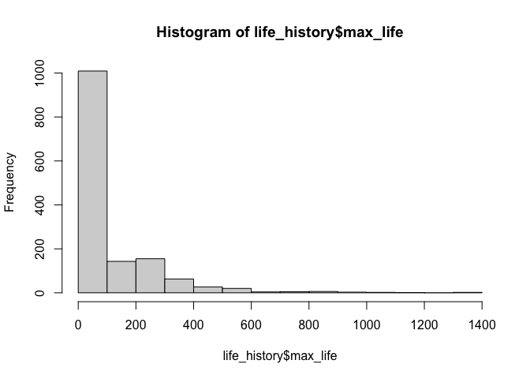

## Learning Goals
*At the end of this exercise, you will be able to:*    
1. Identify and manage NA's is data sets where NA's are represented in multiple ways.    
2. Use the `naniar` and `visdat` packages to help manage NA's in large data sets.  

## Breakout Rooms  
Please take 5-8 minutes to check over your answers to HW 6 in your group. If you are stuck, please remember that you can check the key in [Joel's repository](https://github.com/jmledford3115/BIS15LW2022_jledford).  

## Midterm 1 Review
Let's briefly review the questions from midterm 1 so you can get an idea of how I was thinking about the problems. Remember, there is more than one way to get at these answers, so don't worry if yours looks different than mine!  

## Load the libraries

```r
library("tidyverse")
library("janitor")
library("skimr")
```

## Review
When working with outside or "wild" data, dealing with NA's is a fundamental part of the data cleaning or tidying process. Data scientists spend most of their time cleaning and transforming data- including managing NA's. There isn't a single approach that will always work so you need to be careful about using replacements strategies across an entire data set. And, as the data sets become larger NA's can become trickier to deal with.  

For the following, we will use life history data for mammals. The [data](http://esapubs.org/archive/ecol/E084/093/) are from:  
**S. K. Morgan Ernest. 2003. Life history characteristics of placental non-volant mammals. Ecology 84:3402.**  

## Practice
1. Load the mammals life history data and clean the names.  

```r
life_history <- read_csv("data/mammal_lifehistories_v3.csv") %>% clean_names()
```

```
## Rows: 1440 Columns: 13
```

```
## ── Column specification ────────────────────────────────────────────────────────
## Delimiter: ","
## chr (5): order, family, Genus, species, newborn
## dbl (8): mass, gestation, weaning, wean mass, AFR, max. life, litter size, l...
```

```
## 
## ℹ Use `spec()` to retrieve the full column specification for this data.
## ℹ Specify the column types or set `show_col_types = FALSE` to quiet this message.
```

2. Use one or more of the functions from the last lab to determine if there are NA's in the data, how they are represented, and where they are located.

```r
summary(life_history)
```

```
##     order              family             genus             species         
##  Length:1440        Length:1440        Length:1440        Length:1440       
##  Class :character   Class :character   Class :character   Class :character  
##  Mode  :character   Mode  :character   Mode  :character   Mode  :character  
##                                                                             
##                                                                             
##                                                                             
##                                                                             
##       mass             gestation         newborn             weaning       
##  Min.   :     -999   Min.   :-999.00   Length:1440        Min.   :-999.00  
##  1st Qu.:       50   1st Qu.:-999.00   Class :character   1st Qu.:-999.00  
##  Median :      403   Median :   1.05   Mode  :character   Median :   0.73  
##  Mean   :   383577   Mean   :-287.25                      Mean   :-427.17  
##  3rd Qu.:     7009   3rd Qu.:   4.50                      3rd Qu.:   2.00  
##  Max.   :149000000   Max.   :  21.46                      Max.   :  48.00  
##                                                                            
##    wean_mass             afr             max_life        litter_size      
##  Min.   :    -999   Min.   :-999.00   Min.   :   0.00   Min.   :-999.000  
##  1st Qu.:    -999   1st Qu.:-999.00   1st Qu.:   0.00   1st Qu.:   1.000  
##  Median :    -999   Median :   2.50   Median :   0.00   Median :   2.270  
##  Mean   :   16049   Mean   :-408.12   Mean   :  93.19   Mean   : -55.634  
##  3rd Qu.:      10   3rd Qu.:  15.61   3rd Qu.: 147.25   3rd Qu.:   3.835  
##  Max.   :19075000   Max.   : 210.00   Max.   :1368.00   Max.   :  14.180  
##                                                                           
##   litters_year  
##  Min.   :0.140  
##  1st Qu.:1.000  
##  Median :1.000  
##  Mean   :1.636  
##  3rd Qu.:2.000  
##  Max.   :7.500  
##  NA's   :689
```


```r
is.na(life_history)
```

```
##         order family genus species  mass gestation newborn weaning wean_mass
##    [1,] FALSE  FALSE FALSE   FALSE FALSE     FALSE   FALSE   FALSE     FALSE
##    [2,] FALSE  FALSE FALSE   FALSE FALSE     FALSE   FALSE   FALSE     FALSE
##    [3,] FALSE  FALSE FALSE   FALSE FALSE     FALSE   FALSE   FALSE     FALSE
##    [4,] FALSE  FALSE FALSE   FALSE FALSE     FALSE   FALSE   FALSE     FALSE
##    [5,] FALSE  FALSE FALSE   FALSE FALSE     FALSE   FALSE   FALSE     FALSE
##    [6,] FALSE  FALSE FALSE   FALSE FALSE     FALSE   FALSE   FALSE     FALSE
##    [7,] FALSE  FALSE FALSE   FALSE FALSE     FALSE   FALSE   FALSE     FALSE
##    [8,] FALSE  FALSE FALSE   FALSE FALSE     FALSE   FALSE   FALSE     FALSE
##    [9,] FALSE  FALSE FALSE   FALSE FALSE     FALSE   FALSE   FALSE     FALSE
##   [10,] FALSE  FALSE FALSE   FALSE FALSE     FALSE   FALSE   FALSE     FALSE
##   [11,] FALSE  FALSE FALSE   FALSE FALSE     FALSE   FALSE   FALSE     FALSE
##   [12,] FALSE  FALSE FALSE   FALSE FALSE     FALSE   FALSE   FALSE     FALSE
##   [13,] FALSE  FALSE FALSE   FALSE FALSE     FALSE   FALSE   FALSE     FALSE
##   [14,] FALSE  FALSE FALSE   FALSE FALSE     FALSE   FALSE   FALSE     FALSE
##   [15,] FALSE  FALSE FALSE   FALSE FALSE     FALSE   FALSE   FALSE     FALSE
##   [16,] FALSE  FALSE FALSE   FALSE FALSE     FALSE   FALSE   FALSE     FALSE
##   [17,] FALSE  FALSE FALSE   FALSE FALSE     FALSE   FALSE   FALSE     FALSE
##   [18,] FALSE  FALSE FALSE   FALSE FALSE     FALSE   FALSE   FALSE     FALSE
##   [19,] FALSE  FALSE FALSE   FALSE FALSE     FALSE   FALSE   FALSE     FALSE
##   [20,] FALSE  FALSE FALSE   FALSE FALSE     FALSE   FALSE   FALSE     FALSE
##   [21,] FALSE  FALSE FALSE   FALSE FALSE     FALSE   FALSE   FALSE     FALSE
##   [22,] FALSE  FALSE FALSE   FALSE FALSE     FALSE   FALSE   FALSE     FALSE
##   [23,] FALSE  FALSE FALSE   FALSE FALSE     FALSE   FALSE   FALSE     FALSE
##   [24,] FALSE  FALSE FALSE   FALSE FALSE     FALSE   FALSE   FALSE     FALSE
##   [25,] FALSE  FALSE FALSE   FALSE FALSE     FALSE   FALSE   FALSE     FALSE
##   [26,] FALSE  FALSE FALSE   FALSE FALSE     FALSE   FALSE   FALSE     FALSE
##   [27,] FALSE  FALSE FALSE   FALSE FALSE     FALSE   FALSE   FALSE     FALSE
##   [28,] FALSE  FALSE FALSE   FALSE FALSE     FALSE   FALSE   FALSE     FALSE
##   [29,] FALSE  FALSE FALSE   FALSE FALSE     FALSE   FALSE   FALSE     FALSE
##   [30,] FALSE  FALSE FALSE   FALSE FALSE     FALSE   FALSE   FALSE     FALSE
##   [31,] FALSE  FALSE FALSE   FALSE FALSE     FALSE   FALSE   FALSE     FALSE
##   [32,] FALSE  FALSE FALSE   FALSE FALSE     FALSE   FALSE   FALSE     FALSE
##   [33,] FALSE  FALSE FALSE   FALSE FALSE     FALSE   FALSE   FALSE     FALSE
##   [34,] FALSE  FALSE FALSE   FALSE FALSE     FALSE   FALSE   FALSE     FALSE
##   [35,] FALSE  FALSE FALSE   FALSE FALSE     FALSE   FALSE   FALSE     FALSE
##   [36,] FALSE  FALSE FALSE   FALSE FALSE     FALSE   FALSE   FALSE     FALSE
##   [37,] FALSE  FALSE FALSE   FALSE FALSE     FALSE   FALSE   FALSE     FALSE
##   [38,] FALSE  FALSE FALSE   FALSE FALSE     FALSE   FALSE   FALSE     FALSE
##   [39,] FALSE  FALSE FALSE   FALSE FALSE     FALSE   FALSE   FALSE     FALSE
##   [40,] FALSE  FALSE FALSE   FALSE FALSE     FALSE   FALSE   FALSE     FALSE
##   [41,] FALSE  FALSE FALSE   FALSE FALSE     FALSE   FALSE   FALSE     FALSE
##   [42,] FALSE  FALSE FALSE   FALSE FALSE     FALSE   FALSE   FALSE     FALSE
##   [43,] FALSE  FALSE FALSE   FALSE FALSE     FALSE   FALSE   FALSE     FALSE
##   [44,] FALSE  FALSE FALSE   FALSE FALSE     FALSE   FALSE   FALSE     FALSE
##   [45,] FALSE  FALSE FALSE   FALSE FALSE     FALSE   FALSE   FALSE     FALSE
##   [46,] FALSE  FALSE FALSE   FALSE FALSE     FALSE   FALSE   FALSE     FALSE
##   [47,] FALSE  FALSE FALSE   FALSE FALSE     FALSE   FALSE   FALSE     FALSE
##   [48,] FALSE  FALSE FALSE   FALSE FALSE     FALSE   FALSE   FALSE     FALSE
##   [49,] FALSE  FALSE FALSE   FALSE FALSE     FALSE   FALSE   FALSE     FALSE
##   [50,] FALSE  FALSE FALSE   FALSE FALSE     FALSE   FALSE   FALSE     FALSE
##   [51,] FALSE  FALSE FALSE   FALSE FALSE     FALSE   FALSE   FALSE     FALSE
##   [52,] FALSE  FALSE FALSE   FALSE FALSE     FALSE   FALSE   FALSE     FALSE
##   [53,] FALSE  FALSE FALSE   FALSE FALSE     FALSE   FALSE   FALSE     FALSE
##   [54,] FALSE  FALSE FALSE   FALSE FALSE     FALSE   FALSE   FALSE     FALSE
##   [55,] FALSE  FALSE FALSE   FALSE FALSE     FALSE   FALSE   FALSE     FALSE
##   [56,] FALSE  FALSE FALSE   FALSE FALSE     FALSE   FALSE   FALSE     FALSE
##   [57,] FALSE  FALSE FALSE   FALSE FALSE     FALSE   FALSE   FALSE     FALSE
##   [58,] FALSE  FALSE FALSE   FALSE FALSE     FALSE   FALSE   FALSE     FALSE
##   [59,] FALSE  FALSE FALSE   FALSE FALSE     FALSE   FALSE   FALSE     FALSE
##   [60,] FALSE  FALSE FALSE   FALSE FALSE     FALSE   FALSE   FALSE     FALSE
##   [61,] FALSE  FALSE FALSE   FALSE FALSE     FALSE   FALSE   FALSE     FALSE
##   [62,] FALSE  FALSE FALSE   FALSE FALSE     FALSE   FALSE   FALSE     FALSE
##   [63,] FALSE  FALSE FALSE   FALSE FALSE     FALSE   FALSE   FALSE     FALSE
##   [64,] FALSE  FALSE FALSE   FALSE FALSE     FALSE   FALSE   FALSE     FALSE
##   [65,] FALSE  FALSE FALSE   FALSE FALSE     FALSE   FALSE   FALSE     FALSE
##   [66,] FALSE  FALSE FALSE   FALSE FALSE     FALSE   FALSE   FALSE     FALSE
##   [67,] FALSE  FALSE FALSE   FALSE FALSE     FALSE   FALSE   FALSE     FALSE
##   [68,] FALSE  FALSE FALSE   FALSE FALSE     FALSE   FALSE   FALSE     FALSE
##   [69,] FALSE  FALSE FALSE   FALSE FALSE     FALSE   FALSE   FALSE     FALSE
##   [70,] FALSE  FALSE FALSE   FALSE FALSE     FALSE   FALSE   FALSE     FALSE
##   [71,] FALSE  FALSE FALSE   FALSE FALSE     FALSE   FALSE   FALSE     FALSE
##   [72,] FALSE  FALSE FALSE   FALSE FALSE     FALSE   FALSE   FALSE     FALSE
##   [73,] FALSE  FALSE FALSE   FALSE FALSE     FALSE   FALSE   FALSE     FALSE
##   [74,] FALSE  FALSE FALSE   FALSE FALSE     FALSE   FALSE   FALSE     FALSE
##   [75,] FALSE  FALSE FALSE   FALSE FALSE     FALSE   FALSE   FALSE     FALSE
##   [76,] FALSE  FALSE FALSE   FALSE FALSE     FALSE   FALSE   FALSE     FALSE
##   [77,] FALSE  FALSE FALSE   FALSE FALSE     FALSE   FALSE   FALSE     FALSE
##   [78,] FALSE  FALSE FALSE   FALSE FALSE     FALSE   FALSE   FALSE     FALSE
##   [79,] FALSE  FALSE FALSE   FALSE FALSE     FALSE   FALSE   FALSE     FALSE
##   [80,] FALSE  FALSE FALSE   FALSE FALSE     FALSE   FALSE   FALSE     FALSE
##   [81,] FALSE  FALSE FALSE   FALSE FALSE     FALSE   FALSE   FALSE     FALSE
##   [82,] FALSE  FALSE FALSE   FALSE FALSE     FALSE   FALSE   FALSE     FALSE
##   [83,] FALSE  FALSE FALSE   FALSE FALSE     FALSE   FALSE   FALSE     FALSE
##   [84,] FALSE  FALSE FALSE   FALSE FALSE     FALSE   FALSE   FALSE     FALSE
##   [85,] FALSE  FALSE FALSE   FALSE FALSE     FALSE   FALSE   FALSE     FALSE
##   [86,] FALSE  FALSE FALSE   FALSE FALSE     FALSE   FALSE   FALSE     FALSE
##   [87,] FALSE  FALSE FALSE   FALSE FALSE     FALSE   FALSE   FALSE     FALSE
##   [88,] FALSE  FALSE FALSE   FALSE FALSE     FALSE   FALSE   FALSE     FALSE
##   [89,] FALSE  FALSE FALSE   FALSE FALSE     FALSE   FALSE   FALSE     FALSE
##   [90,] FALSE  FALSE FALSE   FALSE FALSE     FALSE   FALSE   FALSE     FALSE
##   [91,] FALSE  FALSE FALSE   FALSE FALSE     FALSE   FALSE   FALSE     FALSE
##   [92,] FALSE  FALSE FALSE   FALSE FALSE     FALSE   FALSE   FALSE     FALSE
##   [93,] FALSE  FALSE FALSE   FALSE FALSE     FALSE   FALSE   FALSE     FALSE
##   [94,] FALSE  FALSE FALSE   FALSE FALSE     FALSE   FALSE   FALSE     FALSE
##   [95,] FALSE  FALSE FALSE   FALSE FALSE     FALSE   FALSE   FALSE     FALSE
##   [96,] FALSE  FALSE FALSE   FALSE FALSE     FALSE   FALSE   FALSE     FALSE
##   [97,] FALSE  FALSE FALSE   FALSE FALSE     FALSE   FALSE   FALSE     FALSE
##   [98,] FALSE  FALSE FALSE   FALSE FALSE     FALSE   FALSE   FALSE     FALSE
##   [99,] FALSE  FALSE FALSE   FALSE FALSE     FALSE   FALSE   FALSE     FALSE
##  [100,] FALSE  FALSE FALSE   FALSE FALSE     FALSE   FALSE   FALSE     FALSE
##  [101,] FALSE  FALSE FALSE   FALSE FALSE     FALSE   FALSE   FALSE     FALSE
##  [102,] FALSE  FALSE FALSE   FALSE FALSE     FALSE   FALSE   FALSE     FALSE
##  [103,] FALSE  FALSE FALSE   FALSE FALSE     FALSE   FALSE   FALSE     FALSE
##  [104,] FALSE  FALSE FALSE   FALSE FALSE     FALSE   FALSE   FALSE     FALSE
##  [105,] FALSE  FALSE FALSE   FALSE FALSE     FALSE   FALSE   FALSE     FALSE
##  [106,] FALSE  FALSE FALSE   FALSE FALSE     FALSE   FALSE   FALSE     FALSE
##  [107,] FALSE  FALSE FALSE   FALSE FALSE     FALSE   FALSE   FALSE     FALSE
##  [108,] FALSE  FALSE FALSE   FALSE FALSE     FALSE   FALSE   FALSE     FALSE
##  [109,] FALSE  FALSE FALSE   FALSE FALSE     FALSE   FALSE   FALSE     FALSE
##  [110,] FALSE  FALSE FALSE   FALSE FALSE     FALSE   FALSE   FALSE     FALSE
##  [111,] FALSE  FALSE FALSE   FALSE FALSE     FALSE   FALSE   FALSE     FALSE
##  [112,] FALSE  FALSE FALSE   FALSE FALSE     FALSE   FALSE   FALSE     FALSE
##  [113,] FALSE  FALSE FALSE   FALSE FALSE     FALSE   FALSE   FALSE     FALSE
##  [114,] FALSE  FALSE FALSE   FALSE FALSE     FALSE   FALSE   FALSE     FALSE
##  [115,] FALSE  FALSE FALSE   FALSE FALSE     FALSE   FALSE   FALSE     FALSE
##  [116,] FALSE  FALSE FALSE   FALSE FALSE     FALSE   FALSE   FALSE     FALSE
##  [117,] FALSE  FALSE FALSE   FALSE FALSE     FALSE   FALSE   FALSE     FALSE
##  [118,] FALSE  FALSE FALSE   FALSE FALSE     FALSE   FALSE   FALSE     FALSE
##  [119,] FALSE  FALSE FALSE   FALSE FALSE     FALSE   FALSE   FALSE     FALSE
##  [120,] FALSE  FALSE FALSE   FALSE FALSE     FALSE   FALSE   FALSE     FALSE
##  [121,] FALSE  FALSE FALSE   FALSE FALSE     FALSE   FALSE   FALSE     FALSE
##  [122,] FALSE  FALSE FALSE   FALSE FALSE     FALSE   FALSE   FALSE     FALSE
##  [123,] FALSE  FALSE FALSE   FALSE FALSE     FALSE   FALSE   FALSE     FALSE
##  [124,] FALSE  FALSE FALSE   FALSE FALSE     FALSE   FALSE   FALSE     FALSE
##  [125,] FALSE  FALSE FALSE   FALSE FALSE     FALSE   FALSE   FALSE     FALSE
##  [126,] FALSE  FALSE FALSE   FALSE FALSE     FALSE   FALSE   FALSE     FALSE
##  [127,] FALSE  FALSE FALSE   FALSE FALSE     FALSE   FALSE   FALSE     FALSE
##  [128,] FALSE  FALSE FALSE   FALSE FALSE     FALSE   FALSE   FALSE     FALSE
##  [129,] FALSE  FALSE FALSE   FALSE FALSE     FALSE   FALSE   FALSE     FALSE
##  [130,] FALSE  FALSE FALSE   FALSE FALSE     FALSE   FALSE   FALSE     FALSE
##  [131,] FALSE  FALSE FALSE   FALSE FALSE     FALSE   FALSE   FALSE     FALSE
##  [132,] FALSE  FALSE FALSE   FALSE FALSE     FALSE   FALSE   FALSE     FALSE
##  [133,] FALSE  FALSE FALSE   FALSE FALSE     FALSE   FALSE   FALSE     FALSE
##  [134,] FALSE  FALSE FALSE   FALSE FALSE     FALSE   FALSE   FALSE     FALSE
##  [135,] FALSE  FALSE FALSE   FALSE FALSE     FALSE   FALSE   FALSE     FALSE
##  [136,] FALSE  FALSE FALSE   FALSE FALSE     FALSE   FALSE   FALSE     FALSE
##  [137,] FALSE  FALSE FALSE   FALSE FALSE     FALSE   FALSE   FALSE     FALSE
##  [138,] FALSE  FALSE FALSE   FALSE FALSE     FALSE   FALSE   FALSE     FALSE
##  [139,] FALSE  FALSE FALSE   FALSE FALSE     FALSE   FALSE   FALSE     FALSE
##  [140,] FALSE  FALSE FALSE   FALSE FALSE     FALSE   FALSE   FALSE     FALSE
##  [141,] FALSE  FALSE FALSE   FALSE FALSE     FALSE   FALSE   FALSE     FALSE
##  [142,] FALSE  FALSE FALSE   FALSE FALSE     FALSE   FALSE   FALSE     FALSE
##  [143,] FALSE  FALSE FALSE   FALSE FALSE     FALSE   FALSE   FALSE     FALSE
##  [144,] FALSE  FALSE FALSE   FALSE FALSE     FALSE   FALSE   FALSE     FALSE
##  [145,] FALSE  FALSE FALSE   FALSE FALSE     FALSE   FALSE   FALSE     FALSE
##  [146,] FALSE  FALSE FALSE   FALSE FALSE     FALSE   FALSE   FALSE     FALSE
##  [147,] FALSE  FALSE FALSE   FALSE FALSE     FALSE   FALSE   FALSE     FALSE
##  [148,] FALSE  FALSE FALSE   FALSE FALSE     FALSE   FALSE   FALSE     FALSE
##  [149,] FALSE  FALSE FALSE   FALSE FALSE     FALSE   FALSE   FALSE     FALSE
##  [150,] FALSE  FALSE FALSE   FALSE FALSE     FALSE   FALSE   FALSE     FALSE
##  [151,] FALSE  FALSE FALSE   FALSE FALSE     FALSE   FALSE   FALSE     FALSE
##  [152,] FALSE  FALSE FALSE   FALSE FALSE     FALSE   FALSE   FALSE     FALSE
##  [153,] FALSE  FALSE FALSE   FALSE FALSE     FALSE   FALSE   FALSE     FALSE
##  [154,] FALSE  FALSE FALSE   FALSE FALSE     FALSE   FALSE   FALSE     FALSE
##  [155,] FALSE  FALSE FALSE   FALSE FALSE     FALSE   FALSE   FALSE     FALSE
##  [156,] FALSE  FALSE FALSE   FALSE FALSE     FALSE   FALSE   FALSE     FALSE
##  [157,] FALSE  FALSE FALSE   FALSE FALSE     FALSE   FALSE   FALSE     FALSE
##  [158,] FALSE  FALSE FALSE   FALSE FALSE     FALSE   FALSE   FALSE     FALSE
##  [159,] FALSE  FALSE FALSE   FALSE FALSE     FALSE   FALSE   FALSE     FALSE
##  [160,] FALSE  FALSE FALSE   FALSE FALSE     FALSE   FALSE   FALSE     FALSE
##  [161,] FALSE  FALSE FALSE   FALSE FALSE     FALSE   FALSE   FALSE     FALSE
##  [162,] FALSE  FALSE FALSE   FALSE FALSE     FALSE   FALSE   FALSE     FALSE
##  [163,] FALSE  FALSE FALSE   FALSE FALSE     FALSE   FALSE   FALSE     FALSE
##  [164,] FALSE  FALSE FALSE   FALSE FALSE     FALSE   FALSE   FALSE     FALSE
##  [165,] FALSE  FALSE FALSE   FALSE FALSE     FALSE   FALSE   FALSE     FALSE
##  [166,] FALSE  FALSE FALSE   FALSE FALSE     FALSE   FALSE   FALSE     FALSE
##  [167,] FALSE  FALSE FALSE   FALSE FALSE     FALSE   FALSE   FALSE     FALSE
##  [168,] FALSE  FALSE FALSE   FALSE FALSE     FALSE   FALSE   FALSE     FALSE
##  [169,] FALSE  FALSE FALSE   FALSE FALSE     FALSE   FALSE   FALSE     FALSE
##  [170,] FALSE  FALSE FALSE   FALSE FALSE     FALSE   FALSE   FALSE     FALSE
##  [171,] FALSE  FALSE FALSE   FALSE FALSE     FALSE   FALSE   FALSE     FALSE
##  [172,] FALSE  FALSE FALSE   FALSE FALSE     FALSE   FALSE   FALSE     FALSE
##  [173,] FALSE  FALSE FALSE   FALSE FALSE     FALSE   FALSE   FALSE     FALSE
##  [174,] FALSE  FALSE FALSE   FALSE FALSE     FALSE   FALSE   FALSE     FALSE
##  [175,] FALSE  FALSE FALSE   FALSE FALSE     FALSE   FALSE   FALSE     FALSE
##  [176,] FALSE  FALSE FALSE   FALSE FALSE     FALSE   FALSE   FALSE     FALSE
##  [177,] FALSE  FALSE FALSE   FALSE FALSE     FALSE   FALSE   FALSE     FALSE
##  [178,] FALSE  FALSE FALSE   FALSE FALSE     FALSE   FALSE   FALSE     FALSE
##  [179,] FALSE  FALSE FALSE   FALSE FALSE     FALSE   FALSE   FALSE     FALSE
##  [180,] FALSE  FALSE FALSE   FALSE FALSE     FALSE   FALSE   FALSE     FALSE
##  [181,] FALSE  FALSE FALSE   FALSE FALSE     FALSE   FALSE   FALSE     FALSE
##  [182,] FALSE  FALSE FALSE   FALSE FALSE     FALSE   FALSE   FALSE     FALSE
##  [183,] FALSE  FALSE FALSE   FALSE FALSE     FALSE   FALSE   FALSE     FALSE
##  [184,] FALSE  FALSE FALSE   FALSE FALSE     FALSE   FALSE   FALSE     FALSE
##  [185,] FALSE  FALSE FALSE   FALSE FALSE     FALSE   FALSE   FALSE     FALSE
##  [186,] FALSE  FALSE FALSE   FALSE FALSE     FALSE   FALSE   FALSE     FALSE
##  [187,] FALSE  FALSE FALSE   FALSE FALSE     FALSE   FALSE   FALSE     FALSE
##  [188,] FALSE  FALSE FALSE   FALSE FALSE     FALSE   FALSE   FALSE     FALSE
##  [189,] FALSE  FALSE FALSE   FALSE FALSE     FALSE   FALSE   FALSE     FALSE
##  [190,] FALSE  FALSE FALSE   FALSE FALSE     FALSE   FALSE   FALSE     FALSE
##  [191,] FALSE  FALSE FALSE   FALSE FALSE     FALSE   FALSE   FALSE     FALSE
##  [192,] FALSE  FALSE FALSE   FALSE FALSE     FALSE   FALSE   FALSE     FALSE
##  [193,] FALSE  FALSE FALSE   FALSE FALSE     FALSE   FALSE   FALSE     FALSE
##  [194,] FALSE  FALSE FALSE   FALSE FALSE     FALSE   FALSE   FALSE     FALSE
##  [195,] FALSE  FALSE FALSE   FALSE FALSE     FALSE   FALSE   FALSE     FALSE
##  [196,] FALSE  FALSE FALSE   FALSE FALSE     FALSE   FALSE   FALSE     FALSE
##  [197,] FALSE  FALSE FALSE   FALSE FALSE     FALSE   FALSE   FALSE     FALSE
##  [198,] FALSE  FALSE FALSE   FALSE FALSE     FALSE   FALSE   FALSE     FALSE
##  [199,] FALSE  FALSE FALSE   FALSE FALSE     FALSE   FALSE   FALSE     FALSE
##  [200,] FALSE  FALSE FALSE   FALSE FALSE     FALSE   FALSE   FALSE     FALSE
##  [201,] FALSE  FALSE FALSE   FALSE FALSE     FALSE   FALSE   FALSE     FALSE
##  [202,] FALSE  FALSE FALSE   FALSE FALSE     FALSE   FALSE   FALSE     FALSE
##  [203,] FALSE  FALSE FALSE   FALSE FALSE     FALSE   FALSE   FALSE     FALSE
##  [204,] FALSE  FALSE FALSE   FALSE FALSE     FALSE   FALSE   FALSE     FALSE
##  [205,] FALSE  FALSE FALSE   FALSE FALSE     FALSE   FALSE   FALSE     FALSE
##  [206,] FALSE  FALSE FALSE   FALSE FALSE     FALSE   FALSE   FALSE     FALSE
##  [207,] FALSE  FALSE FALSE   FALSE FALSE     FALSE   FALSE   FALSE     FALSE
##  [208,] FALSE  FALSE FALSE   FALSE FALSE     FALSE   FALSE   FALSE     FALSE
##  [209,] FALSE  FALSE FALSE   FALSE FALSE     FALSE   FALSE   FALSE     FALSE
##  [210,] FALSE  FALSE FALSE   FALSE FALSE     FALSE   FALSE   FALSE     FALSE
##  [211,] FALSE  FALSE FALSE   FALSE FALSE     FALSE   FALSE   FALSE     FALSE
##  [212,] FALSE  FALSE FALSE   FALSE FALSE     FALSE   FALSE   FALSE     FALSE
##  [213,] FALSE  FALSE FALSE   FALSE FALSE     FALSE   FALSE   FALSE     FALSE
##  [214,] FALSE  FALSE FALSE   FALSE FALSE     FALSE   FALSE   FALSE     FALSE
##  [215,] FALSE  FALSE FALSE   FALSE FALSE     FALSE   FALSE   FALSE     FALSE
##  [216,] FALSE  FALSE FALSE   FALSE FALSE     FALSE   FALSE   FALSE     FALSE
##  [217,] FALSE  FALSE FALSE   FALSE FALSE     FALSE   FALSE   FALSE     FALSE
##  [218,] FALSE  FALSE FALSE   FALSE FALSE     FALSE   FALSE   FALSE     FALSE
##  [219,] FALSE  FALSE FALSE   FALSE FALSE     FALSE   FALSE   FALSE     FALSE
##  [220,] FALSE  FALSE FALSE   FALSE FALSE     FALSE   FALSE   FALSE     FALSE
##  [221,] FALSE  FALSE FALSE   FALSE FALSE     FALSE   FALSE   FALSE     FALSE
##  [222,] FALSE  FALSE FALSE   FALSE FALSE     FALSE   FALSE   FALSE     FALSE
##  [223,] FALSE  FALSE FALSE   FALSE FALSE     FALSE   FALSE   FALSE     FALSE
##  [224,] FALSE  FALSE FALSE   FALSE FALSE     FALSE   FALSE   FALSE     FALSE
##  [225,] FALSE  FALSE FALSE   FALSE FALSE     FALSE   FALSE   FALSE     FALSE
##  [226,] FALSE  FALSE FALSE   FALSE FALSE     FALSE   FALSE   FALSE     FALSE
##  [227,] FALSE  FALSE FALSE   FALSE FALSE     FALSE   FALSE   FALSE     FALSE
##  [228,] FALSE  FALSE FALSE   FALSE FALSE     FALSE   FALSE   FALSE     FALSE
##  [229,] FALSE  FALSE FALSE   FALSE FALSE     FALSE   FALSE   FALSE     FALSE
##  [230,] FALSE  FALSE FALSE   FALSE FALSE     FALSE   FALSE   FALSE     FALSE
##  [231,] FALSE  FALSE FALSE   FALSE FALSE     FALSE   FALSE   FALSE     FALSE
##  [232,] FALSE  FALSE FALSE   FALSE FALSE     FALSE   FALSE   FALSE     FALSE
##  [233,] FALSE  FALSE FALSE   FALSE FALSE     FALSE   FALSE   FALSE     FALSE
##  [234,] FALSE  FALSE FALSE   FALSE FALSE     FALSE   FALSE   FALSE     FALSE
##  [235,] FALSE  FALSE FALSE   FALSE FALSE     FALSE   FALSE   FALSE     FALSE
##  [236,] FALSE  FALSE FALSE   FALSE FALSE     FALSE   FALSE   FALSE     FALSE
##  [237,] FALSE  FALSE FALSE   FALSE FALSE     FALSE   FALSE   FALSE     FALSE
##  [238,] FALSE  FALSE FALSE   FALSE FALSE     FALSE   FALSE   FALSE     FALSE
##  [239,] FALSE  FALSE FALSE   FALSE FALSE     FALSE   FALSE   FALSE     FALSE
##  [240,] FALSE  FALSE FALSE   FALSE FALSE     FALSE   FALSE   FALSE     FALSE
##  [241,] FALSE  FALSE FALSE   FALSE FALSE     FALSE   FALSE   FALSE     FALSE
##  [242,] FALSE  FALSE FALSE   FALSE FALSE     FALSE   FALSE   FALSE     FALSE
##  [243,] FALSE  FALSE FALSE   FALSE FALSE     FALSE   FALSE   FALSE     FALSE
##  [244,] FALSE  FALSE FALSE   FALSE FALSE     FALSE   FALSE   FALSE     FALSE
##  [245,] FALSE  FALSE FALSE   FALSE FALSE     FALSE   FALSE   FALSE     FALSE
##  [246,] FALSE  FALSE FALSE   FALSE FALSE     FALSE   FALSE   FALSE     FALSE
##  [247,] FALSE  FALSE FALSE   FALSE FALSE     FALSE   FALSE   FALSE     FALSE
##  [248,] FALSE  FALSE FALSE   FALSE FALSE     FALSE   FALSE   FALSE     FALSE
##  [249,] FALSE  FALSE FALSE   FALSE FALSE     FALSE   FALSE   FALSE     FALSE
##  [250,] FALSE  FALSE FALSE   FALSE FALSE     FALSE   FALSE   FALSE     FALSE
##  [251,] FALSE  FALSE FALSE   FALSE FALSE     FALSE   FALSE   FALSE     FALSE
##  [252,] FALSE  FALSE FALSE   FALSE FALSE     FALSE   FALSE   FALSE     FALSE
##  [253,] FALSE  FALSE FALSE   FALSE FALSE     FALSE   FALSE   FALSE     FALSE
##  [254,] FALSE  FALSE FALSE   FALSE FALSE     FALSE   FALSE   FALSE     FALSE
##  [255,] FALSE  FALSE FALSE   FALSE FALSE     FALSE   FALSE   FALSE     FALSE
##  [256,] FALSE  FALSE FALSE   FALSE FALSE     FALSE   FALSE   FALSE     FALSE
##  [257,] FALSE  FALSE FALSE   FALSE FALSE     FALSE   FALSE   FALSE     FALSE
##  [258,] FALSE  FALSE FALSE   FALSE FALSE     FALSE   FALSE   FALSE     FALSE
##  [259,] FALSE  FALSE FALSE   FALSE FALSE     FALSE   FALSE   FALSE     FALSE
##  [260,] FALSE  FALSE FALSE   FALSE FALSE     FALSE   FALSE   FALSE     FALSE
##  [261,] FALSE  FALSE FALSE   FALSE FALSE     FALSE   FALSE   FALSE     FALSE
##  [262,] FALSE  FALSE FALSE   FALSE FALSE     FALSE   FALSE   FALSE     FALSE
##  [263,] FALSE  FALSE FALSE   FALSE FALSE     FALSE   FALSE   FALSE     FALSE
##  [264,] FALSE  FALSE FALSE   FALSE FALSE     FALSE   FALSE   FALSE     FALSE
##  [265,] FALSE  FALSE FALSE   FALSE FALSE     FALSE   FALSE   FALSE     FALSE
##  [266,] FALSE  FALSE FALSE   FALSE FALSE     FALSE   FALSE   FALSE     FALSE
##  [267,] FALSE  FALSE FALSE   FALSE FALSE     FALSE   FALSE   FALSE     FALSE
##  [268,] FALSE  FALSE FALSE   FALSE FALSE     FALSE   FALSE   FALSE     FALSE
##  [269,] FALSE  FALSE FALSE   FALSE FALSE     FALSE   FALSE   FALSE     FALSE
##  [270,] FALSE  FALSE FALSE   FALSE FALSE     FALSE   FALSE   FALSE     FALSE
##  [271,] FALSE  FALSE FALSE   FALSE FALSE     FALSE   FALSE   FALSE     FALSE
##  [272,] FALSE  FALSE FALSE   FALSE FALSE     FALSE   FALSE   FALSE     FALSE
##  [273,] FALSE  FALSE FALSE   FALSE FALSE     FALSE   FALSE   FALSE     FALSE
##  [274,] FALSE  FALSE FALSE   FALSE FALSE     FALSE   FALSE   FALSE     FALSE
##  [275,] FALSE  FALSE FALSE   FALSE FALSE     FALSE   FALSE   FALSE     FALSE
##  [276,] FALSE  FALSE FALSE   FALSE FALSE     FALSE   FALSE   FALSE     FALSE
##  [277,] FALSE  FALSE FALSE   FALSE FALSE     FALSE   FALSE   FALSE     FALSE
##  [278,] FALSE  FALSE FALSE   FALSE FALSE     FALSE   FALSE   FALSE     FALSE
##  [279,] FALSE  FALSE FALSE   FALSE FALSE     FALSE   FALSE   FALSE     FALSE
##  [280,] FALSE  FALSE FALSE   FALSE FALSE     FALSE   FALSE   FALSE     FALSE
##  [281,] FALSE  FALSE FALSE   FALSE FALSE     FALSE   FALSE   FALSE     FALSE
##  [282,] FALSE  FALSE FALSE   FALSE FALSE     FALSE   FALSE   FALSE     FALSE
##  [283,] FALSE  FALSE FALSE   FALSE FALSE     FALSE   FALSE   FALSE     FALSE
##  [284,] FALSE  FALSE FALSE   FALSE FALSE     FALSE   FALSE   FALSE     FALSE
##  [285,] FALSE  FALSE FALSE   FALSE FALSE     FALSE   FALSE   FALSE     FALSE
##  [286,] FALSE  FALSE FALSE   FALSE FALSE     FALSE   FALSE   FALSE     FALSE
##  [287,] FALSE  FALSE FALSE   FALSE FALSE     FALSE   FALSE   FALSE     FALSE
##  [288,] FALSE  FALSE FALSE   FALSE FALSE     FALSE   FALSE   FALSE     FALSE
##  [289,] FALSE  FALSE FALSE   FALSE FALSE     FALSE   FALSE   FALSE     FALSE
##  [290,] FALSE  FALSE FALSE   FALSE FALSE     FALSE   FALSE   FALSE     FALSE
##  [291,] FALSE  FALSE FALSE   FALSE FALSE     FALSE   FALSE   FALSE     FALSE
##  [292,] FALSE  FALSE FALSE   FALSE FALSE     FALSE   FALSE   FALSE     FALSE
##  [293,] FALSE  FALSE FALSE   FALSE FALSE     FALSE   FALSE   FALSE     FALSE
##  [294,] FALSE  FALSE FALSE   FALSE FALSE     FALSE   FALSE   FALSE     FALSE
##  [295,] FALSE  FALSE FALSE   FALSE FALSE     FALSE   FALSE   FALSE     FALSE
##  [296,] FALSE  FALSE FALSE   FALSE FALSE     FALSE   FALSE   FALSE     FALSE
##  [297,] FALSE  FALSE FALSE   FALSE FALSE     FALSE   FALSE   FALSE     FALSE
##  [298,] FALSE  FALSE FALSE   FALSE FALSE     FALSE   FALSE   FALSE     FALSE
##  [299,] FALSE  FALSE FALSE   FALSE FALSE     FALSE   FALSE   FALSE     FALSE
##  [300,] FALSE  FALSE FALSE   FALSE FALSE     FALSE   FALSE   FALSE     FALSE
##  [301,] FALSE  FALSE FALSE   FALSE FALSE     FALSE   FALSE   FALSE     FALSE
##  [302,] FALSE  FALSE FALSE   FALSE FALSE     FALSE   FALSE   FALSE     FALSE
##  [303,] FALSE  FALSE FALSE   FALSE FALSE     FALSE   FALSE   FALSE     FALSE
##  [304,] FALSE  FALSE FALSE   FALSE FALSE     FALSE   FALSE   FALSE     FALSE
##  [305,] FALSE  FALSE FALSE   FALSE FALSE     FALSE   FALSE   FALSE     FALSE
##  [306,] FALSE  FALSE FALSE   FALSE FALSE     FALSE   FALSE   FALSE     FALSE
##  [307,] FALSE  FALSE FALSE   FALSE FALSE     FALSE   FALSE   FALSE     FALSE
##  [308,] FALSE  FALSE FALSE   FALSE FALSE     FALSE   FALSE   FALSE     FALSE
##  [309,] FALSE  FALSE FALSE   FALSE FALSE     FALSE   FALSE   FALSE     FALSE
##  [310,] FALSE  FALSE FALSE   FALSE FALSE     FALSE   FALSE   FALSE     FALSE
##  [311,] FALSE  FALSE FALSE   FALSE FALSE     FALSE   FALSE   FALSE     FALSE
##  [312,] FALSE  FALSE FALSE   FALSE FALSE     FALSE   FALSE   FALSE     FALSE
##  [313,] FALSE  FALSE FALSE   FALSE FALSE     FALSE   FALSE   FALSE     FALSE
##  [314,] FALSE  FALSE FALSE   FALSE FALSE     FALSE   FALSE   FALSE     FALSE
##  [315,] FALSE  FALSE FALSE   FALSE FALSE     FALSE   FALSE   FALSE     FALSE
##  [316,] FALSE  FALSE FALSE   FALSE FALSE     FALSE   FALSE   FALSE     FALSE
##  [317,] FALSE  FALSE FALSE   FALSE FALSE     FALSE   FALSE   FALSE     FALSE
##  [318,] FALSE  FALSE FALSE   FALSE FALSE     FALSE   FALSE   FALSE     FALSE
##  [319,] FALSE  FALSE FALSE   FALSE FALSE     FALSE   FALSE   FALSE     FALSE
##  [320,] FALSE  FALSE FALSE   FALSE FALSE     FALSE   FALSE   FALSE     FALSE
##  [321,] FALSE  FALSE FALSE   FALSE FALSE     FALSE   FALSE   FALSE     FALSE
##  [322,] FALSE  FALSE FALSE   FALSE FALSE     FALSE   FALSE   FALSE     FALSE
##  [323,] FALSE  FALSE FALSE   FALSE FALSE     FALSE   FALSE   FALSE     FALSE
##  [324,] FALSE  FALSE FALSE   FALSE FALSE     FALSE   FALSE   FALSE     FALSE
##  [325,] FALSE  FALSE FALSE   FALSE FALSE     FALSE   FALSE   FALSE     FALSE
##  [326,] FALSE  FALSE FALSE   FALSE FALSE     FALSE   FALSE   FALSE     FALSE
##  [327,] FALSE  FALSE FALSE   FALSE FALSE     FALSE   FALSE   FALSE     FALSE
##  [328,] FALSE  FALSE FALSE   FALSE FALSE     FALSE   FALSE   FALSE     FALSE
##  [329,] FALSE  FALSE FALSE   FALSE FALSE     FALSE   FALSE   FALSE     FALSE
##  [330,] FALSE  FALSE FALSE   FALSE FALSE     FALSE   FALSE   FALSE     FALSE
##  [331,] FALSE  FALSE FALSE   FALSE FALSE     FALSE   FALSE   FALSE     FALSE
##  [332,] FALSE  FALSE FALSE   FALSE FALSE     FALSE   FALSE   FALSE     FALSE
##  [333,] FALSE  FALSE FALSE   FALSE FALSE     FALSE   FALSE   FALSE     FALSE
##  [334,] FALSE  FALSE FALSE   FALSE FALSE     FALSE   FALSE   FALSE     FALSE
##  [335,] FALSE  FALSE FALSE   FALSE FALSE     FALSE   FALSE   FALSE     FALSE
##  [336,] FALSE  FALSE FALSE   FALSE FALSE     FALSE   FALSE   FALSE     FALSE
##  [337,] FALSE  FALSE FALSE   FALSE FALSE     FALSE   FALSE   FALSE     FALSE
##  [338,] FALSE  FALSE FALSE   FALSE FALSE     FALSE   FALSE   FALSE     FALSE
##  [339,] FALSE  FALSE FALSE   FALSE FALSE     FALSE   FALSE   FALSE     FALSE
##  [340,] FALSE  FALSE FALSE   FALSE FALSE     FALSE   FALSE   FALSE     FALSE
##  [341,] FALSE  FALSE FALSE   FALSE FALSE     FALSE   FALSE   FALSE     FALSE
##  [342,] FALSE  FALSE FALSE   FALSE FALSE     FALSE   FALSE   FALSE     FALSE
##  [343,] FALSE  FALSE FALSE   FALSE FALSE     FALSE   FALSE   FALSE     FALSE
##  [344,] FALSE  FALSE FALSE   FALSE FALSE     FALSE   FALSE   FALSE     FALSE
##  [345,] FALSE  FALSE FALSE   FALSE FALSE     FALSE   FALSE   FALSE     FALSE
##  [346,] FALSE  FALSE FALSE   FALSE FALSE     FALSE   FALSE   FALSE     FALSE
##  [347,] FALSE  FALSE FALSE   FALSE FALSE     FALSE   FALSE   FALSE     FALSE
##  [348,] FALSE  FALSE FALSE   FALSE FALSE     FALSE   FALSE   FALSE     FALSE
##  [349,] FALSE  FALSE FALSE   FALSE FALSE     FALSE   FALSE   FALSE     FALSE
##  [350,] FALSE  FALSE FALSE   FALSE FALSE     FALSE   FALSE   FALSE     FALSE
##  [351,] FALSE  FALSE FALSE   FALSE FALSE     FALSE   FALSE   FALSE     FALSE
##  [352,] FALSE  FALSE FALSE   FALSE FALSE     FALSE   FALSE   FALSE     FALSE
##  [353,] FALSE  FALSE FALSE   FALSE FALSE     FALSE   FALSE   FALSE     FALSE
##  [354,] FALSE  FALSE FALSE   FALSE FALSE     FALSE   FALSE   FALSE     FALSE
##  [355,] FALSE  FALSE FALSE   FALSE FALSE     FALSE   FALSE   FALSE     FALSE
##  [356,] FALSE  FALSE FALSE   FALSE FALSE     FALSE   FALSE   FALSE     FALSE
##  [357,] FALSE  FALSE FALSE   FALSE FALSE     FALSE   FALSE   FALSE     FALSE
##  [358,] FALSE  FALSE FALSE   FALSE FALSE     FALSE   FALSE   FALSE     FALSE
##  [359,] FALSE  FALSE FALSE   FALSE FALSE     FALSE   FALSE   FALSE     FALSE
##  [360,] FALSE  FALSE FALSE   FALSE FALSE     FALSE   FALSE   FALSE     FALSE
##  [361,] FALSE  FALSE FALSE   FALSE FALSE     FALSE   FALSE   FALSE     FALSE
##  [362,] FALSE  FALSE FALSE   FALSE FALSE     FALSE   FALSE   FALSE     FALSE
##  [363,] FALSE  FALSE FALSE   FALSE FALSE     FALSE   FALSE   FALSE     FALSE
##  [364,] FALSE  FALSE FALSE   FALSE FALSE     FALSE   FALSE   FALSE     FALSE
##  [365,] FALSE  FALSE FALSE   FALSE FALSE     FALSE   FALSE   FALSE     FALSE
##  [366,] FALSE  FALSE FALSE   FALSE FALSE     FALSE   FALSE   FALSE     FALSE
##  [367,] FALSE  FALSE FALSE   FALSE FALSE     FALSE   FALSE   FALSE     FALSE
##  [368,] FALSE  FALSE FALSE   FALSE FALSE     FALSE   FALSE   FALSE     FALSE
##  [369,] FALSE  FALSE FALSE   FALSE FALSE     FALSE   FALSE   FALSE     FALSE
##  [370,] FALSE  FALSE FALSE   FALSE FALSE     FALSE   FALSE   FALSE     FALSE
##  [371,] FALSE  FALSE FALSE   FALSE FALSE     FALSE   FALSE   FALSE     FALSE
##  [372,] FALSE  FALSE FALSE   FALSE FALSE     FALSE   FALSE   FALSE     FALSE
##  [373,] FALSE  FALSE FALSE   FALSE FALSE     FALSE   FALSE   FALSE     FALSE
##  [374,] FALSE  FALSE FALSE   FALSE FALSE     FALSE   FALSE   FALSE     FALSE
##  [375,] FALSE  FALSE FALSE   FALSE FALSE     FALSE   FALSE   FALSE     FALSE
##  [376,] FALSE  FALSE FALSE   FALSE FALSE     FALSE   FALSE   FALSE     FALSE
##  [377,] FALSE  FALSE FALSE   FALSE FALSE     FALSE   FALSE   FALSE     FALSE
##  [378,] FALSE  FALSE FALSE   FALSE FALSE     FALSE   FALSE   FALSE     FALSE
##  [379,] FALSE  FALSE FALSE   FALSE FALSE     FALSE   FALSE   FALSE     FALSE
##  [380,] FALSE  FALSE FALSE   FALSE FALSE     FALSE   FALSE   FALSE     FALSE
##  [381,] FALSE  FALSE FALSE   FALSE FALSE     FALSE   FALSE   FALSE     FALSE
##  [382,] FALSE  FALSE FALSE   FALSE FALSE     FALSE   FALSE   FALSE     FALSE
##  [383,] FALSE  FALSE FALSE   FALSE FALSE     FALSE   FALSE   FALSE     FALSE
##  [384,] FALSE  FALSE FALSE   FALSE FALSE     FALSE   FALSE   FALSE     FALSE
##  [385,] FALSE  FALSE FALSE   FALSE FALSE     FALSE   FALSE   FALSE     FALSE
##  [386,] FALSE  FALSE FALSE   FALSE FALSE     FALSE   FALSE   FALSE     FALSE
##  [387,] FALSE  FALSE FALSE   FALSE FALSE     FALSE   FALSE   FALSE     FALSE
##  [388,] FALSE  FALSE FALSE   FALSE FALSE     FALSE   FALSE   FALSE     FALSE
##  [389,] FALSE  FALSE FALSE   FALSE FALSE     FALSE   FALSE   FALSE     FALSE
##  [390,] FALSE  FALSE FALSE   FALSE FALSE     FALSE   FALSE   FALSE     FALSE
##  [391,] FALSE  FALSE FALSE   FALSE FALSE     FALSE   FALSE   FALSE     FALSE
##  [392,] FALSE  FALSE FALSE   FALSE FALSE     FALSE   FALSE   FALSE     FALSE
##  [393,] FALSE  FALSE FALSE   FALSE FALSE     FALSE   FALSE   FALSE     FALSE
##  [394,] FALSE  FALSE FALSE   FALSE FALSE     FALSE   FALSE   FALSE     FALSE
##  [395,] FALSE  FALSE FALSE   FALSE FALSE     FALSE   FALSE   FALSE     FALSE
##  [396,] FALSE  FALSE FALSE   FALSE FALSE     FALSE   FALSE   FALSE     FALSE
##  [397,] FALSE  FALSE FALSE   FALSE FALSE     FALSE   FALSE   FALSE     FALSE
##  [398,] FALSE  FALSE FALSE   FALSE FALSE     FALSE   FALSE   FALSE     FALSE
##  [399,] FALSE  FALSE FALSE   FALSE FALSE     FALSE   FALSE   FALSE     FALSE
##  [400,] FALSE  FALSE FALSE   FALSE FALSE     FALSE   FALSE   FALSE     FALSE
##  [401,] FALSE  FALSE FALSE   FALSE FALSE     FALSE   FALSE   FALSE     FALSE
##  [402,] FALSE  FALSE FALSE   FALSE FALSE     FALSE   FALSE   FALSE     FALSE
##  [403,] FALSE  FALSE FALSE   FALSE FALSE     FALSE   FALSE   FALSE     FALSE
##  [404,] FALSE  FALSE FALSE   FALSE FALSE     FALSE   FALSE   FALSE     FALSE
##  [405,] FALSE  FALSE FALSE   FALSE FALSE     FALSE   FALSE   FALSE     FALSE
##  [406,] FALSE  FALSE FALSE   FALSE FALSE     FALSE   FALSE   FALSE     FALSE
##  [407,] FALSE  FALSE FALSE   FALSE FALSE     FALSE   FALSE   FALSE     FALSE
##  [408,] FALSE  FALSE FALSE   FALSE FALSE     FALSE   FALSE   FALSE     FALSE
##  [409,] FALSE  FALSE FALSE   FALSE FALSE     FALSE   FALSE   FALSE     FALSE
##  [410,] FALSE  FALSE FALSE   FALSE FALSE     FALSE   FALSE   FALSE     FALSE
##  [411,] FALSE  FALSE FALSE   FALSE FALSE     FALSE   FALSE   FALSE     FALSE
##  [412,] FALSE  FALSE FALSE   FALSE FALSE     FALSE   FALSE   FALSE     FALSE
##  [413,] FALSE  FALSE FALSE   FALSE FALSE     FALSE   FALSE   FALSE     FALSE
##  [414,] FALSE  FALSE FALSE   FALSE FALSE     FALSE   FALSE   FALSE     FALSE
##  [415,] FALSE  FALSE FALSE   FALSE FALSE     FALSE   FALSE   FALSE     FALSE
##  [416,] FALSE  FALSE FALSE   FALSE FALSE     FALSE   FALSE   FALSE     FALSE
##  [417,] FALSE  FALSE FALSE   FALSE FALSE     FALSE   FALSE   FALSE     FALSE
##  [418,] FALSE  FALSE FALSE   FALSE FALSE     FALSE   FALSE   FALSE     FALSE
##  [419,] FALSE  FALSE FALSE   FALSE FALSE     FALSE   FALSE   FALSE     FALSE
##  [420,] FALSE  FALSE FALSE   FALSE FALSE     FALSE   FALSE   FALSE     FALSE
##  [421,] FALSE  FALSE FALSE   FALSE FALSE     FALSE   FALSE   FALSE     FALSE
##  [422,] FALSE  FALSE FALSE   FALSE FALSE     FALSE   FALSE   FALSE     FALSE
##  [423,] FALSE  FALSE FALSE   FALSE FALSE     FALSE   FALSE   FALSE     FALSE
##  [424,] FALSE  FALSE FALSE   FALSE FALSE     FALSE   FALSE   FALSE     FALSE
##  [425,] FALSE  FALSE FALSE   FALSE FALSE     FALSE   FALSE   FALSE     FALSE
##  [426,] FALSE  FALSE FALSE   FALSE FALSE     FALSE   FALSE   FALSE     FALSE
##  [427,] FALSE  FALSE FALSE   FALSE FALSE     FALSE   FALSE   FALSE     FALSE
##  [428,] FALSE  FALSE FALSE   FALSE FALSE     FALSE   FALSE   FALSE     FALSE
##  [429,] FALSE  FALSE FALSE   FALSE FALSE     FALSE   FALSE   FALSE     FALSE
##  [430,] FALSE  FALSE FALSE   FALSE FALSE     FALSE   FALSE   FALSE     FALSE
##  [431,] FALSE  FALSE FALSE   FALSE FALSE     FALSE   FALSE   FALSE     FALSE
##  [432,] FALSE  FALSE FALSE   FALSE FALSE     FALSE   FALSE   FALSE     FALSE
##  [433,] FALSE  FALSE FALSE   FALSE FALSE     FALSE   FALSE   FALSE     FALSE
##  [434,] FALSE  FALSE FALSE   FALSE FALSE     FALSE   FALSE   FALSE     FALSE
##  [435,] FALSE  FALSE FALSE   FALSE FALSE     FALSE   FALSE   FALSE     FALSE
##  [436,] FALSE  FALSE FALSE   FALSE FALSE     FALSE   FALSE   FALSE     FALSE
##  [437,] FALSE  FALSE FALSE   FALSE FALSE     FALSE   FALSE   FALSE     FALSE
##  [438,] FALSE  FALSE FALSE   FALSE FALSE     FALSE   FALSE   FALSE     FALSE
##  [439,] FALSE  FALSE FALSE   FALSE FALSE     FALSE   FALSE   FALSE     FALSE
##  [440,] FALSE  FALSE FALSE   FALSE FALSE     FALSE   FALSE   FALSE     FALSE
##  [441,] FALSE  FALSE FALSE   FALSE FALSE     FALSE   FALSE   FALSE     FALSE
##  [442,] FALSE  FALSE FALSE   FALSE FALSE     FALSE   FALSE   FALSE     FALSE
##  [443,] FALSE  FALSE FALSE   FALSE FALSE     FALSE   FALSE   FALSE     FALSE
##  [444,] FALSE  FALSE FALSE   FALSE FALSE     FALSE   FALSE   FALSE     FALSE
##  [445,] FALSE  FALSE FALSE   FALSE FALSE     FALSE   FALSE   FALSE     FALSE
##  [446,] FALSE  FALSE FALSE   FALSE FALSE     FALSE   FALSE   FALSE     FALSE
##  [447,] FALSE  FALSE FALSE   FALSE FALSE     FALSE   FALSE   FALSE     FALSE
##  [448,] FALSE  FALSE FALSE   FALSE FALSE     FALSE   FALSE   FALSE     FALSE
##  [449,] FALSE  FALSE FALSE   FALSE FALSE     FALSE   FALSE   FALSE     FALSE
##  [450,] FALSE  FALSE FALSE   FALSE FALSE     FALSE   FALSE   FALSE     FALSE
##  [451,] FALSE  FALSE FALSE   FALSE FALSE     FALSE   FALSE   FALSE     FALSE
##  [452,] FALSE  FALSE FALSE   FALSE FALSE     FALSE   FALSE   FALSE     FALSE
##  [453,] FALSE  FALSE FALSE   FALSE FALSE     FALSE   FALSE   FALSE     FALSE
##  [454,] FALSE  FALSE FALSE   FALSE FALSE     FALSE   FALSE   FALSE     FALSE
##  [455,] FALSE  FALSE FALSE   FALSE FALSE     FALSE   FALSE   FALSE     FALSE
##  [456,] FALSE  FALSE FALSE   FALSE FALSE     FALSE   FALSE   FALSE     FALSE
##  [457,] FALSE  FALSE FALSE   FALSE FALSE     FALSE   FALSE   FALSE     FALSE
##  [458,] FALSE  FALSE FALSE   FALSE FALSE     FALSE   FALSE   FALSE     FALSE
##  [459,] FALSE  FALSE FALSE   FALSE FALSE     FALSE   FALSE   FALSE     FALSE
##  [460,] FALSE  FALSE FALSE   FALSE FALSE     FALSE   FALSE   FALSE     FALSE
##  [461,] FALSE  FALSE FALSE   FALSE FALSE     FALSE   FALSE   FALSE     FALSE
##  [462,] FALSE  FALSE FALSE   FALSE FALSE     FALSE   FALSE   FALSE     FALSE
##  [463,] FALSE  FALSE FALSE   FALSE FALSE     FALSE   FALSE   FALSE     FALSE
##  [464,] FALSE  FALSE FALSE   FALSE FALSE     FALSE   FALSE   FALSE     FALSE
##  [465,] FALSE  FALSE FALSE   FALSE FALSE     FALSE   FALSE   FALSE     FALSE
##  [466,] FALSE  FALSE FALSE   FALSE FALSE     FALSE   FALSE   FALSE     FALSE
##  [467,] FALSE  FALSE FALSE   FALSE FALSE     FALSE   FALSE   FALSE     FALSE
##  [468,] FALSE  FALSE FALSE   FALSE FALSE     FALSE   FALSE   FALSE     FALSE
##  [469,] FALSE  FALSE FALSE   FALSE FALSE     FALSE   FALSE   FALSE     FALSE
##  [470,] FALSE  FALSE FALSE   FALSE FALSE     FALSE   FALSE   FALSE     FALSE
##  [471,] FALSE  FALSE FALSE   FALSE FALSE     FALSE   FALSE   FALSE     FALSE
##  [472,] FALSE  FALSE FALSE   FALSE FALSE     FALSE   FALSE   FALSE     FALSE
##  [473,] FALSE  FALSE FALSE   FALSE FALSE     FALSE   FALSE   FALSE     FALSE
##  [474,] FALSE  FALSE FALSE   FALSE FALSE     FALSE   FALSE   FALSE     FALSE
##  [475,] FALSE  FALSE FALSE   FALSE FALSE     FALSE   FALSE   FALSE     FALSE
##  [476,] FALSE  FALSE FALSE   FALSE FALSE     FALSE   FALSE   FALSE     FALSE
##  [477,] FALSE  FALSE FALSE   FALSE FALSE     FALSE   FALSE   FALSE     FALSE
##  [478,] FALSE  FALSE FALSE   FALSE FALSE     FALSE   FALSE   FALSE     FALSE
##  [479,] FALSE  FALSE FALSE   FALSE FALSE     FALSE   FALSE   FALSE     FALSE
##  [480,] FALSE  FALSE FALSE   FALSE FALSE     FALSE   FALSE   FALSE     FALSE
##  [481,] FALSE  FALSE FALSE   FALSE FALSE     FALSE   FALSE   FALSE     FALSE
##  [482,] FALSE  FALSE FALSE   FALSE FALSE     FALSE   FALSE   FALSE     FALSE
##  [483,] FALSE  FALSE FALSE   FALSE FALSE     FALSE   FALSE   FALSE     FALSE
##  [484,] FALSE  FALSE FALSE   FALSE FALSE     FALSE   FALSE   FALSE     FALSE
##  [485,] FALSE  FALSE FALSE   FALSE FALSE     FALSE   FALSE   FALSE     FALSE
##  [486,] FALSE  FALSE FALSE   FALSE FALSE     FALSE   FALSE   FALSE     FALSE
##  [487,] FALSE  FALSE FALSE   FALSE FALSE     FALSE   FALSE   FALSE     FALSE
##  [488,] FALSE  FALSE FALSE   FALSE FALSE     FALSE   FALSE   FALSE     FALSE
##  [489,] FALSE  FALSE FALSE   FALSE FALSE     FALSE   FALSE   FALSE     FALSE
##  [490,] FALSE  FALSE FALSE   FALSE FALSE     FALSE   FALSE   FALSE     FALSE
##  [491,] FALSE  FALSE FALSE   FALSE FALSE     FALSE   FALSE   FALSE     FALSE
##  [492,] FALSE  FALSE FALSE   FALSE FALSE     FALSE   FALSE   FALSE     FALSE
##  [493,] FALSE  FALSE FALSE   FALSE FALSE     FALSE   FALSE   FALSE     FALSE
##  [494,] FALSE  FALSE FALSE   FALSE FALSE     FALSE   FALSE   FALSE     FALSE
##  [495,] FALSE  FALSE FALSE   FALSE FALSE     FALSE   FALSE   FALSE     FALSE
##  [496,] FALSE  FALSE FALSE   FALSE FALSE     FALSE   FALSE   FALSE     FALSE
##  [497,] FALSE  FALSE FALSE   FALSE FALSE     FALSE   FALSE   FALSE     FALSE
##  [498,] FALSE  FALSE FALSE   FALSE FALSE     FALSE   FALSE   FALSE     FALSE
##  [499,] FALSE  FALSE FALSE   FALSE FALSE     FALSE   FALSE   FALSE     FALSE
##  [500,] FALSE  FALSE FALSE   FALSE FALSE     FALSE   FALSE   FALSE     FALSE
##  [501,] FALSE  FALSE FALSE   FALSE FALSE     FALSE   FALSE   FALSE     FALSE
##  [502,] FALSE  FALSE FALSE   FALSE FALSE     FALSE   FALSE   FALSE     FALSE
##  [503,] FALSE  FALSE FALSE   FALSE FALSE     FALSE   FALSE   FALSE     FALSE
##  [504,] FALSE  FALSE FALSE   FALSE FALSE     FALSE   FALSE   FALSE     FALSE
##  [505,] FALSE  FALSE FALSE   FALSE FALSE     FALSE   FALSE   FALSE     FALSE
##  [506,] FALSE  FALSE FALSE   FALSE FALSE     FALSE   FALSE   FALSE     FALSE
##  [507,] FALSE  FALSE FALSE   FALSE FALSE     FALSE   FALSE   FALSE     FALSE
##  [508,] FALSE  FALSE FALSE   FALSE FALSE     FALSE   FALSE   FALSE     FALSE
##  [509,] FALSE  FALSE FALSE   FALSE FALSE     FALSE   FALSE   FALSE     FALSE
##  [510,] FALSE  FALSE FALSE   FALSE FALSE     FALSE   FALSE   FALSE     FALSE
##  [511,] FALSE  FALSE FALSE   FALSE FALSE     FALSE   FALSE   FALSE     FALSE
##  [512,] FALSE  FALSE FALSE   FALSE FALSE     FALSE   FALSE   FALSE     FALSE
##  [513,] FALSE  FALSE FALSE   FALSE FALSE     FALSE   FALSE   FALSE     FALSE
##  [514,] FALSE  FALSE FALSE   FALSE FALSE     FALSE   FALSE   FALSE     FALSE
##  [515,] FALSE  FALSE FALSE   FALSE FALSE     FALSE   FALSE   FALSE     FALSE
##  [516,] FALSE  FALSE FALSE   FALSE FALSE     FALSE   FALSE   FALSE     FALSE
##  [517,] FALSE  FALSE FALSE   FALSE FALSE     FALSE   FALSE   FALSE     FALSE
##  [518,] FALSE  FALSE FALSE   FALSE FALSE     FALSE   FALSE   FALSE     FALSE
##  [519,] FALSE  FALSE FALSE   FALSE FALSE     FALSE   FALSE   FALSE     FALSE
##  [520,] FALSE  FALSE FALSE   FALSE FALSE     FALSE   FALSE   FALSE     FALSE
##  [521,] FALSE  FALSE FALSE   FALSE FALSE     FALSE   FALSE   FALSE     FALSE
##  [522,] FALSE  FALSE FALSE   FALSE FALSE     FALSE   FALSE   FALSE     FALSE
##  [523,] FALSE  FALSE FALSE   FALSE FALSE     FALSE   FALSE   FALSE     FALSE
##  [524,] FALSE  FALSE FALSE   FALSE FALSE     FALSE   FALSE   FALSE     FALSE
##  [525,] FALSE  FALSE FALSE   FALSE FALSE     FALSE   FALSE   FALSE     FALSE
##  [526,] FALSE  FALSE FALSE   FALSE FALSE     FALSE   FALSE   FALSE     FALSE
##  [527,] FALSE  FALSE FALSE   FALSE FALSE     FALSE   FALSE   FALSE     FALSE
##  [528,] FALSE  FALSE FALSE   FALSE FALSE     FALSE   FALSE   FALSE     FALSE
##  [529,] FALSE  FALSE FALSE   FALSE FALSE     FALSE   FALSE   FALSE     FALSE
##  [530,] FALSE  FALSE FALSE   FALSE FALSE     FALSE   FALSE   FALSE     FALSE
##  [531,] FALSE  FALSE FALSE   FALSE FALSE     FALSE   FALSE   FALSE     FALSE
##  [532,] FALSE  FALSE FALSE   FALSE FALSE     FALSE   FALSE   FALSE     FALSE
##  [533,] FALSE  FALSE FALSE   FALSE FALSE     FALSE   FALSE   FALSE     FALSE
##  [534,] FALSE  FALSE FALSE   FALSE FALSE     FALSE   FALSE   FALSE     FALSE
##  [535,] FALSE  FALSE FALSE   FALSE FALSE     FALSE   FALSE   FALSE     FALSE
##  [536,] FALSE  FALSE FALSE   FALSE FALSE     FALSE   FALSE   FALSE     FALSE
##  [537,] FALSE  FALSE FALSE   FALSE FALSE     FALSE   FALSE   FALSE     FALSE
##  [538,] FALSE  FALSE FALSE   FALSE FALSE     FALSE   FALSE   FALSE     FALSE
##  [539,] FALSE  FALSE FALSE   FALSE FALSE     FALSE   FALSE   FALSE     FALSE
##  [540,] FALSE  FALSE FALSE   FALSE FALSE     FALSE   FALSE   FALSE     FALSE
##  [541,] FALSE  FALSE FALSE   FALSE FALSE     FALSE   FALSE   FALSE     FALSE
##  [542,] FALSE  FALSE FALSE   FALSE FALSE     FALSE   FALSE   FALSE     FALSE
##  [543,] FALSE  FALSE FALSE   FALSE FALSE     FALSE   FALSE   FALSE     FALSE
##  [544,] FALSE  FALSE FALSE   FALSE FALSE     FALSE   FALSE   FALSE     FALSE
##  [545,] FALSE  FALSE FALSE   FALSE FALSE     FALSE   FALSE   FALSE     FALSE
##  [546,] FALSE  FALSE FALSE   FALSE FALSE     FALSE   FALSE   FALSE     FALSE
##  [547,] FALSE  FALSE FALSE   FALSE FALSE     FALSE   FALSE   FALSE     FALSE
##  [548,] FALSE  FALSE FALSE   FALSE FALSE     FALSE   FALSE   FALSE     FALSE
##  [549,] FALSE  FALSE FALSE   FALSE FALSE     FALSE   FALSE   FALSE     FALSE
##  [550,] FALSE  FALSE FALSE   FALSE FALSE     FALSE   FALSE   FALSE     FALSE
##  [551,] FALSE  FALSE FALSE   FALSE FALSE     FALSE   FALSE   FALSE     FALSE
##  [552,] FALSE  FALSE FALSE   FALSE FALSE     FALSE   FALSE   FALSE     FALSE
##  [553,] FALSE  FALSE FALSE   FALSE FALSE     FALSE   FALSE   FALSE     FALSE
##  [554,] FALSE  FALSE FALSE   FALSE FALSE     FALSE   FALSE   FALSE     FALSE
##  [555,] FALSE  FALSE FALSE   FALSE FALSE     FALSE   FALSE   FALSE     FALSE
##  [556,] FALSE  FALSE FALSE   FALSE FALSE     FALSE   FALSE   FALSE     FALSE
##  [557,] FALSE  FALSE FALSE   FALSE FALSE     FALSE   FALSE   FALSE     FALSE
##  [558,] FALSE  FALSE FALSE   FALSE FALSE     FALSE   FALSE   FALSE     FALSE
##  [559,] FALSE  FALSE FALSE   FALSE FALSE     FALSE   FALSE   FALSE     FALSE
##  [560,] FALSE  FALSE FALSE   FALSE FALSE     FALSE   FALSE   FALSE     FALSE
##  [561,] FALSE  FALSE FALSE   FALSE FALSE     FALSE   FALSE   FALSE     FALSE
##  [562,] FALSE  FALSE FALSE   FALSE FALSE     FALSE   FALSE   FALSE     FALSE
##  [563,] FALSE  FALSE FALSE   FALSE FALSE     FALSE   FALSE   FALSE     FALSE
##  [564,] FALSE  FALSE FALSE   FALSE FALSE     FALSE   FALSE   FALSE     FALSE
##  [565,] FALSE  FALSE FALSE   FALSE FALSE     FALSE   FALSE   FALSE     FALSE
##  [566,] FALSE  FALSE FALSE   FALSE FALSE     FALSE   FALSE   FALSE     FALSE
##  [567,] FALSE  FALSE FALSE   FALSE FALSE     FALSE   FALSE   FALSE     FALSE
##  [568,] FALSE  FALSE FALSE   FALSE FALSE     FALSE   FALSE   FALSE     FALSE
##  [569,] FALSE  FALSE FALSE   FALSE FALSE     FALSE   FALSE   FALSE     FALSE
##  [570,] FALSE  FALSE FALSE   FALSE FALSE     FALSE   FALSE   FALSE     FALSE
##  [571,] FALSE  FALSE FALSE   FALSE FALSE     FALSE   FALSE   FALSE     FALSE
##  [572,] FALSE  FALSE FALSE   FALSE FALSE     FALSE   FALSE   FALSE     FALSE
##  [573,] FALSE  FALSE FALSE   FALSE FALSE     FALSE   FALSE   FALSE     FALSE
##  [574,] FALSE  FALSE FALSE   FALSE FALSE     FALSE   FALSE   FALSE     FALSE
##  [575,] FALSE  FALSE FALSE   FALSE FALSE     FALSE   FALSE   FALSE     FALSE
##  [576,] FALSE  FALSE FALSE   FALSE FALSE     FALSE   FALSE   FALSE     FALSE
##  [577,] FALSE  FALSE FALSE   FALSE FALSE     FALSE   FALSE   FALSE     FALSE
##  [578,] FALSE  FALSE FALSE   FALSE FALSE     FALSE   FALSE   FALSE     FALSE
##  [579,] FALSE  FALSE FALSE   FALSE FALSE     FALSE   FALSE   FALSE     FALSE
##  [580,] FALSE  FALSE FALSE   FALSE FALSE     FALSE   FALSE   FALSE     FALSE
##  [581,] FALSE  FALSE FALSE   FALSE FALSE     FALSE   FALSE   FALSE     FALSE
##  [582,] FALSE  FALSE FALSE   FALSE FALSE     FALSE   FALSE   FALSE     FALSE
##  [583,] FALSE  FALSE FALSE   FALSE FALSE     FALSE   FALSE   FALSE     FALSE
##  [584,] FALSE  FALSE FALSE   FALSE FALSE     FALSE   FALSE   FALSE     FALSE
##  [585,] FALSE  FALSE FALSE   FALSE FALSE     FALSE   FALSE   FALSE     FALSE
##  [586,] FALSE  FALSE FALSE   FALSE FALSE     FALSE   FALSE   FALSE     FALSE
##  [587,] FALSE  FALSE FALSE   FALSE FALSE     FALSE   FALSE   FALSE     FALSE
##  [588,] FALSE  FALSE FALSE   FALSE FALSE     FALSE   FALSE   FALSE     FALSE
##  [589,] FALSE  FALSE FALSE   FALSE FALSE     FALSE   FALSE   FALSE     FALSE
##  [590,] FALSE  FALSE FALSE   FALSE FALSE     FALSE   FALSE   FALSE     FALSE
##  [591,] FALSE  FALSE FALSE   FALSE FALSE     FALSE   FALSE   FALSE     FALSE
##  [592,] FALSE  FALSE FALSE   FALSE FALSE     FALSE   FALSE   FALSE     FALSE
##  [593,] FALSE  FALSE FALSE   FALSE FALSE     FALSE   FALSE   FALSE     FALSE
##  [594,] FALSE  FALSE FALSE   FALSE FALSE     FALSE   FALSE   FALSE     FALSE
##  [595,] FALSE  FALSE FALSE   FALSE FALSE     FALSE   FALSE   FALSE     FALSE
##  [596,] FALSE  FALSE FALSE   FALSE FALSE     FALSE   FALSE   FALSE     FALSE
##  [597,] FALSE  FALSE FALSE   FALSE FALSE     FALSE   FALSE   FALSE     FALSE
##  [598,] FALSE  FALSE FALSE   FALSE FALSE     FALSE   FALSE   FALSE     FALSE
##  [599,] FALSE  FALSE FALSE   FALSE FALSE     FALSE   FALSE   FALSE     FALSE
##  [600,] FALSE  FALSE FALSE   FALSE FALSE     FALSE   FALSE   FALSE     FALSE
##  [601,] FALSE  FALSE FALSE   FALSE FALSE     FALSE   FALSE   FALSE     FALSE
##  [602,] FALSE  FALSE FALSE   FALSE FALSE     FALSE   FALSE   FALSE     FALSE
##  [603,] FALSE  FALSE FALSE   FALSE FALSE     FALSE   FALSE   FALSE     FALSE
##  [604,] FALSE  FALSE FALSE   FALSE FALSE     FALSE   FALSE   FALSE     FALSE
##  [605,] FALSE  FALSE FALSE   FALSE FALSE     FALSE   FALSE   FALSE     FALSE
##  [606,] FALSE  FALSE FALSE   FALSE FALSE     FALSE   FALSE   FALSE     FALSE
##  [607,] FALSE  FALSE FALSE   FALSE FALSE     FALSE   FALSE   FALSE     FALSE
##  [608,] FALSE  FALSE FALSE   FALSE FALSE     FALSE   FALSE   FALSE     FALSE
##  [609,] FALSE  FALSE FALSE   FALSE FALSE     FALSE   FALSE   FALSE     FALSE
##  [610,] FALSE  FALSE FALSE   FALSE FALSE     FALSE   FALSE   FALSE     FALSE
##  [611,] FALSE  FALSE FALSE   FALSE FALSE     FALSE   FALSE   FALSE     FALSE
##  [612,] FALSE  FALSE FALSE   FALSE FALSE     FALSE   FALSE   FALSE     FALSE
##  [613,] FALSE  FALSE FALSE   FALSE FALSE     FALSE   FALSE   FALSE     FALSE
##  [614,] FALSE  FALSE FALSE   FALSE FALSE     FALSE   FALSE   FALSE     FALSE
##  [615,] FALSE  FALSE FALSE   FALSE FALSE     FALSE   FALSE   FALSE     FALSE
##  [616,] FALSE  FALSE FALSE   FALSE FALSE     FALSE   FALSE   FALSE     FALSE
##  [617,] FALSE  FALSE FALSE   FALSE FALSE     FALSE   FALSE   FALSE     FALSE
##  [618,] FALSE  FALSE FALSE   FALSE FALSE     FALSE   FALSE   FALSE     FALSE
##  [619,] FALSE  FALSE FALSE   FALSE FALSE     FALSE   FALSE   FALSE     FALSE
##  [620,] FALSE  FALSE FALSE   FALSE FALSE     FALSE   FALSE   FALSE     FALSE
##  [621,] FALSE  FALSE FALSE   FALSE FALSE     FALSE   FALSE   FALSE     FALSE
##  [622,] FALSE  FALSE FALSE   FALSE FALSE     FALSE   FALSE   FALSE     FALSE
##  [623,] FALSE  FALSE FALSE   FALSE FALSE     FALSE   FALSE   FALSE     FALSE
##  [624,] FALSE  FALSE FALSE   FALSE FALSE     FALSE   FALSE   FALSE     FALSE
##  [625,] FALSE  FALSE FALSE   FALSE FALSE     FALSE   FALSE   FALSE     FALSE
##  [626,] FALSE  FALSE FALSE   FALSE FALSE     FALSE   FALSE   FALSE     FALSE
##  [627,] FALSE  FALSE FALSE   FALSE FALSE     FALSE   FALSE   FALSE     FALSE
##  [628,] FALSE  FALSE FALSE   FALSE FALSE     FALSE   FALSE   FALSE     FALSE
##  [629,] FALSE  FALSE FALSE   FALSE FALSE     FALSE   FALSE   FALSE     FALSE
##  [630,] FALSE  FALSE FALSE   FALSE FALSE     FALSE   FALSE   FALSE     FALSE
##  [631,] FALSE  FALSE FALSE   FALSE FALSE     FALSE   FALSE   FALSE     FALSE
##  [632,] FALSE  FALSE FALSE   FALSE FALSE     FALSE   FALSE   FALSE     FALSE
##  [633,] FALSE  FALSE FALSE   FALSE FALSE     FALSE   FALSE   FALSE     FALSE
##  [634,] FALSE  FALSE FALSE   FALSE FALSE     FALSE   FALSE   FALSE     FALSE
##  [635,] FALSE  FALSE FALSE   FALSE FALSE     FALSE   FALSE   FALSE     FALSE
##  [636,] FALSE  FALSE FALSE   FALSE FALSE     FALSE   FALSE   FALSE     FALSE
##  [637,] FALSE  FALSE FALSE   FALSE FALSE     FALSE   FALSE   FALSE     FALSE
##  [638,] FALSE  FALSE FALSE   FALSE FALSE     FALSE   FALSE   FALSE     FALSE
##  [639,] FALSE  FALSE FALSE   FALSE FALSE     FALSE   FALSE   FALSE     FALSE
##  [640,] FALSE  FALSE FALSE   FALSE FALSE     FALSE   FALSE   FALSE     FALSE
##  [641,] FALSE  FALSE FALSE   FALSE FALSE     FALSE   FALSE   FALSE     FALSE
##  [642,] FALSE  FALSE FALSE   FALSE FALSE     FALSE   FALSE   FALSE     FALSE
##  [643,] FALSE  FALSE FALSE   FALSE FALSE     FALSE   FALSE   FALSE     FALSE
##  [644,] FALSE  FALSE FALSE   FALSE FALSE     FALSE   FALSE   FALSE     FALSE
##  [645,] FALSE  FALSE FALSE   FALSE FALSE     FALSE   FALSE   FALSE     FALSE
##  [646,] FALSE  FALSE FALSE   FALSE FALSE     FALSE   FALSE   FALSE     FALSE
##  [647,] FALSE  FALSE FALSE   FALSE FALSE     FALSE   FALSE   FALSE     FALSE
##  [648,] FALSE  FALSE FALSE   FALSE FALSE     FALSE   FALSE   FALSE     FALSE
##  [649,] FALSE  FALSE FALSE   FALSE FALSE     FALSE   FALSE   FALSE     FALSE
##  [650,] FALSE  FALSE FALSE   FALSE FALSE     FALSE   FALSE   FALSE     FALSE
##  [651,] FALSE  FALSE FALSE   FALSE FALSE     FALSE   FALSE   FALSE     FALSE
##  [652,] FALSE  FALSE FALSE   FALSE FALSE     FALSE   FALSE   FALSE     FALSE
##  [653,] FALSE  FALSE FALSE   FALSE FALSE     FALSE   FALSE   FALSE     FALSE
##  [654,] FALSE  FALSE FALSE   FALSE FALSE     FALSE   FALSE   FALSE     FALSE
##  [655,] FALSE  FALSE FALSE   FALSE FALSE     FALSE   FALSE   FALSE     FALSE
##  [656,] FALSE  FALSE FALSE   FALSE FALSE     FALSE   FALSE   FALSE     FALSE
##  [657,] FALSE  FALSE FALSE   FALSE FALSE     FALSE   FALSE   FALSE     FALSE
##  [658,] FALSE  FALSE FALSE   FALSE FALSE     FALSE   FALSE   FALSE     FALSE
##  [659,] FALSE  FALSE FALSE   FALSE FALSE     FALSE   FALSE   FALSE     FALSE
##  [660,] FALSE  FALSE FALSE   FALSE FALSE     FALSE   FALSE   FALSE     FALSE
##  [661,] FALSE  FALSE FALSE   FALSE FALSE     FALSE   FALSE   FALSE     FALSE
##  [662,] FALSE  FALSE FALSE   FALSE FALSE     FALSE   FALSE   FALSE     FALSE
##  [663,] FALSE  FALSE FALSE   FALSE FALSE     FALSE   FALSE   FALSE     FALSE
##  [664,] FALSE  FALSE FALSE   FALSE FALSE     FALSE   FALSE   FALSE     FALSE
##  [665,] FALSE  FALSE FALSE   FALSE FALSE     FALSE   FALSE   FALSE     FALSE
##  [666,] FALSE  FALSE FALSE   FALSE FALSE     FALSE   FALSE   FALSE     FALSE
##  [667,] FALSE  FALSE FALSE   FALSE FALSE     FALSE   FALSE   FALSE     FALSE
##  [668,] FALSE  FALSE FALSE   FALSE FALSE     FALSE   FALSE   FALSE     FALSE
##  [669,] FALSE  FALSE FALSE   FALSE FALSE     FALSE   FALSE   FALSE     FALSE
##  [670,] FALSE  FALSE FALSE   FALSE FALSE     FALSE   FALSE   FALSE     FALSE
##  [671,] FALSE  FALSE FALSE   FALSE FALSE     FALSE   FALSE   FALSE     FALSE
##  [672,] FALSE  FALSE FALSE   FALSE FALSE     FALSE   FALSE   FALSE     FALSE
##  [673,] FALSE  FALSE FALSE   FALSE FALSE     FALSE   FALSE   FALSE     FALSE
##  [674,] FALSE  FALSE FALSE   FALSE FALSE     FALSE   FALSE   FALSE     FALSE
##  [675,] FALSE  FALSE FALSE   FALSE FALSE     FALSE   FALSE   FALSE     FALSE
##  [676,] FALSE  FALSE FALSE   FALSE FALSE     FALSE   FALSE   FALSE     FALSE
##  [677,] FALSE  FALSE FALSE   FALSE FALSE     FALSE   FALSE   FALSE     FALSE
##  [678,] FALSE  FALSE FALSE   FALSE FALSE     FALSE   FALSE   FALSE     FALSE
##  [679,] FALSE  FALSE FALSE   FALSE FALSE     FALSE   FALSE   FALSE     FALSE
##  [680,] FALSE  FALSE FALSE   FALSE FALSE     FALSE   FALSE   FALSE     FALSE
##  [681,] FALSE  FALSE FALSE   FALSE FALSE     FALSE   FALSE   FALSE     FALSE
##  [682,] FALSE  FALSE FALSE   FALSE FALSE     FALSE   FALSE   FALSE     FALSE
##  [683,] FALSE  FALSE FALSE   FALSE FALSE     FALSE   FALSE   FALSE     FALSE
##  [684,] FALSE  FALSE FALSE   FALSE FALSE     FALSE   FALSE   FALSE     FALSE
##  [685,] FALSE  FALSE FALSE   FALSE FALSE     FALSE   FALSE   FALSE     FALSE
##  [686,] FALSE  FALSE FALSE   FALSE FALSE     FALSE   FALSE   FALSE     FALSE
##  [687,] FALSE  FALSE FALSE   FALSE FALSE     FALSE   FALSE   FALSE     FALSE
##  [688,] FALSE  FALSE FALSE   FALSE FALSE     FALSE   FALSE   FALSE     FALSE
##  [689,] FALSE  FALSE FALSE   FALSE FALSE     FALSE   FALSE   FALSE     FALSE
##  [690,] FALSE  FALSE FALSE   FALSE FALSE     FALSE   FALSE   FALSE     FALSE
##  [691,] FALSE  FALSE FALSE   FALSE FALSE     FALSE   FALSE   FALSE     FALSE
##  [692,] FALSE  FALSE FALSE   FALSE FALSE     FALSE   FALSE   FALSE     FALSE
##  [693,] FALSE  FALSE FALSE   FALSE FALSE     FALSE   FALSE   FALSE     FALSE
##  [694,] FALSE  FALSE FALSE   FALSE FALSE     FALSE   FALSE   FALSE     FALSE
##  [695,] FALSE  FALSE FALSE   FALSE FALSE     FALSE   FALSE   FALSE     FALSE
##  [696,] FALSE  FALSE FALSE   FALSE FALSE     FALSE   FALSE   FALSE     FALSE
##  [697,] FALSE  FALSE FALSE   FALSE FALSE     FALSE   FALSE   FALSE     FALSE
##  [698,] FALSE  FALSE FALSE   FALSE FALSE     FALSE   FALSE   FALSE     FALSE
##  [699,] FALSE  FALSE FALSE   FALSE FALSE     FALSE   FALSE   FALSE     FALSE
##  [700,] FALSE  FALSE FALSE   FALSE FALSE     FALSE   FALSE   FALSE     FALSE
##  [701,] FALSE  FALSE FALSE   FALSE FALSE     FALSE   FALSE   FALSE     FALSE
##  [702,] FALSE  FALSE FALSE   FALSE FALSE     FALSE   FALSE   FALSE     FALSE
##  [703,] FALSE  FALSE FALSE   FALSE FALSE     FALSE   FALSE   FALSE     FALSE
##  [704,] FALSE  FALSE FALSE   FALSE FALSE     FALSE   FALSE   FALSE     FALSE
##  [705,] FALSE  FALSE FALSE   FALSE FALSE     FALSE   FALSE   FALSE     FALSE
##  [706,] FALSE  FALSE FALSE   FALSE FALSE     FALSE   FALSE   FALSE     FALSE
##  [707,] FALSE  FALSE FALSE   FALSE FALSE     FALSE   FALSE   FALSE     FALSE
##  [708,] FALSE  FALSE FALSE   FALSE FALSE     FALSE   FALSE   FALSE     FALSE
##  [709,] FALSE  FALSE FALSE   FALSE FALSE     FALSE   FALSE   FALSE     FALSE
##  [710,] FALSE  FALSE FALSE   FALSE FALSE     FALSE   FALSE   FALSE     FALSE
##  [711,] FALSE  FALSE FALSE   FALSE FALSE     FALSE   FALSE   FALSE     FALSE
##  [712,] FALSE  FALSE FALSE   FALSE FALSE     FALSE   FALSE   FALSE     FALSE
##  [713,] FALSE  FALSE FALSE   FALSE FALSE     FALSE   FALSE   FALSE     FALSE
##  [714,] FALSE  FALSE FALSE   FALSE FALSE     FALSE   FALSE   FALSE     FALSE
##  [715,] FALSE  FALSE FALSE   FALSE FALSE     FALSE   FALSE   FALSE     FALSE
##  [716,] FALSE  FALSE FALSE   FALSE FALSE     FALSE   FALSE   FALSE     FALSE
##  [717,] FALSE  FALSE FALSE   FALSE FALSE     FALSE   FALSE   FALSE     FALSE
##  [718,] FALSE  FALSE FALSE   FALSE FALSE     FALSE   FALSE   FALSE     FALSE
##  [719,] FALSE  FALSE FALSE   FALSE FALSE     FALSE   FALSE   FALSE     FALSE
##  [720,] FALSE  FALSE FALSE   FALSE FALSE     FALSE   FALSE   FALSE     FALSE
##  [721,] FALSE  FALSE FALSE   FALSE FALSE     FALSE   FALSE   FALSE     FALSE
##  [722,] FALSE  FALSE FALSE   FALSE FALSE     FALSE   FALSE   FALSE     FALSE
##  [723,] FALSE  FALSE FALSE   FALSE FALSE     FALSE   FALSE   FALSE     FALSE
##  [724,] FALSE  FALSE FALSE   FALSE FALSE     FALSE   FALSE   FALSE     FALSE
##  [725,] FALSE  FALSE FALSE   FALSE FALSE     FALSE   FALSE   FALSE     FALSE
##  [726,] FALSE  FALSE FALSE   FALSE FALSE     FALSE   FALSE   FALSE     FALSE
##  [727,] FALSE  FALSE FALSE   FALSE FALSE     FALSE   FALSE   FALSE     FALSE
##  [728,] FALSE  FALSE FALSE   FALSE FALSE     FALSE   FALSE   FALSE     FALSE
##  [729,] FALSE  FALSE FALSE   FALSE FALSE     FALSE   FALSE   FALSE     FALSE
##  [730,] FALSE  FALSE FALSE   FALSE FALSE     FALSE   FALSE   FALSE     FALSE
##  [731,] FALSE  FALSE FALSE   FALSE FALSE     FALSE   FALSE   FALSE     FALSE
##  [732,] FALSE  FALSE FALSE   FALSE FALSE     FALSE   FALSE   FALSE     FALSE
##  [733,] FALSE  FALSE FALSE   FALSE FALSE     FALSE   FALSE   FALSE     FALSE
##  [734,] FALSE  FALSE FALSE   FALSE FALSE     FALSE   FALSE   FALSE     FALSE
##  [735,] FALSE  FALSE FALSE   FALSE FALSE     FALSE   FALSE   FALSE     FALSE
##  [736,] FALSE  FALSE FALSE   FALSE FALSE     FALSE   FALSE   FALSE     FALSE
##  [737,] FALSE  FALSE FALSE   FALSE FALSE     FALSE   FALSE   FALSE     FALSE
##  [738,] FALSE  FALSE FALSE   FALSE FALSE     FALSE   FALSE   FALSE     FALSE
##  [739,] FALSE  FALSE FALSE   FALSE FALSE     FALSE   FALSE   FALSE     FALSE
##  [740,] FALSE  FALSE FALSE   FALSE FALSE     FALSE   FALSE   FALSE     FALSE
##  [741,] FALSE  FALSE FALSE   FALSE FALSE     FALSE   FALSE   FALSE     FALSE
##  [742,] FALSE  FALSE FALSE   FALSE FALSE     FALSE   FALSE   FALSE     FALSE
##  [743,] FALSE  FALSE FALSE   FALSE FALSE     FALSE   FALSE   FALSE     FALSE
##  [744,] FALSE  FALSE FALSE   FALSE FALSE     FALSE   FALSE   FALSE     FALSE
##  [745,] FALSE  FALSE FALSE   FALSE FALSE     FALSE   FALSE   FALSE     FALSE
##  [746,] FALSE  FALSE FALSE   FALSE FALSE     FALSE   FALSE   FALSE     FALSE
##  [747,] FALSE  FALSE FALSE   FALSE FALSE     FALSE   FALSE   FALSE     FALSE
##  [748,] FALSE  FALSE FALSE   FALSE FALSE     FALSE   FALSE   FALSE     FALSE
##  [749,] FALSE  FALSE FALSE   FALSE FALSE     FALSE   FALSE   FALSE     FALSE
##  [750,] FALSE  FALSE FALSE   FALSE FALSE     FALSE   FALSE   FALSE     FALSE
##  [751,] FALSE  FALSE FALSE   FALSE FALSE     FALSE   FALSE   FALSE     FALSE
##  [752,] FALSE  FALSE FALSE   FALSE FALSE     FALSE   FALSE   FALSE     FALSE
##  [753,] FALSE  FALSE FALSE   FALSE FALSE     FALSE   FALSE   FALSE     FALSE
##  [754,] FALSE  FALSE FALSE   FALSE FALSE     FALSE   FALSE   FALSE     FALSE
##  [755,] FALSE  FALSE FALSE   FALSE FALSE     FALSE   FALSE   FALSE     FALSE
##  [756,] FALSE  FALSE FALSE   FALSE FALSE     FALSE   FALSE   FALSE     FALSE
##  [757,] FALSE  FALSE FALSE   FALSE FALSE     FALSE   FALSE   FALSE     FALSE
##  [758,] FALSE  FALSE FALSE   FALSE FALSE     FALSE   FALSE   FALSE     FALSE
##  [759,] FALSE  FALSE FALSE   FALSE FALSE     FALSE   FALSE   FALSE     FALSE
##  [760,] FALSE  FALSE FALSE   FALSE FALSE     FALSE   FALSE   FALSE     FALSE
##  [761,] FALSE  FALSE FALSE   FALSE FALSE     FALSE   FALSE   FALSE     FALSE
##  [762,] FALSE  FALSE FALSE   FALSE FALSE     FALSE   FALSE   FALSE     FALSE
##  [763,] FALSE  FALSE FALSE   FALSE FALSE     FALSE   FALSE   FALSE     FALSE
##  [764,] FALSE  FALSE FALSE   FALSE FALSE     FALSE   FALSE   FALSE     FALSE
##  [765,] FALSE  FALSE FALSE   FALSE FALSE     FALSE   FALSE   FALSE     FALSE
##  [766,] FALSE  FALSE FALSE   FALSE FALSE     FALSE   FALSE   FALSE     FALSE
##  [767,] FALSE  FALSE FALSE   FALSE FALSE     FALSE   FALSE   FALSE     FALSE
##  [768,] FALSE  FALSE FALSE   FALSE FALSE     FALSE   FALSE   FALSE     FALSE
##  [769,] FALSE  FALSE FALSE   FALSE FALSE     FALSE   FALSE   FALSE     FALSE
##  [770,] FALSE  FALSE FALSE   FALSE FALSE     FALSE   FALSE   FALSE     FALSE
##  [771,] FALSE  FALSE FALSE   FALSE FALSE     FALSE   FALSE   FALSE     FALSE
##  [772,] FALSE  FALSE FALSE   FALSE FALSE     FALSE   FALSE   FALSE     FALSE
##  [773,] FALSE  FALSE FALSE   FALSE FALSE     FALSE   FALSE   FALSE     FALSE
##  [774,] FALSE  FALSE FALSE   FALSE FALSE     FALSE   FALSE   FALSE     FALSE
##  [775,] FALSE  FALSE FALSE   FALSE FALSE     FALSE   FALSE   FALSE     FALSE
##  [776,] FALSE  FALSE FALSE   FALSE FALSE     FALSE   FALSE   FALSE     FALSE
##  [777,] FALSE  FALSE FALSE   FALSE FALSE     FALSE   FALSE   FALSE     FALSE
##  [778,] FALSE  FALSE FALSE   FALSE FALSE     FALSE   FALSE   FALSE     FALSE
##  [779,] FALSE  FALSE FALSE   FALSE FALSE     FALSE   FALSE   FALSE     FALSE
##  [780,] FALSE  FALSE FALSE   FALSE FALSE     FALSE   FALSE   FALSE     FALSE
##  [781,] FALSE  FALSE FALSE   FALSE FALSE     FALSE   FALSE   FALSE     FALSE
##  [782,] FALSE  FALSE FALSE   FALSE FALSE     FALSE   FALSE   FALSE     FALSE
##  [783,] FALSE  FALSE FALSE   FALSE FALSE     FALSE   FALSE   FALSE     FALSE
##  [784,] FALSE  FALSE FALSE   FALSE FALSE     FALSE   FALSE   FALSE     FALSE
##  [785,] FALSE  FALSE FALSE   FALSE FALSE     FALSE   FALSE   FALSE     FALSE
##  [786,] FALSE  FALSE FALSE   FALSE FALSE     FALSE   FALSE   FALSE     FALSE
##  [787,] FALSE  FALSE FALSE   FALSE FALSE     FALSE   FALSE   FALSE     FALSE
##  [788,] FALSE  FALSE FALSE   FALSE FALSE     FALSE   FALSE   FALSE     FALSE
##  [789,] FALSE  FALSE FALSE   FALSE FALSE     FALSE   FALSE   FALSE     FALSE
##  [790,] FALSE  FALSE FALSE   FALSE FALSE     FALSE   FALSE   FALSE     FALSE
##  [791,] FALSE  FALSE FALSE   FALSE FALSE     FALSE   FALSE   FALSE     FALSE
##  [792,] FALSE  FALSE FALSE   FALSE FALSE     FALSE   FALSE   FALSE     FALSE
##  [793,] FALSE  FALSE FALSE   FALSE FALSE     FALSE   FALSE   FALSE     FALSE
##  [794,] FALSE  FALSE FALSE   FALSE FALSE     FALSE   FALSE   FALSE     FALSE
##  [795,] FALSE  FALSE FALSE   FALSE FALSE     FALSE   FALSE   FALSE     FALSE
##  [796,] FALSE  FALSE FALSE   FALSE FALSE     FALSE   FALSE   FALSE     FALSE
##  [797,] FALSE  FALSE FALSE   FALSE FALSE     FALSE   FALSE   FALSE     FALSE
##  [798,] FALSE  FALSE FALSE   FALSE FALSE     FALSE   FALSE   FALSE     FALSE
##  [799,] FALSE  FALSE FALSE   FALSE FALSE     FALSE   FALSE   FALSE     FALSE
##  [800,] FALSE  FALSE FALSE   FALSE FALSE     FALSE   FALSE   FALSE     FALSE
##  [801,] FALSE  FALSE FALSE   FALSE FALSE     FALSE   FALSE   FALSE     FALSE
##  [802,] FALSE  FALSE FALSE   FALSE FALSE     FALSE   FALSE   FALSE     FALSE
##  [803,] FALSE  FALSE FALSE   FALSE FALSE     FALSE   FALSE   FALSE     FALSE
##  [804,] FALSE  FALSE FALSE   FALSE FALSE     FALSE   FALSE   FALSE     FALSE
##  [805,] FALSE  FALSE FALSE   FALSE FALSE     FALSE   FALSE   FALSE     FALSE
##  [806,] FALSE  FALSE FALSE   FALSE FALSE     FALSE   FALSE   FALSE     FALSE
##  [807,] FALSE  FALSE FALSE   FALSE FALSE     FALSE   FALSE   FALSE     FALSE
##  [808,] FALSE  FALSE FALSE   FALSE FALSE     FALSE   FALSE   FALSE     FALSE
##  [809,] FALSE  FALSE FALSE   FALSE FALSE     FALSE   FALSE   FALSE     FALSE
##  [810,] FALSE  FALSE FALSE   FALSE FALSE     FALSE   FALSE   FALSE     FALSE
##  [811,] FALSE  FALSE FALSE   FALSE FALSE     FALSE   FALSE   FALSE     FALSE
##  [812,] FALSE  FALSE FALSE   FALSE FALSE     FALSE   FALSE   FALSE     FALSE
##  [813,] FALSE  FALSE FALSE   FALSE FALSE     FALSE   FALSE   FALSE     FALSE
##  [814,] FALSE  FALSE FALSE   FALSE FALSE     FALSE   FALSE   FALSE     FALSE
##  [815,] FALSE  FALSE FALSE   FALSE FALSE     FALSE   FALSE   FALSE     FALSE
##  [816,] FALSE  FALSE FALSE   FALSE FALSE     FALSE   FALSE   FALSE     FALSE
##  [817,] FALSE  FALSE FALSE   FALSE FALSE     FALSE   FALSE   FALSE     FALSE
##  [818,] FALSE  FALSE FALSE   FALSE FALSE     FALSE   FALSE   FALSE     FALSE
##  [819,] FALSE  FALSE FALSE   FALSE FALSE     FALSE   FALSE   FALSE     FALSE
##  [820,] FALSE  FALSE FALSE   FALSE FALSE     FALSE   FALSE   FALSE     FALSE
##  [821,] FALSE  FALSE FALSE   FALSE FALSE     FALSE   FALSE   FALSE     FALSE
##  [822,] FALSE  FALSE FALSE   FALSE FALSE     FALSE   FALSE   FALSE     FALSE
##  [823,] FALSE  FALSE FALSE   FALSE FALSE     FALSE   FALSE   FALSE     FALSE
##  [824,] FALSE  FALSE FALSE   FALSE FALSE     FALSE   FALSE   FALSE     FALSE
##  [825,] FALSE  FALSE FALSE   FALSE FALSE     FALSE   FALSE   FALSE     FALSE
##  [826,] FALSE  FALSE FALSE   FALSE FALSE     FALSE   FALSE   FALSE     FALSE
##  [827,] FALSE  FALSE FALSE   FALSE FALSE     FALSE   FALSE   FALSE     FALSE
##  [828,] FALSE  FALSE FALSE   FALSE FALSE     FALSE   FALSE   FALSE     FALSE
##  [829,] FALSE  FALSE FALSE   FALSE FALSE     FALSE   FALSE   FALSE     FALSE
##  [830,] FALSE  FALSE FALSE   FALSE FALSE     FALSE   FALSE   FALSE     FALSE
##  [831,] FALSE  FALSE FALSE   FALSE FALSE     FALSE   FALSE   FALSE     FALSE
##  [832,] FALSE  FALSE FALSE   FALSE FALSE     FALSE   FALSE   FALSE     FALSE
##  [833,] FALSE  FALSE FALSE   FALSE FALSE     FALSE   FALSE   FALSE     FALSE
##  [834,] FALSE  FALSE FALSE   FALSE FALSE     FALSE   FALSE   FALSE     FALSE
##  [835,] FALSE  FALSE FALSE   FALSE FALSE     FALSE   FALSE   FALSE     FALSE
##  [836,] FALSE  FALSE FALSE   FALSE FALSE     FALSE   FALSE   FALSE     FALSE
##  [837,] FALSE  FALSE FALSE   FALSE FALSE     FALSE   FALSE   FALSE     FALSE
##  [838,] FALSE  FALSE FALSE   FALSE FALSE     FALSE   FALSE   FALSE     FALSE
##  [839,] FALSE  FALSE FALSE   FALSE FALSE     FALSE   FALSE   FALSE     FALSE
##  [840,] FALSE  FALSE FALSE   FALSE FALSE     FALSE   FALSE   FALSE     FALSE
##  [841,] FALSE  FALSE FALSE   FALSE FALSE     FALSE   FALSE   FALSE     FALSE
##  [842,] FALSE  FALSE FALSE   FALSE FALSE     FALSE   FALSE   FALSE     FALSE
##  [843,] FALSE  FALSE FALSE   FALSE FALSE     FALSE   FALSE   FALSE     FALSE
##  [844,] FALSE  FALSE FALSE   FALSE FALSE     FALSE   FALSE   FALSE     FALSE
##  [845,] FALSE  FALSE FALSE   FALSE FALSE     FALSE   FALSE   FALSE     FALSE
##  [846,] FALSE  FALSE FALSE   FALSE FALSE     FALSE   FALSE   FALSE     FALSE
##  [847,] FALSE  FALSE FALSE   FALSE FALSE     FALSE   FALSE   FALSE     FALSE
##  [848,] FALSE  FALSE FALSE   FALSE FALSE     FALSE   FALSE   FALSE     FALSE
##  [849,] FALSE  FALSE FALSE   FALSE FALSE     FALSE   FALSE   FALSE     FALSE
##  [850,] FALSE  FALSE FALSE   FALSE FALSE     FALSE   FALSE   FALSE     FALSE
##  [851,] FALSE  FALSE FALSE   FALSE FALSE     FALSE   FALSE   FALSE     FALSE
##  [852,] FALSE  FALSE FALSE   FALSE FALSE     FALSE   FALSE   FALSE     FALSE
##  [853,] FALSE  FALSE FALSE   FALSE FALSE     FALSE   FALSE   FALSE     FALSE
##  [854,] FALSE  FALSE FALSE   FALSE FALSE     FALSE   FALSE   FALSE     FALSE
##  [855,] FALSE  FALSE FALSE   FALSE FALSE     FALSE   FALSE   FALSE     FALSE
##  [856,] FALSE  FALSE FALSE   FALSE FALSE     FALSE   FALSE   FALSE     FALSE
##  [857,] FALSE  FALSE FALSE   FALSE FALSE     FALSE   FALSE   FALSE     FALSE
##  [858,] FALSE  FALSE FALSE   FALSE FALSE     FALSE   FALSE   FALSE     FALSE
##  [859,] FALSE  FALSE FALSE   FALSE FALSE     FALSE   FALSE   FALSE     FALSE
##  [860,] FALSE  FALSE FALSE   FALSE FALSE     FALSE   FALSE   FALSE     FALSE
##  [861,] FALSE  FALSE FALSE   FALSE FALSE     FALSE   FALSE   FALSE     FALSE
##  [862,] FALSE  FALSE FALSE   FALSE FALSE     FALSE   FALSE   FALSE     FALSE
##  [863,] FALSE  FALSE FALSE   FALSE FALSE     FALSE   FALSE   FALSE     FALSE
##  [864,] FALSE  FALSE FALSE   FALSE FALSE     FALSE   FALSE   FALSE     FALSE
##  [865,] FALSE  FALSE FALSE   FALSE FALSE     FALSE   FALSE   FALSE     FALSE
##  [866,] FALSE  FALSE FALSE   FALSE FALSE     FALSE   FALSE   FALSE     FALSE
##  [867,] FALSE  FALSE FALSE   FALSE FALSE     FALSE   FALSE   FALSE     FALSE
##  [868,] FALSE  FALSE FALSE   FALSE FALSE     FALSE   FALSE   FALSE     FALSE
##  [869,] FALSE  FALSE FALSE   FALSE FALSE     FALSE   FALSE   FALSE     FALSE
##  [870,] FALSE  FALSE FALSE   FALSE FALSE     FALSE   FALSE   FALSE     FALSE
##  [871,] FALSE  FALSE FALSE   FALSE FALSE     FALSE   FALSE   FALSE     FALSE
##  [872,] FALSE  FALSE FALSE   FALSE FALSE     FALSE   FALSE   FALSE     FALSE
##  [873,] FALSE  FALSE FALSE   FALSE FALSE     FALSE   FALSE   FALSE     FALSE
##  [874,] FALSE  FALSE FALSE   FALSE FALSE     FALSE   FALSE   FALSE     FALSE
##  [875,] FALSE  FALSE FALSE   FALSE FALSE     FALSE   FALSE   FALSE     FALSE
##  [876,] FALSE  FALSE FALSE   FALSE FALSE     FALSE   FALSE   FALSE     FALSE
##  [877,] FALSE  FALSE FALSE   FALSE FALSE     FALSE   FALSE   FALSE     FALSE
##  [878,] FALSE  FALSE FALSE   FALSE FALSE     FALSE   FALSE   FALSE     FALSE
##  [879,] FALSE  FALSE FALSE   FALSE FALSE     FALSE   FALSE   FALSE     FALSE
##  [880,] FALSE  FALSE FALSE   FALSE FALSE     FALSE   FALSE   FALSE     FALSE
##  [881,] FALSE  FALSE FALSE   FALSE FALSE     FALSE   FALSE   FALSE     FALSE
##  [882,] FALSE  FALSE FALSE   FALSE FALSE     FALSE   FALSE   FALSE     FALSE
##  [883,] FALSE  FALSE FALSE   FALSE FALSE     FALSE   FALSE   FALSE     FALSE
##  [884,] FALSE  FALSE FALSE   FALSE FALSE     FALSE   FALSE   FALSE     FALSE
##  [885,] FALSE  FALSE FALSE   FALSE FALSE     FALSE   FALSE   FALSE     FALSE
##  [886,] FALSE  FALSE FALSE   FALSE FALSE     FALSE   FALSE   FALSE     FALSE
##  [887,] FALSE  FALSE FALSE   FALSE FALSE     FALSE   FALSE   FALSE     FALSE
##  [888,] FALSE  FALSE FALSE   FALSE FALSE     FALSE   FALSE   FALSE     FALSE
##  [889,] FALSE  FALSE FALSE   FALSE FALSE     FALSE   FALSE   FALSE     FALSE
##  [890,] FALSE  FALSE FALSE   FALSE FALSE     FALSE   FALSE   FALSE     FALSE
##  [891,] FALSE  FALSE FALSE   FALSE FALSE     FALSE   FALSE   FALSE     FALSE
##  [892,] FALSE  FALSE FALSE   FALSE FALSE     FALSE   FALSE   FALSE     FALSE
##  [893,] FALSE  FALSE FALSE   FALSE FALSE     FALSE   FALSE   FALSE     FALSE
##  [894,] FALSE  FALSE FALSE   FALSE FALSE     FALSE   FALSE   FALSE     FALSE
##  [895,] FALSE  FALSE FALSE   FALSE FALSE     FALSE   FALSE   FALSE     FALSE
##  [896,] FALSE  FALSE FALSE   FALSE FALSE     FALSE   FALSE   FALSE     FALSE
##  [897,] FALSE  FALSE FALSE   FALSE FALSE     FALSE   FALSE   FALSE     FALSE
##  [898,] FALSE  FALSE FALSE   FALSE FALSE     FALSE   FALSE   FALSE     FALSE
##  [899,] FALSE  FALSE FALSE   FALSE FALSE     FALSE   FALSE   FALSE     FALSE
##  [900,] FALSE  FALSE FALSE   FALSE FALSE     FALSE   FALSE   FALSE     FALSE
##  [901,] FALSE  FALSE FALSE   FALSE FALSE     FALSE   FALSE   FALSE     FALSE
##  [902,] FALSE  FALSE FALSE   FALSE FALSE     FALSE   FALSE   FALSE     FALSE
##  [903,] FALSE  FALSE FALSE   FALSE FALSE     FALSE   FALSE   FALSE     FALSE
##  [904,] FALSE  FALSE FALSE   FALSE FALSE     FALSE   FALSE   FALSE     FALSE
##  [905,] FALSE  FALSE FALSE   FALSE FALSE     FALSE   FALSE   FALSE     FALSE
##  [906,] FALSE  FALSE FALSE   FALSE FALSE     FALSE   FALSE   FALSE     FALSE
##  [907,] FALSE  FALSE FALSE   FALSE FALSE     FALSE   FALSE   FALSE     FALSE
##  [908,] FALSE  FALSE FALSE   FALSE FALSE     FALSE   FALSE   FALSE     FALSE
##  [909,] FALSE  FALSE FALSE   FALSE FALSE     FALSE   FALSE   FALSE     FALSE
##  [910,] FALSE  FALSE FALSE   FALSE FALSE     FALSE   FALSE   FALSE     FALSE
##  [911,] FALSE  FALSE FALSE   FALSE FALSE     FALSE   FALSE   FALSE     FALSE
##  [912,] FALSE  FALSE FALSE   FALSE FALSE     FALSE   FALSE   FALSE     FALSE
##  [913,] FALSE  FALSE FALSE   FALSE FALSE     FALSE   FALSE   FALSE     FALSE
##  [914,] FALSE  FALSE FALSE   FALSE FALSE     FALSE   FALSE   FALSE     FALSE
##  [915,] FALSE  FALSE FALSE   FALSE FALSE     FALSE   FALSE   FALSE     FALSE
##  [916,] FALSE  FALSE FALSE   FALSE FALSE     FALSE   FALSE   FALSE     FALSE
##  [917,] FALSE  FALSE FALSE   FALSE FALSE     FALSE   FALSE   FALSE     FALSE
##  [918,] FALSE  FALSE FALSE   FALSE FALSE     FALSE   FALSE   FALSE     FALSE
##  [919,] FALSE  FALSE FALSE   FALSE FALSE     FALSE   FALSE   FALSE     FALSE
##  [920,] FALSE  FALSE FALSE   FALSE FALSE     FALSE   FALSE   FALSE     FALSE
##  [921,] FALSE  FALSE FALSE   FALSE FALSE     FALSE   FALSE   FALSE     FALSE
##  [922,] FALSE  FALSE FALSE   FALSE FALSE     FALSE   FALSE   FALSE     FALSE
##  [923,] FALSE  FALSE FALSE   FALSE FALSE     FALSE   FALSE   FALSE     FALSE
##  [924,] FALSE  FALSE FALSE   FALSE FALSE     FALSE   FALSE   FALSE     FALSE
##  [925,] FALSE  FALSE FALSE   FALSE FALSE     FALSE   FALSE   FALSE     FALSE
##  [926,] FALSE  FALSE FALSE   FALSE FALSE     FALSE   FALSE   FALSE     FALSE
##  [927,] FALSE  FALSE FALSE   FALSE FALSE     FALSE   FALSE   FALSE     FALSE
##  [928,] FALSE  FALSE FALSE   FALSE FALSE     FALSE   FALSE   FALSE     FALSE
##  [929,] FALSE  FALSE FALSE   FALSE FALSE     FALSE   FALSE   FALSE     FALSE
##  [930,] FALSE  FALSE FALSE   FALSE FALSE     FALSE   FALSE   FALSE     FALSE
##  [931,] FALSE  FALSE FALSE   FALSE FALSE     FALSE   FALSE   FALSE     FALSE
##  [932,] FALSE  FALSE FALSE   FALSE FALSE     FALSE   FALSE   FALSE     FALSE
##  [933,] FALSE  FALSE FALSE   FALSE FALSE     FALSE   FALSE   FALSE     FALSE
##  [934,] FALSE  FALSE FALSE   FALSE FALSE     FALSE   FALSE   FALSE     FALSE
##  [935,] FALSE  FALSE FALSE   FALSE FALSE     FALSE   FALSE   FALSE     FALSE
##  [936,] FALSE  FALSE FALSE   FALSE FALSE     FALSE   FALSE   FALSE     FALSE
##  [937,] FALSE  FALSE FALSE   FALSE FALSE     FALSE   FALSE   FALSE     FALSE
##  [938,] FALSE  FALSE FALSE   FALSE FALSE     FALSE   FALSE   FALSE     FALSE
##  [939,] FALSE  FALSE FALSE   FALSE FALSE     FALSE   FALSE   FALSE     FALSE
##  [940,] FALSE  FALSE FALSE   FALSE FALSE     FALSE   FALSE   FALSE     FALSE
##  [941,] FALSE  FALSE FALSE   FALSE FALSE     FALSE   FALSE   FALSE     FALSE
##  [942,] FALSE  FALSE FALSE   FALSE FALSE     FALSE   FALSE   FALSE     FALSE
##  [943,] FALSE  FALSE FALSE   FALSE FALSE     FALSE   FALSE   FALSE     FALSE
##  [944,] FALSE  FALSE FALSE   FALSE FALSE     FALSE   FALSE   FALSE     FALSE
##  [945,] FALSE  FALSE FALSE   FALSE FALSE     FALSE   FALSE   FALSE     FALSE
##  [946,] FALSE  FALSE FALSE   FALSE FALSE     FALSE   FALSE   FALSE     FALSE
##  [947,] FALSE  FALSE FALSE   FALSE FALSE     FALSE   FALSE   FALSE     FALSE
##  [948,] FALSE  FALSE FALSE   FALSE FALSE     FALSE   FALSE   FALSE     FALSE
##  [949,] FALSE  FALSE FALSE   FALSE FALSE     FALSE   FALSE   FALSE     FALSE
##  [950,] FALSE  FALSE FALSE   FALSE FALSE     FALSE   FALSE   FALSE     FALSE
##  [951,] FALSE  FALSE FALSE   FALSE FALSE     FALSE   FALSE   FALSE     FALSE
##  [952,] FALSE  FALSE FALSE   FALSE FALSE     FALSE   FALSE   FALSE     FALSE
##  [953,] FALSE  FALSE FALSE   FALSE FALSE     FALSE   FALSE   FALSE     FALSE
##  [954,] FALSE  FALSE FALSE   FALSE FALSE     FALSE   FALSE   FALSE     FALSE
##  [955,] FALSE  FALSE FALSE   FALSE FALSE     FALSE   FALSE   FALSE     FALSE
##  [956,] FALSE  FALSE FALSE   FALSE FALSE     FALSE   FALSE   FALSE     FALSE
##  [957,] FALSE  FALSE FALSE   FALSE FALSE     FALSE   FALSE   FALSE     FALSE
##  [958,] FALSE  FALSE FALSE   FALSE FALSE     FALSE   FALSE   FALSE     FALSE
##  [959,] FALSE  FALSE FALSE   FALSE FALSE     FALSE   FALSE   FALSE     FALSE
##  [960,] FALSE  FALSE FALSE   FALSE FALSE     FALSE   FALSE   FALSE     FALSE
##  [961,] FALSE  FALSE FALSE   FALSE FALSE     FALSE   FALSE   FALSE     FALSE
##  [962,] FALSE  FALSE FALSE   FALSE FALSE     FALSE   FALSE   FALSE     FALSE
##  [963,] FALSE  FALSE FALSE   FALSE FALSE     FALSE   FALSE   FALSE     FALSE
##  [964,] FALSE  FALSE FALSE   FALSE FALSE     FALSE   FALSE   FALSE     FALSE
##  [965,] FALSE  FALSE FALSE   FALSE FALSE     FALSE   FALSE   FALSE     FALSE
##  [966,] FALSE  FALSE FALSE   FALSE FALSE     FALSE   FALSE   FALSE     FALSE
##  [967,] FALSE  FALSE FALSE   FALSE FALSE     FALSE   FALSE   FALSE     FALSE
##  [968,] FALSE  FALSE FALSE   FALSE FALSE     FALSE   FALSE   FALSE     FALSE
##  [969,] FALSE  FALSE FALSE   FALSE FALSE     FALSE   FALSE   FALSE     FALSE
##  [970,] FALSE  FALSE FALSE   FALSE FALSE     FALSE   FALSE   FALSE     FALSE
##  [971,] FALSE  FALSE FALSE   FALSE FALSE     FALSE   FALSE   FALSE     FALSE
##  [972,] FALSE  FALSE FALSE   FALSE FALSE     FALSE   FALSE   FALSE     FALSE
##  [973,] FALSE  FALSE FALSE   FALSE FALSE     FALSE   FALSE   FALSE     FALSE
##  [974,] FALSE  FALSE FALSE   FALSE FALSE     FALSE   FALSE   FALSE     FALSE
##  [975,] FALSE  FALSE FALSE   FALSE FALSE     FALSE   FALSE   FALSE     FALSE
##  [976,] FALSE  FALSE FALSE   FALSE FALSE     FALSE   FALSE   FALSE     FALSE
##  [977,] FALSE  FALSE FALSE   FALSE FALSE     FALSE   FALSE   FALSE     FALSE
##  [978,] FALSE  FALSE FALSE   FALSE FALSE     FALSE   FALSE   FALSE     FALSE
##  [979,] FALSE  FALSE FALSE   FALSE FALSE     FALSE   FALSE   FALSE     FALSE
##  [980,] FALSE  FALSE FALSE   FALSE FALSE     FALSE   FALSE   FALSE     FALSE
##  [981,] FALSE  FALSE FALSE   FALSE FALSE     FALSE   FALSE   FALSE     FALSE
##  [982,] FALSE  FALSE FALSE   FALSE FALSE     FALSE   FALSE   FALSE     FALSE
##  [983,] FALSE  FALSE FALSE   FALSE FALSE     FALSE   FALSE   FALSE     FALSE
##  [984,] FALSE  FALSE FALSE   FALSE FALSE     FALSE   FALSE   FALSE     FALSE
##  [985,] FALSE  FALSE FALSE   FALSE FALSE     FALSE   FALSE   FALSE     FALSE
##  [986,] FALSE  FALSE FALSE   FALSE FALSE     FALSE   FALSE   FALSE     FALSE
##  [987,] FALSE  FALSE FALSE   FALSE FALSE     FALSE   FALSE   FALSE     FALSE
##  [988,] FALSE  FALSE FALSE   FALSE FALSE     FALSE   FALSE   FALSE     FALSE
##  [989,] FALSE  FALSE FALSE   FALSE FALSE     FALSE   FALSE   FALSE     FALSE
##  [990,] FALSE  FALSE FALSE   FALSE FALSE     FALSE   FALSE   FALSE     FALSE
##  [991,] FALSE  FALSE FALSE   FALSE FALSE     FALSE   FALSE   FALSE     FALSE
##  [992,] FALSE  FALSE FALSE   FALSE FALSE     FALSE   FALSE   FALSE     FALSE
##  [993,] FALSE  FALSE FALSE   FALSE FALSE     FALSE   FALSE   FALSE     FALSE
##  [994,] FALSE  FALSE FALSE   FALSE FALSE     FALSE   FALSE   FALSE     FALSE
##  [995,] FALSE  FALSE FALSE   FALSE FALSE     FALSE   FALSE   FALSE     FALSE
##  [996,] FALSE  FALSE FALSE   FALSE FALSE     FALSE   FALSE   FALSE     FALSE
##  [997,] FALSE  FALSE FALSE   FALSE FALSE     FALSE   FALSE   FALSE     FALSE
##  [998,] FALSE  FALSE FALSE   FALSE FALSE     FALSE   FALSE   FALSE     FALSE
##  [999,] FALSE  FALSE FALSE   FALSE FALSE     FALSE   FALSE   FALSE     FALSE
## [1000,] FALSE  FALSE FALSE   FALSE FALSE     FALSE   FALSE   FALSE     FALSE
## [1001,] FALSE  FALSE FALSE   FALSE FALSE     FALSE   FALSE   FALSE     FALSE
## [1002,] FALSE  FALSE FALSE   FALSE FALSE     FALSE   FALSE   FALSE     FALSE
## [1003,] FALSE  FALSE FALSE   FALSE FALSE     FALSE   FALSE   FALSE     FALSE
## [1004,] FALSE  FALSE FALSE   FALSE FALSE     FALSE   FALSE   FALSE     FALSE
## [1005,] FALSE  FALSE FALSE   FALSE FALSE     FALSE   FALSE   FALSE     FALSE
## [1006,] FALSE  FALSE FALSE   FALSE FALSE     FALSE   FALSE   FALSE     FALSE
## [1007,] FALSE  FALSE FALSE   FALSE FALSE     FALSE   FALSE   FALSE     FALSE
## [1008,] FALSE  FALSE FALSE   FALSE FALSE     FALSE   FALSE   FALSE     FALSE
## [1009,] FALSE  FALSE FALSE   FALSE FALSE     FALSE   FALSE   FALSE     FALSE
## [1010,] FALSE  FALSE FALSE   FALSE FALSE     FALSE   FALSE   FALSE     FALSE
## [1011,] FALSE  FALSE FALSE   FALSE FALSE     FALSE   FALSE   FALSE     FALSE
## [1012,] FALSE  FALSE FALSE   FALSE FALSE     FALSE   FALSE   FALSE     FALSE
## [1013,] FALSE  FALSE FALSE   FALSE FALSE     FALSE   FALSE   FALSE     FALSE
## [1014,] FALSE  FALSE FALSE   FALSE FALSE     FALSE   FALSE   FALSE     FALSE
## [1015,] FALSE  FALSE FALSE   FALSE FALSE     FALSE   FALSE   FALSE     FALSE
## [1016,] FALSE  FALSE FALSE   FALSE FALSE     FALSE   FALSE   FALSE     FALSE
## [1017,] FALSE  FALSE FALSE   FALSE FALSE     FALSE   FALSE   FALSE     FALSE
## [1018,] FALSE  FALSE FALSE   FALSE FALSE     FALSE   FALSE   FALSE     FALSE
## [1019,] FALSE  FALSE FALSE   FALSE FALSE     FALSE   FALSE   FALSE     FALSE
## [1020,] FALSE  FALSE FALSE   FALSE FALSE     FALSE   FALSE   FALSE     FALSE
## [1021,] FALSE  FALSE FALSE   FALSE FALSE     FALSE   FALSE   FALSE     FALSE
## [1022,] FALSE  FALSE FALSE   FALSE FALSE     FALSE   FALSE   FALSE     FALSE
## [1023,] FALSE  FALSE FALSE   FALSE FALSE     FALSE   FALSE   FALSE     FALSE
## [1024,] FALSE  FALSE FALSE   FALSE FALSE     FALSE   FALSE   FALSE     FALSE
## [1025,] FALSE  FALSE FALSE   FALSE FALSE     FALSE   FALSE   FALSE     FALSE
## [1026,] FALSE  FALSE FALSE   FALSE FALSE     FALSE   FALSE   FALSE     FALSE
## [1027,] FALSE  FALSE FALSE   FALSE FALSE     FALSE   FALSE   FALSE     FALSE
## [1028,] FALSE  FALSE FALSE   FALSE FALSE     FALSE   FALSE   FALSE     FALSE
## [1029,] FALSE  FALSE FALSE   FALSE FALSE     FALSE   FALSE   FALSE     FALSE
## [1030,] FALSE  FALSE FALSE   FALSE FALSE     FALSE   FALSE   FALSE     FALSE
## [1031,] FALSE  FALSE FALSE   FALSE FALSE     FALSE   FALSE   FALSE     FALSE
## [1032,] FALSE  FALSE FALSE   FALSE FALSE     FALSE   FALSE   FALSE     FALSE
## [1033,] FALSE  FALSE FALSE   FALSE FALSE     FALSE   FALSE   FALSE     FALSE
## [1034,] FALSE  FALSE FALSE   FALSE FALSE     FALSE   FALSE   FALSE     FALSE
## [1035,] FALSE  FALSE FALSE   FALSE FALSE     FALSE   FALSE   FALSE     FALSE
## [1036,] FALSE  FALSE FALSE   FALSE FALSE     FALSE   FALSE   FALSE     FALSE
## [1037,] FALSE  FALSE FALSE   FALSE FALSE     FALSE   FALSE   FALSE     FALSE
## [1038,] FALSE  FALSE FALSE   FALSE FALSE     FALSE   FALSE   FALSE     FALSE
## [1039,] FALSE  FALSE FALSE   FALSE FALSE     FALSE   FALSE   FALSE     FALSE
## [1040,] FALSE  FALSE FALSE   FALSE FALSE     FALSE   FALSE   FALSE     FALSE
## [1041,] FALSE  FALSE FALSE   FALSE FALSE     FALSE   FALSE   FALSE     FALSE
## [1042,] FALSE  FALSE FALSE   FALSE FALSE     FALSE   FALSE   FALSE     FALSE
## [1043,] FALSE  FALSE FALSE   FALSE FALSE     FALSE   FALSE   FALSE     FALSE
## [1044,] FALSE  FALSE FALSE   FALSE FALSE     FALSE   FALSE   FALSE     FALSE
## [1045,] FALSE  FALSE FALSE   FALSE FALSE     FALSE   FALSE   FALSE     FALSE
## [1046,] FALSE  FALSE FALSE   FALSE FALSE     FALSE   FALSE   FALSE     FALSE
## [1047,] FALSE  FALSE FALSE   FALSE FALSE     FALSE   FALSE   FALSE     FALSE
## [1048,] FALSE  FALSE FALSE   FALSE FALSE     FALSE   FALSE   FALSE     FALSE
## [1049,] FALSE  FALSE FALSE   FALSE FALSE     FALSE   FALSE   FALSE     FALSE
## [1050,] FALSE  FALSE FALSE   FALSE FALSE     FALSE   FALSE   FALSE     FALSE
## [1051,] FALSE  FALSE FALSE   FALSE FALSE     FALSE   FALSE   FALSE     FALSE
## [1052,] FALSE  FALSE FALSE   FALSE FALSE     FALSE   FALSE   FALSE     FALSE
## [1053,] FALSE  FALSE FALSE   FALSE FALSE     FALSE   FALSE   FALSE     FALSE
## [1054,] FALSE  FALSE FALSE   FALSE FALSE     FALSE   FALSE   FALSE     FALSE
## [1055,] FALSE  FALSE FALSE   FALSE FALSE     FALSE   FALSE   FALSE     FALSE
## [1056,] FALSE  FALSE FALSE   FALSE FALSE     FALSE   FALSE   FALSE     FALSE
## [1057,] FALSE  FALSE FALSE   FALSE FALSE     FALSE   FALSE   FALSE     FALSE
## [1058,] FALSE  FALSE FALSE   FALSE FALSE     FALSE   FALSE   FALSE     FALSE
## [1059,] FALSE  FALSE FALSE   FALSE FALSE     FALSE   FALSE   FALSE     FALSE
## [1060,] FALSE  FALSE FALSE   FALSE FALSE     FALSE   FALSE   FALSE     FALSE
## [1061,] FALSE  FALSE FALSE   FALSE FALSE     FALSE   FALSE   FALSE     FALSE
## [1062,] FALSE  FALSE FALSE   FALSE FALSE     FALSE   FALSE   FALSE     FALSE
## [1063,] FALSE  FALSE FALSE   FALSE FALSE     FALSE   FALSE   FALSE     FALSE
## [1064,] FALSE  FALSE FALSE   FALSE FALSE     FALSE   FALSE   FALSE     FALSE
## [1065,] FALSE  FALSE FALSE   FALSE FALSE     FALSE   FALSE   FALSE     FALSE
## [1066,] FALSE  FALSE FALSE   FALSE FALSE     FALSE   FALSE   FALSE     FALSE
## [1067,] FALSE  FALSE FALSE   FALSE FALSE     FALSE   FALSE   FALSE     FALSE
## [1068,] FALSE  FALSE FALSE   FALSE FALSE     FALSE   FALSE   FALSE     FALSE
## [1069,] FALSE  FALSE FALSE   FALSE FALSE     FALSE   FALSE   FALSE     FALSE
## [1070,] FALSE  FALSE FALSE   FALSE FALSE     FALSE   FALSE   FALSE     FALSE
## [1071,] FALSE  FALSE FALSE   FALSE FALSE     FALSE   FALSE   FALSE     FALSE
## [1072,] FALSE  FALSE FALSE   FALSE FALSE     FALSE   FALSE   FALSE     FALSE
## [1073,] FALSE  FALSE FALSE   FALSE FALSE     FALSE   FALSE   FALSE     FALSE
## [1074,] FALSE  FALSE FALSE   FALSE FALSE     FALSE   FALSE   FALSE     FALSE
## [1075,] FALSE  FALSE FALSE   FALSE FALSE     FALSE   FALSE   FALSE     FALSE
## [1076,] FALSE  FALSE FALSE   FALSE FALSE     FALSE   FALSE   FALSE     FALSE
## [1077,] FALSE  FALSE FALSE   FALSE FALSE     FALSE   FALSE   FALSE     FALSE
## [1078,] FALSE  FALSE FALSE   FALSE FALSE     FALSE   FALSE   FALSE     FALSE
## [1079,] FALSE  FALSE FALSE   FALSE FALSE     FALSE   FALSE   FALSE     FALSE
## [1080,] FALSE  FALSE FALSE   FALSE FALSE     FALSE   FALSE   FALSE     FALSE
## [1081,] FALSE  FALSE FALSE   FALSE FALSE     FALSE   FALSE   FALSE     FALSE
## [1082,] FALSE  FALSE FALSE   FALSE FALSE     FALSE   FALSE   FALSE     FALSE
## [1083,] FALSE  FALSE FALSE   FALSE FALSE     FALSE   FALSE   FALSE     FALSE
## [1084,] FALSE  FALSE FALSE   FALSE FALSE     FALSE   FALSE   FALSE     FALSE
## [1085,] FALSE  FALSE FALSE   FALSE FALSE     FALSE   FALSE   FALSE     FALSE
## [1086,] FALSE  FALSE FALSE   FALSE FALSE     FALSE   FALSE   FALSE     FALSE
## [1087,] FALSE  FALSE FALSE   FALSE FALSE     FALSE   FALSE   FALSE     FALSE
## [1088,] FALSE  FALSE FALSE   FALSE FALSE     FALSE   FALSE   FALSE     FALSE
## [1089,] FALSE  FALSE FALSE   FALSE FALSE     FALSE   FALSE   FALSE     FALSE
## [1090,] FALSE  FALSE FALSE   FALSE FALSE     FALSE   FALSE   FALSE     FALSE
## [1091,] FALSE  FALSE FALSE   FALSE FALSE     FALSE   FALSE   FALSE     FALSE
## [1092,] FALSE  FALSE FALSE   FALSE FALSE     FALSE   FALSE   FALSE     FALSE
## [1093,] FALSE  FALSE FALSE   FALSE FALSE     FALSE   FALSE   FALSE     FALSE
## [1094,] FALSE  FALSE FALSE   FALSE FALSE     FALSE   FALSE   FALSE     FALSE
## [1095,] FALSE  FALSE FALSE   FALSE FALSE     FALSE   FALSE   FALSE     FALSE
## [1096,] FALSE  FALSE FALSE   FALSE FALSE     FALSE   FALSE   FALSE     FALSE
## [1097,] FALSE  FALSE FALSE   FALSE FALSE     FALSE   FALSE   FALSE     FALSE
## [1098,] FALSE  FALSE FALSE   FALSE FALSE     FALSE   FALSE   FALSE     FALSE
## [1099,] FALSE  FALSE FALSE   FALSE FALSE     FALSE   FALSE   FALSE     FALSE
## [1100,] FALSE  FALSE FALSE   FALSE FALSE     FALSE   FALSE   FALSE     FALSE
## [1101,] FALSE  FALSE FALSE   FALSE FALSE     FALSE   FALSE   FALSE     FALSE
## [1102,] FALSE  FALSE FALSE   FALSE FALSE     FALSE   FALSE   FALSE     FALSE
## [1103,] FALSE  FALSE FALSE   FALSE FALSE     FALSE   FALSE   FALSE     FALSE
## [1104,] FALSE  FALSE FALSE   FALSE FALSE     FALSE   FALSE   FALSE     FALSE
## [1105,] FALSE  FALSE FALSE   FALSE FALSE     FALSE   FALSE   FALSE     FALSE
## [1106,] FALSE  FALSE FALSE   FALSE FALSE     FALSE   FALSE   FALSE     FALSE
## [1107,] FALSE  FALSE FALSE   FALSE FALSE     FALSE   FALSE   FALSE     FALSE
## [1108,] FALSE  FALSE FALSE   FALSE FALSE     FALSE   FALSE   FALSE     FALSE
## [1109,] FALSE  FALSE FALSE   FALSE FALSE     FALSE   FALSE   FALSE     FALSE
## [1110,] FALSE  FALSE FALSE   FALSE FALSE     FALSE   FALSE   FALSE     FALSE
## [1111,] FALSE  FALSE FALSE   FALSE FALSE     FALSE   FALSE   FALSE     FALSE
## [1112,] FALSE  FALSE FALSE   FALSE FALSE     FALSE   FALSE   FALSE     FALSE
## [1113,] FALSE  FALSE FALSE   FALSE FALSE     FALSE   FALSE   FALSE     FALSE
## [1114,] FALSE  FALSE FALSE   FALSE FALSE     FALSE   FALSE   FALSE     FALSE
## [1115,] FALSE  FALSE FALSE   FALSE FALSE     FALSE   FALSE   FALSE     FALSE
## [1116,] FALSE  FALSE FALSE   FALSE FALSE     FALSE   FALSE   FALSE     FALSE
## [1117,] FALSE  FALSE FALSE   FALSE FALSE     FALSE   FALSE   FALSE     FALSE
## [1118,] FALSE  FALSE FALSE   FALSE FALSE     FALSE   FALSE   FALSE     FALSE
## [1119,] FALSE  FALSE FALSE   FALSE FALSE     FALSE   FALSE   FALSE     FALSE
## [1120,] FALSE  FALSE FALSE   FALSE FALSE     FALSE   FALSE   FALSE     FALSE
## [1121,] FALSE  FALSE FALSE   FALSE FALSE     FALSE   FALSE   FALSE     FALSE
## [1122,] FALSE  FALSE FALSE   FALSE FALSE     FALSE   FALSE   FALSE     FALSE
## [1123,] FALSE  FALSE FALSE   FALSE FALSE     FALSE   FALSE   FALSE     FALSE
## [1124,] FALSE  FALSE FALSE   FALSE FALSE     FALSE   FALSE   FALSE     FALSE
## [1125,] FALSE  FALSE FALSE   FALSE FALSE     FALSE   FALSE   FALSE     FALSE
## [1126,] FALSE  FALSE FALSE   FALSE FALSE     FALSE   FALSE   FALSE     FALSE
## [1127,] FALSE  FALSE FALSE   FALSE FALSE     FALSE   FALSE   FALSE     FALSE
## [1128,] FALSE  FALSE FALSE   FALSE FALSE     FALSE   FALSE   FALSE     FALSE
## [1129,] FALSE  FALSE FALSE   FALSE FALSE     FALSE   FALSE   FALSE     FALSE
## [1130,] FALSE  FALSE FALSE   FALSE FALSE     FALSE   FALSE   FALSE     FALSE
## [1131,] FALSE  FALSE FALSE   FALSE FALSE     FALSE   FALSE   FALSE     FALSE
## [1132,] FALSE  FALSE FALSE   FALSE FALSE     FALSE   FALSE   FALSE     FALSE
## [1133,] FALSE  FALSE FALSE   FALSE FALSE     FALSE   FALSE   FALSE     FALSE
## [1134,] FALSE  FALSE FALSE   FALSE FALSE     FALSE   FALSE   FALSE     FALSE
## [1135,] FALSE  FALSE FALSE   FALSE FALSE     FALSE   FALSE   FALSE     FALSE
## [1136,] FALSE  FALSE FALSE   FALSE FALSE     FALSE   FALSE   FALSE     FALSE
## [1137,] FALSE  FALSE FALSE   FALSE FALSE     FALSE   FALSE   FALSE     FALSE
## [1138,] FALSE  FALSE FALSE   FALSE FALSE     FALSE   FALSE   FALSE     FALSE
## [1139,] FALSE  FALSE FALSE   FALSE FALSE     FALSE   FALSE   FALSE     FALSE
## [1140,] FALSE  FALSE FALSE   FALSE FALSE     FALSE   FALSE   FALSE     FALSE
## [1141,] FALSE  FALSE FALSE   FALSE FALSE     FALSE   FALSE   FALSE     FALSE
## [1142,] FALSE  FALSE FALSE   FALSE FALSE     FALSE   FALSE   FALSE     FALSE
## [1143,] FALSE  FALSE FALSE   FALSE FALSE     FALSE   FALSE   FALSE     FALSE
## [1144,] FALSE  FALSE FALSE   FALSE FALSE     FALSE   FALSE   FALSE     FALSE
## [1145,] FALSE  FALSE FALSE   FALSE FALSE     FALSE   FALSE   FALSE     FALSE
## [1146,] FALSE  FALSE FALSE   FALSE FALSE     FALSE   FALSE   FALSE     FALSE
## [1147,] FALSE  FALSE FALSE   FALSE FALSE     FALSE   FALSE   FALSE     FALSE
## [1148,] FALSE  FALSE FALSE   FALSE FALSE     FALSE   FALSE   FALSE     FALSE
## [1149,] FALSE  FALSE FALSE   FALSE FALSE     FALSE   FALSE   FALSE     FALSE
## [1150,] FALSE  FALSE FALSE   FALSE FALSE     FALSE   FALSE   FALSE     FALSE
## [1151,] FALSE  FALSE FALSE   FALSE FALSE     FALSE   FALSE   FALSE     FALSE
## [1152,] FALSE  FALSE FALSE   FALSE FALSE     FALSE   FALSE   FALSE     FALSE
## [1153,] FALSE  FALSE FALSE   FALSE FALSE     FALSE   FALSE   FALSE     FALSE
## [1154,] FALSE  FALSE FALSE   FALSE FALSE     FALSE   FALSE   FALSE     FALSE
## [1155,] FALSE  FALSE FALSE   FALSE FALSE     FALSE   FALSE   FALSE     FALSE
## [1156,] FALSE  FALSE FALSE   FALSE FALSE     FALSE   FALSE   FALSE     FALSE
## [1157,] FALSE  FALSE FALSE   FALSE FALSE     FALSE   FALSE   FALSE     FALSE
## [1158,] FALSE  FALSE FALSE   FALSE FALSE     FALSE   FALSE   FALSE     FALSE
## [1159,] FALSE  FALSE FALSE   FALSE FALSE     FALSE   FALSE   FALSE     FALSE
## [1160,] FALSE  FALSE FALSE   FALSE FALSE     FALSE   FALSE   FALSE     FALSE
## [1161,] FALSE  FALSE FALSE   FALSE FALSE     FALSE   FALSE   FALSE     FALSE
## [1162,] FALSE  FALSE FALSE   FALSE FALSE     FALSE   FALSE   FALSE     FALSE
## [1163,] FALSE  FALSE FALSE   FALSE FALSE     FALSE   FALSE   FALSE     FALSE
## [1164,] FALSE  FALSE FALSE   FALSE FALSE     FALSE   FALSE   FALSE     FALSE
## [1165,] FALSE  FALSE FALSE   FALSE FALSE     FALSE   FALSE   FALSE     FALSE
## [1166,] FALSE  FALSE FALSE   FALSE FALSE     FALSE   FALSE   FALSE     FALSE
## [1167,] FALSE  FALSE FALSE   FALSE FALSE     FALSE   FALSE   FALSE     FALSE
## [1168,] FALSE  FALSE FALSE   FALSE FALSE     FALSE   FALSE   FALSE     FALSE
## [1169,] FALSE  FALSE FALSE   FALSE FALSE     FALSE   FALSE   FALSE     FALSE
## [1170,] FALSE  FALSE FALSE   FALSE FALSE     FALSE   FALSE   FALSE     FALSE
## [1171,] FALSE  FALSE FALSE   FALSE FALSE     FALSE   FALSE   FALSE     FALSE
## [1172,] FALSE  FALSE FALSE   FALSE FALSE     FALSE   FALSE   FALSE     FALSE
## [1173,] FALSE  FALSE FALSE   FALSE FALSE     FALSE   FALSE   FALSE     FALSE
## [1174,] FALSE  FALSE FALSE   FALSE FALSE     FALSE   FALSE   FALSE     FALSE
## [1175,] FALSE  FALSE FALSE   FALSE FALSE     FALSE   FALSE   FALSE     FALSE
## [1176,] FALSE  FALSE FALSE   FALSE FALSE     FALSE   FALSE   FALSE     FALSE
## [1177,] FALSE  FALSE FALSE   FALSE FALSE     FALSE   FALSE   FALSE     FALSE
## [1178,] FALSE  FALSE FALSE   FALSE FALSE     FALSE   FALSE   FALSE     FALSE
## [1179,] FALSE  FALSE FALSE   FALSE FALSE     FALSE   FALSE   FALSE     FALSE
## [1180,] FALSE  FALSE FALSE   FALSE FALSE     FALSE   FALSE   FALSE     FALSE
## [1181,] FALSE  FALSE FALSE   FALSE FALSE     FALSE   FALSE   FALSE     FALSE
## [1182,] FALSE  FALSE FALSE   FALSE FALSE     FALSE   FALSE   FALSE     FALSE
## [1183,] FALSE  FALSE FALSE   FALSE FALSE     FALSE   FALSE   FALSE     FALSE
## [1184,] FALSE  FALSE FALSE   FALSE FALSE     FALSE   FALSE   FALSE     FALSE
## [1185,] FALSE  FALSE FALSE   FALSE FALSE     FALSE   FALSE   FALSE     FALSE
## [1186,] FALSE  FALSE FALSE   FALSE FALSE     FALSE   FALSE   FALSE     FALSE
## [1187,] FALSE  FALSE FALSE   FALSE FALSE     FALSE   FALSE   FALSE     FALSE
## [1188,] FALSE  FALSE FALSE   FALSE FALSE     FALSE   FALSE   FALSE     FALSE
## [1189,] FALSE  FALSE FALSE   FALSE FALSE     FALSE   FALSE   FALSE     FALSE
## [1190,] FALSE  FALSE FALSE   FALSE FALSE     FALSE   FALSE   FALSE     FALSE
## [1191,] FALSE  FALSE FALSE   FALSE FALSE     FALSE   FALSE   FALSE     FALSE
## [1192,] FALSE  FALSE FALSE   FALSE FALSE     FALSE   FALSE   FALSE     FALSE
## [1193,] FALSE  FALSE FALSE   FALSE FALSE     FALSE   FALSE   FALSE     FALSE
## [1194,] FALSE  FALSE FALSE   FALSE FALSE     FALSE   FALSE   FALSE     FALSE
## [1195,] FALSE  FALSE FALSE   FALSE FALSE     FALSE   FALSE   FALSE     FALSE
## [1196,] FALSE  FALSE FALSE   FALSE FALSE     FALSE   FALSE   FALSE     FALSE
## [1197,] FALSE  FALSE FALSE   FALSE FALSE     FALSE   FALSE   FALSE     FALSE
## [1198,] FALSE  FALSE FALSE   FALSE FALSE     FALSE   FALSE   FALSE     FALSE
## [1199,] FALSE  FALSE FALSE   FALSE FALSE     FALSE   FALSE   FALSE     FALSE
## [1200,] FALSE  FALSE FALSE   FALSE FALSE     FALSE   FALSE   FALSE     FALSE
## [1201,] FALSE  FALSE FALSE   FALSE FALSE     FALSE   FALSE   FALSE     FALSE
## [1202,] FALSE  FALSE FALSE   FALSE FALSE     FALSE   FALSE   FALSE     FALSE
## [1203,] FALSE  FALSE FALSE   FALSE FALSE     FALSE   FALSE   FALSE     FALSE
## [1204,] FALSE  FALSE FALSE   FALSE FALSE     FALSE   FALSE   FALSE     FALSE
## [1205,] FALSE  FALSE FALSE   FALSE FALSE     FALSE   FALSE   FALSE     FALSE
## [1206,] FALSE  FALSE FALSE   FALSE FALSE     FALSE   FALSE   FALSE     FALSE
## [1207,] FALSE  FALSE FALSE   FALSE FALSE     FALSE   FALSE   FALSE     FALSE
## [1208,] FALSE  FALSE FALSE   FALSE FALSE     FALSE   FALSE   FALSE     FALSE
## [1209,] FALSE  FALSE FALSE   FALSE FALSE     FALSE   FALSE   FALSE     FALSE
## [1210,] FALSE  FALSE FALSE   FALSE FALSE     FALSE   FALSE   FALSE     FALSE
## [1211,] FALSE  FALSE FALSE   FALSE FALSE     FALSE   FALSE   FALSE     FALSE
## [1212,] FALSE  FALSE FALSE   FALSE FALSE     FALSE   FALSE   FALSE     FALSE
## [1213,] FALSE  FALSE FALSE   FALSE FALSE     FALSE   FALSE   FALSE     FALSE
## [1214,] FALSE  FALSE FALSE   FALSE FALSE     FALSE   FALSE   FALSE     FALSE
## [1215,] FALSE  FALSE FALSE   FALSE FALSE     FALSE   FALSE   FALSE     FALSE
## [1216,] FALSE  FALSE FALSE   FALSE FALSE     FALSE   FALSE   FALSE     FALSE
## [1217,] FALSE  FALSE FALSE   FALSE FALSE     FALSE   FALSE   FALSE     FALSE
## [1218,] FALSE  FALSE FALSE   FALSE FALSE     FALSE   FALSE   FALSE     FALSE
## [1219,] FALSE  FALSE FALSE   FALSE FALSE     FALSE   FALSE   FALSE     FALSE
## [1220,] FALSE  FALSE FALSE   FALSE FALSE     FALSE   FALSE   FALSE     FALSE
## [1221,] FALSE  FALSE FALSE   FALSE FALSE     FALSE   FALSE   FALSE     FALSE
## [1222,] FALSE  FALSE FALSE   FALSE FALSE     FALSE   FALSE   FALSE     FALSE
## [1223,] FALSE  FALSE FALSE   FALSE FALSE     FALSE   FALSE   FALSE     FALSE
## [1224,] FALSE  FALSE FALSE   FALSE FALSE     FALSE   FALSE   FALSE     FALSE
## [1225,] FALSE  FALSE FALSE   FALSE FALSE     FALSE   FALSE   FALSE     FALSE
## [1226,] FALSE  FALSE FALSE   FALSE FALSE     FALSE   FALSE   FALSE     FALSE
## [1227,] FALSE  FALSE FALSE   FALSE FALSE     FALSE   FALSE   FALSE     FALSE
## [1228,] FALSE  FALSE FALSE   FALSE FALSE     FALSE   FALSE   FALSE     FALSE
## [1229,] FALSE  FALSE FALSE   FALSE FALSE     FALSE   FALSE   FALSE     FALSE
## [1230,] FALSE  FALSE FALSE   FALSE FALSE     FALSE   FALSE   FALSE     FALSE
## [1231,] FALSE  FALSE FALSE   FALSE FALSE     FALSE   FALSE   FALSE     FALSE
## [1232,] FALSE  FALSE FALSE   FALSE FALSE     FALSE   FALSE   FALSE     FALSE
## [1233,] FALSE  FALSE FALSE   FALSE FALSE     FALSE   FALSE   FALSE     FALSE
## [1234,] FALSE  FALSE FALSE   FALSE FALSE     FALSE   FALSE   FALSE     FALSE
## [1235,] FALSE  FALSE FALSE   FALSE FALSE     FALSE   FALSE   FALSE     FALSE
## [1236,] FALSE  FALSE FALSE   FALSE FALSE     FALSE   FALSE   FALSE     FALSE
## [1237,] FALSE  FALSE FALSE   FALSE FALSE     FALSE   FALSE   FALSE     FALSE
## [1238,] FALSE  FALSE FALSE   FALSE FALSE     FALSE   FALSE   FALSE     FALSE
## [1239,] FALSE  FALSE FALSE   FALSE FALSE     FALSE   FALSE   FALSE     FALSE
## [1240,] FALSE  FALSE FALSE   FALSE FALSE     FALSE   FALSE   FALSE     FALSE
## [1241,] FALSE  FALSE FALSE   FALSE FALSE     FALSE   FALSE   FALSE     FALSE
## [1242,] FALSE  FALSE FALSE   FALSE FALSE     FALSE   FALSE   FALSE     FALSE
## [1243,] FALSE  FALSE FALSE   FALSE FALSE     FALSE   FALSE   FALSE     FALSE
## [1244,] FALSE  FALSE FALSE   FALSE FALSE     FALSE   FALSE   FALSE     FALSE
## [1245,] FALSE  FALSE FALSE   FALSE FALSE     FALSE   FALSE   FALSE     FALSE
## [1246,] FALSE  FALSE FALSE   FALSE FALSE     FALSE   FALSE   FALSE     FALSE
## [1247,] FALSE  FALSE FALSE   FALSE FALSE     FALSE   FALSE   FALSE     FALSE
## [1248,] FALSE  FALSE FALSE   FALSE FALSE     FALSE   FALSE   FALSE     FALSE
## [1249,] FALSE  FALSE FALSE   FALSE FALSE     FALSE   FALSE   FALSE     FALSE
## [1250,] FALSE  FALSE FALSE   FALSE FALSE     FALSE   FALSE   FALSE     FALSE
## [1251,] FALSE  FALSE FALSE   FALSE FALSE     FALSE   FALSE   FALSE     FALSE
## [1252,] FALSE  FALSE FALSE   FALSE FALSE     FALSE   FALSE   FALSE     FALSE
## [1253,] FALSE  FALSE FALSE   FALSE FALSE     FALSE   FALSE   FALSE     FALSE
## [1254,] FALSE  FALSE FALSE   FALSE FALSE     FALSE   FALSE   FALSE     FALSE
## [1255,] FALSE  FALSE FALSE   FALSE FALSE     FALSE   FALSE   FALSE     FALSE
## [1256,] FALSE  FALSE FALSE   FALSE FALSE     FALSE   FALSE   FALSE     FALSE
## [1257,] FALSE  FALSE FALSE   FALSE FALSE     FALSE   FALSE   FALSE     FALSE
## [1258,] FALSE  FALSE FALSE   FALSE FALSE     FALSE   FALSE   FALSE     FALSE
## [1259,] FALSE  FALSE FALSE   FALSE FALSE     FALSE   FALSE   FALSE     FALSE
## [1260,] FALSE  FALSE FALSE   FALSE FALSE     FALSE   FALSE   FALSE     FALSE
## [1261,] FALSE  FALSE FALSE   FALSE FALSE     FALSE   FALSE   FALSE     FALSE
## [1262,] FALSE  FALSE FALSE   FALSE FALSE     FALSE   FALSE   FALSE     FALSE
## [1263,] FALSE  FALSE FALSE   FALSE FALSE     FALSE   FALSE   FALSE     FALSE
## [1264,] FALSE  FALSE FALSE   FALSE FALSE     FALSE   FALSE   FALSE     FALSE
## [1265,] FALSE  FALSE FALSE   FALSE FALSE     FALSE   FALSE   FALSE     FALSE
## [1266,] FALSE  FALSE FALSE   FALSE FALSE     FALSE   FALSE   FALSE     FALSE
## [1267,] FALSE  FALSE FALSE   FALSE FALSE     FALSE   FALSE   FALSE     FALSE
## [1268,] FALSE  FALSE FALSE   FALSE FALSE     FALSE   FALSE   FALSE     FALSE
## [1269,] FALSE  FALSE FALSE   FALSE FALSE     FALSE   FALSE   FALSE     FALSE
## [1270,] FALSE  FALSE FALSE   FALSE FALSE     FALSE   FALSE   FALSE     FALSE
## [1271,] FALSE  FALSE FALSE   FALSE FALSE     FALSE   FALSE   FALSE     FALSE
## [1272,] FALSE  FALSE FALSE   FALSE FALSE     FALSE   FALSE   FALSE     FALSE
## [1273,] FALSE  FALSE FALSE   FALSE FALSE     FALSE   FALSE   FALSE     FALSE
## [1274,] FALSE  FALSE FALSE   FALSE FALSE     FALSE   FALSE   FALSE     FALSE
## [1275,] FALSE  FALSE FALSE   FALSE FALSE     FALSE   FALSE   FALSE     FALSE
## [1276,] FALSE  FALSE FALSE   FALSE FALSE     FALSE   FALSE   FALSE     FALSE
## [1277,] FALSE  FALSE FALSE   FALSE FALSE     FALSE   FALSE   FALSE     FALSE
## [1278,] FALSE  FALSE FALSE   FALSE FALSE     FALSE   FALSE   FALSE     FALSE
## [1279,] FALSE  FALSE FALSE   FALSE FALSE     FALSE   FALSE   FALSE     FALSE
## [1280,] FALSE  FALSE FALSE   FALSE FALSE     FALSE   FALSE   FALSE     FALSE
## [1281,] FALSE  FALSE FALSE   FALSE FALSE     FALSE   FALSE   FALSE     FALSE
## [1282,] FALSE  FALSE FALSE   FALSE FALSE     FALSE   FALSE   FALSE     FALSE
## [1283,] FALSE  FALSE FALSE   FALSE FALSE     FALSE   FALSE   FALSE     FALSE
## [1284,] FALSE  FALSE FALSE   FALSE FALSE     FALSE   FALSE   FALSE     FALSE
## [1285,] FALSE  FALSE FALSE   FALSE FALSE     FALSE   FALSE   FALSE     FALSE
## [1286,] FALSE  FALSE FALSE   FALSE FALSE     FALSE   FALSE   FALSE     FALSE
## [1287,] FALSE  FALSE FALSE   FALSE FALSE     FALSE   FALSE   FALSE     FALSE
## [1288,] FALSE  FALSE FALSE   FALSE FALSE     FALSE   FALSE   FALSE     FALSE
## [1289,] FALSE  FALSE FALSE   FALSE FALSE     FALSE   FALSE   FALSE     FALSE
## [1290,] FALSE  FALSE FALSE   FALSE FALSE     FALSE   FALSE   FALSE     FALSE
## [1291,] FALSE  FALSE FALSE   FALSE FALSE     FALSE   FALSE   FALSE     FALSE
## [1292,] FALSE  FALSE FALSE   FALSE FALSE     FALSE   FALSE   FALSE     FALSE
## [1293,] FALSE  FALSE FALSE   FALSE FALSE     FALSE   FALSE   FALSE     FALSE
## [1294,] FALSE  FALSE FALSE   FALSE FALSE     FALSE   FALSE   FALSE     FALSE
## [1295,] FALSE  FALSE FALSE   FALSE FALSE     FALSE   FALSE   FALSE     FALSE
## [1296,] FALSE  FALSE FALSE   FALSE FALSE     FALSE   FALSE   FALSE     FALSE
## [1297,] FALSE  FALSE FALSE   FALSE FALSE     FALSE   FALSE   FALSE     FALSE
## [1298,] FALSE  FALSE FALSE   FALSE FALSE     FALSE   FALSE   FALSE     FALSE
## [1299,] FALSE  FALSE FALSE   FALSE FALSE     FALSE   FALSE   FALSE     FALSE
## [1300,] FALSE  FALSE FALSE   FALSE FALSE     FALSE   FALSE   FALSE     FALSE
## [1301,] FALSE  FALSE FALSE   FALSE FALSE     FALSE   FALSE   FALSE     FALSE
## [1302,] FALSE  FALSE FALSE   FALSE FALSE     FALSE   FALSE   FALSE     FALSE
## [1303,] FALSE  FALSE FALSE   FALSE FALSE     FALSE   FALSE   FALSE     FALSE
## [1304,] FALSE  FALSE FALSE   FALSE FALSE     FALSE   FALSE   FALSE     FALSE
## [1305,] FALSE  FALSE FALSE   FALSE FALSE     FALSE   FALSE   FALSE     FALSE
## [1306,] FALSE  FALSE FALSE   FALSE FALSE     FALSE   FALSE   FALSE     FALSE
## [1307,] FALSE  FALSE FALSE   FALSE FALSE     FALSE   FALSE   FALSE     FALSE
## [1308,] FALSE  FALSE FALSE   FALSE FALSE     FALSE   FALSE   FALSE     FALSE
## [1309,] FALSE  FALSE FALSE   FALSE FALSE     FALSE   FALSE   FALSE     FALSE
## [1310,] FALSE  FALSE FALSE   FALSE FALSE     FALSE   FALSE   FALSE     FALSE
## [1311,] FALSE  FALSE FALSE   FALSE FALSE     FALSE   FALSE   FALSE     FALSE
## [1312,] FALSE  FALSE FALSE   FALSE FALSE     FALSE   FALSE   FALSE     FALSE
## [1313,] FALSE  FALSE FALSE   FALSE FALSE     FALSE   FALSE   FALSE     FALSE
## [1314,] FALSE  FALSE FALSE   FALSE FALSE     FALSE   FALSE   FALSE     FALSE
## [1315,] FALSE  FALSE FALSE   FALSE FALSE     FALSE   FALSE   FALSE     FALSE
## [1316,] FALSE  FALSE FALSE   FALSE FALSE     FALSE   FALSE   FALSE     FALSE
## [1317,] FALSE  FALSE FALSE   FALSE FALSE     FALSE   FALSE   FALSE     FALSE
## [1318,] FALSE  FALSE FALSE   FALSE FALSE     FALSE   FALSE   FALSE     FALSE
## [1319,] FALSE  FALSE FALSE   FALSE FALSE     FALSE   FALSE   FALSE     FALSE
## [1320,] FALSE  FALSE FALSE   FALSE FALSE     FALSE   FALSE   FALSE     FALSE
## [1321,] FALSE  FALSE FALSE   FALSE FALSE     FALSE   FALSE   FALSE     FALSE
## [1322,] FALSE  FALSE FALSE   FALSE FALSE     FALSE   FALSE   FALSE     FALSE
## [1323,] FALSE  FALSE FALSE   FALSE FALSE     FALSE   FALSE   FALSE     FALSE
## [1324,] FALSE  FALSE FALSE   FALSE FALSE     FALSE   FALSE   FALSE     FALSE
## [1325,] FALSE  FALSE FALSE   FALSE FALSE     FALSE   FALSE   FALSE     FALSE
## [1326,] FALSE  FALSE FALSE   FALSE FALSE     FALSE   FALSE   FALSE     FALSE
## [1327,] FALSE  FALSE FALSE   FALSE FALSE     FALSE   FALSE   FALSE     FALSE
## [1328,] FALSE  FALSE FALSE   FALSE FALSE     FALSE   FALSE   FALSE     FALSE
## [1329,] FALSE  FALSE FALSE   FALSE FALSE     FALSE   FALSE   FALSE     FALSE
## [1330,] FALSE  FALSE FALSE   FALSE FALSE     FALSE   FALSE   FALSE     FALSE
## [1331,] FALSE  FALSE FALSE   FALSE FALSE     FALSE   FALSE   FALSE     FALSE
## [1332,] FALSE  FALSE FALSE   FALSE FALSE     FALSE   FALSE   FALSE     FALSE
## [1333,] FALSE  FALSE FALSE   FALSE FALSE     FALSE   FALSE   FALSE     FALSE
## [1334,] FALSE  FALSE FALSE   FALSE FALSE     FALSE   FALSE   FALSE     FALSE
## [1335,] FALSE  FALSE FALSE   FALSE FALSE     FALSE   FALSE   FALSE     FALSE
## [1336,] FALSE  FALSE FALSE   FALSE FALSE     FALSE   FALSE   FALSE     FALSE
## [1337,] FALSE  FALSE FALSE   FALSE FALSE     FALSE   FALSE   FALSE     FALSE
## [1338,] FALSE  FALSE FALSE   FALSE FALSE     FALSE   FALSE   FALSE     FALSE
## [1339,] FALSE  FALSE FALSE   FALSE FALSE     FALSE   FALSE   FALSE     FALSE
## [1340,] FALSE  FALSE FALSE   FALSE FALSE     FALSE   FALSE   FALSE     FALSE
## [1341,] FALSE  FALSE FALSE   FALSE FALSE     FALSE   FALSE   FALSE     FALSE
## [1342,] FALSE  FALSE FALSE   FALSE FALSE     FALSE   FALSE   FALSE     FALSE
## [1343,] FALSE  FALSE FALSE   FALSE FALSE     FALSE   FALSE   FALSE     FALSE
## [1344,] FALSE  FALSE FALSE   FALSE FALSE     FALSE   FALSE   FALSE     FALSE
## [1345,] FALSE  FALSE FALSE   FALSE FALSE     FALSE   FALSE   FALSE     FALSE
## [1346,] FALSE  FALSE FALSE   FALSE FALSE     FALSE   FALSE   FALSE     FALSE
## [1347,] FALSE  FALSE FALSE   FALSE FALSE     FALSE   FALSE   FALSE     FALSE
## [1348,] FALSE  FALSE FALSE   FALSE FALSE     FALSE   FALSE   FALSE     FALSE
## [1349,] FALSE  FALSE FALSE   FALSE FALSE     FALSE   FALSE   FALSE     FALSE
## [1350,] FALSE  FALSE FALSE   FALSE FALSE     FALSE   FALSE   FALSE     FALSE
## [1351,] FALSE  FALSE FALSE   FALSE FALSE     FALSE   FALSE   FALSE     FALSE
## [1352,] FALSE  FALSE FALSE   FALSE FALSE     FALSE   FALSE   FALSE     FALSE
## [1353,] FALSE  FALSE FALSE   FALSE FALSE     FALSE   FALSE   FALSE     FALSE
## [1354,] FALSE  FALSE FALSE   FALSE FALSE     FALSE   FALSE   FALSE     FALSE
## [1355,] FALSE  FALSE FALSE   FALSE FALSE     FALSE   FALSE   FALSE     FALSE
## [1356,] FALSE  FALSE FALSE   FALSE FALSE     FALSE   FALSE   FALSE     FALSE
## [1357,] FALSE  FALSE FALSE   FALSE FALSE     FALSE   FALSE   FALSE     FALSE
## [1358,] FALSE  FALSE FALSE   FALSE FALSE     FALSE   FALSE   FALSE     FALSE
## [1359,] FALSE  FALSE FALSE   FALSE FALSE     FALSE   FALSE   FALSE     FALSE
## [1360,] FALSE  FALSE FALSE   FALSE FALSE     FALSE   FALSE   FALSE     FALSE
## [1361,] FALSE  FALSE FALSE   FALSE FALSE     FALSE   FALSE   FALSE     FALSE
## [1362,] FALSE  FALSE FALSE   FALSE FALSE     FALSE   FALSE   FALSE     FALSE
## [1363,] FALSE  FALSE FALSE   FALSE FALSE     FALSE   FALSE   FALSE     FALSE
## [1364,] FALSE  FALSE FALSE   FALSE FALSE     FALSE   FALSE   FALSE     FALSE
## [1365,] FALSE  FALSE FALSE   FALSE FALSE     FALSE   FALSE   FALSE     FALSE
## [1366,] FALSE  FALSE FALSE   FALSE FALSE     FALSE   FALSE   FALSE     FALSE
## [1367,] FALSE  FALSE FALSE   FALSE FALSE     FALSE   FALSE   FALSE     FALSE
## [1368,] FALSE  FALSE FALSE   FALSE FALSE     FALSE   FALSE   FALSE     FALSE
## [1369,] FALSE  FALSE FALSE   FALSE FALSE     FALSE   FALSE   FALSE     FALSE
## [1370,] FALSE  FALSE FALSE   FALSE FALSE     FALSE   FALSE   FALSE     FALSE
## [1371,] FALSE  FALSE FALSE   FALSE FALSE     FALSE   FALSE   FALSE     FALSE
## [1372,] FALSE  FALSE FALSE   FALSE FALSE     FALSE   FALSE   FALSE     FALSE
## [1373,] FALSE  FALSE FALSE   FALSE FALSE     FALSE   FALSE   FALSE     FALSE
## [1374,] FALSE  FALSE FALSE   FALSE FALSE     FALSE   FALSE   FALSE     FALSE
## [1375,] FALSE  FALSE FALSE   FALSE FALSE     FALSE   FALSE   FALSE     FALSE
## [1376,] FALSE  FALSE FALSE   FALSE FALSE     FALSE   FALSE   FALSE     FALSE
## [1377,] FALSE  FALSE FALSE   FALSE FALSE     FALSE   FALSE   FALSE     FALSE
## [1378,] FALSE  FALSE FALSE   FALSE FALSE     FALSE   FALSE   FALSE     FALSE
## [1379,] FALSE  FALSE FALSE   FALSE FALSE     FALSE   FALSE   FALSE     FALSE
## [1380,] FALSE  FALSE FALSE   FALSE FALSE     FALSE   FALSE   FALSE     FALSE
## [1381,] FALSE  FALSE FALSE   FALSE FALSE     FALSE   FALSE   FALSE     FALSE
## [1382,] FALSE  FALSE FALSE   FALSE FALSE     FALSE   FALSE   FALSE     FALSE
## [1383,] FALSE  FALSE FALSE   FALSE FALSE     FALSE   FALSE   FALSE     FALSE
## [1384,] FALSE  FALSE FALSE   FALSE FALSE     FALSE   FALSE   FALSE     FALSE
## [1385,] FALSE  FALSE FALSE   FALSE FALSE     FALSE   FALSE   FALSE     FALSE
## [1386,] FALSE  FALSE FALSE   FALSE FALSE     FALSE   FALSE   FALSE     FALSE
## [1387,] FALSE  FALSE FALSE   FALSE FALSE     FALSE   FALSE   FALSE     FALSE
## [1388,] FALSE  FALSE FALSE   FALSE FALSE     FALSE   FALSE   FALSE     FALSE
## [1389,] FALSE  FALSE FALSE   FALSE FALSE     FALSE   FALSE   FALSE     FALSE
## [1390,] FALSE  FALSE FALSE   FALSE FALSE     FALSE   FALSE   FALSE     FALSE
## [1391,] FALSE  FALSE FALSE   FALSE FALSE     FALSE   FALSE   FALSE     FALSE
## [1392,] FALSE  FALSE FALSE   FALSE FALSE     FALSE   FALSE   FALSE     FALSE
## [1393,] FALSE  FALSE FALSE   FALSE FALSE     FALSE   FALSE   FALSE     FALSE
## [1394,] FALSE  FALSE FALSE   FALSE FALSE     FALSE   FALSE   FALSE     FALSE
## [1395,] FALSE  FALSE FALSE   FALSE FALSE     FALSE   FALSE   FALSE     FALSE
## [1396,] FALSE  FALSE FALSE   FALSE FALSE     FALSE   FALSE   FALSE     FALSE
## [1397,] FALSE  FALSE FALSE   FALSE FALSE     FALSE   FALSE   FALSE     FALSE
## [1398,] FALSE  FALSE FALSE   FALSE FALSE     FALSE   FALSE   FALSE     FALSE
## [1399,] FALSE  FALSE FALSE   FALSE FALSE     FALSE   FALSE   FALSE     FALSE
## [1400,] FALSE  FALSE FALSE   FALSE FALSE     FALSE   FALSE   FALSE     FALSE
## [1401,] FALSE  FALSE FALSE   FALSE FALSE     FALSE   FALSE   FALSE     FALSE
## [1402,] FALSE  FALSE FALSE   FALSE FALSE     FALSE   FALSE   FALSE     FALSE
## [1403,] FALSE  FALSE FALSE   FALSE FALSE     FALSE   FALSE   FALSE     FALSE
## [1404,] FALSE  FALSE FALSE   FALSE FALSE     FALSE   FALSE   FALSE     FALSE
## [1405,] FALSE  FALSE FALSE   FALSE FALSE     FALSE   FALSE   FALSE     FALSE
## [1406,] FALSE  FALSE FALSE   FALSE FALSE     FALSE   FALSE   FALSE     FALSE
## [1407,] FALSE  FALSE FALSE   FALSE FALSE     FALSE   FALSE   FALSE     FALSE
## [1408,] FALSE  FALSE FALSE   FALSE FALSE     FALSE   FALSE   FALSE     FALSE
## [1409,] FALSE  FALSE FALSE   FALSE FALSE     FALSE   FALSE   FALSE     FALSE
## [1410,] FALSE  FALSE FALSE   FALSE FALSE     FALSE   FALSE   FALSE     FALSE
## [1411,] FALSE  FALSE FALSE   FALSE FALSE     FALSE   FALSE   FALSE     FALSE
## [1412,] FALSE  FALSE FALSE   FALSE FALSE     FALSE   FALSE   FALSE     FALSE
## [1413,] FALSE  FALSE FALSE   FALSE FALSE     FALSE   FALSE   FALSE     FALSE
## [1414,] FALSE  FALSE FALSE   FALSE FALSE     FALSE   FALSE   FALSE     FALSE
## [1415,] FALSE  FALSE FALSE   FALSE FALSE     FALSE   FALSE   FALSE     FALSE
## [1416,] FALSE  FALSE FALSE   FALSE FALSE     FALSE   FALSE   FALSE     FALSE
## [1417,] FALSE  FALSE FALSE   FALSE FALSE     FALSE   FALSE   FALSE     FALSE
## [1418,] FALSE  FALSE FALSE   FALSE FALSE     FALSE   FALSE   FALSE     FALSE
## [1419,] FALSE  FALSE FALSE   FALSE FALSE     FALSE   FALSE   FALSE     FALSE
## [1420,] FALSE  FALSE FALSE   FALSE FALSE     FALSE   FALSE   FALSE     FALSE
## [1421,] FALSE  FALSE FALSE   FALSE FALSE     FALSE   FALSE   FALSE     FALSE
## [1422,] FALSE  FALSE FALSE   FALSE FALSE     FALSE   FALSE   FALSE     FALSE
## [1423,] FALSE  FALSE FALSE   FALSE FALSE     FALSE   FALSE   FALSE     FALSE
## [1424,] FALSE  FALSE FALSE   FALSE FALSE     FALSE   FALSE   FALSE     FALSE
## [1425,] FALSE  FALSE FALSE   FALSE FALSE     FALSE   FALSE   FALSE     FALSE
## [1426,] FALSE  FALSE FALSE   FALSE FALSE     FALSE   FALSE   FALSE     FALSE
## [1427,] FALSE  FALSE FALSE   FALSE FALSE     FALSE   FALSE   FALSE     FALSE
## [1428,] FALSE  FALSE FALSE   FALSE FALSE     FALSE   FALSE   FALSE     FALSE
## [1429,] FALSE  FALSE FALSE   FALSE FALSE     FALSE   FALSE   FALSE     FALSE
## [1430,] FALSE  FALSE FALSE   FALSE FALSE     FALSE   FALSE   FALSE     FALSE
## [1431,] FALSE  FALSE FALSE   FALSE FALSE     FALSE   FALSE   FALSE     FALSE
## [1432,] FALSE  FALSE FALSE   FALSE FALSE     FALSE   FALSE   FALSE     FALSE
## [1433,] FALSE  FALSE FALSE   FALSE FALSE     FALSE   FALSE   FALSE     FALSE
## [1434,] FALSE  FALSE FALSE   FALSE FALSE     FALSE   FALSE   FALSE     FALSE
## [1435,] FALSE  FALSE FALSE   FALSE FALSE     FALSE   FALSE   FALSE     FALSE
## [1436,] FALSE  FALSE FALSE   FALSE FALSE     FALSE   FALSE   FALSE     FALSE
## [1437,] FALSE  FALSE FALSE   FALSE FALSE     FALSE   FALSE   FALSE     FALSE
## [1438,] FALSE  FALSE FALSE   FALSE FALSE     FALSE   FALSE   FALSE     FALSE
## [1439,] FALSE  FALSE FALSE   FALSE FALSE     FALSE   FALSE   FALSE     FALSE
## [1440,] FALSE  FALSE FALSE   FALSE FALSE     FALSE   FALSE   FALSE     FALSE
##           afr max_life litter_size litters_year
##    [1,] FALSE    FALSE       FALSE        FALSE
##    [2,] FALSE    FALSE       FALSE        FALSE
##    [3,] FALSE    FALSE       FALSE        FALSE
##    [4,] FALSE    FALSE       FALSE         TRUE
##    [5,] FALSE    FALSE       FALSE         TRUE
##    [6,] FALSE    FALSE       FALSE        FALSE
##    [7,] FALSE    FALSE       FALSE         TRUE
##    [8,] FALSE    FALSE       FALSE        FALSE
##    [9,] FALSE    FALSE       FALSE        FALSE
##   [10,] FALSE    FALSE       FALSE        FALSE
##   [11,] FALSE    FALSE       FALSE        FALSE
##   [12,] FALSE    FALSE       FALSE        FALSE
##   [13,] FALSE    FALSE       FALSE        FALSE
##   [14,] FALSE    FALSE       FALSE        FALSE
##   [15,] FALSE    FALSE       FALSE         TRUE
##   [16,] FALSE    FALSE       FALSE        FALSE
##   [17,] FALSE    FALSE       FALSE        FALSE
##   [18,] FALSE    FALSE       FALSE        FALSE
##   [19,] FALSE    FALSE       FALSE         TRUE
##   [20,] FALSE    FALSE       FALSE         TRUE
##   [21,] FALSE    FALSE       FALSE        FALSE
##   [22,] FALSE    FALSE       FALSE        FALSE
##   [23,] FALSE    FALSE       FALSE        FALSE
##   [24,] FALSE    FALSE       FALSE         TRUE
##   [25,] FALSE    FALSE       FALSE         TRUE
##   [26,] FALSE    FALSE       FALSE         TRUE
##   [27,] FALSE    FALSE       FALSE         TRUE
##   [28,] FALSE    FALSE       FALSE         TRUE
##   [29,] FALSE    FALSE       FALSE         TRUE
##   [30,] FALSE    FALSE       FALSE         TRUE
##   [31,] FALSE    FALSE       FALSE         TRUE
##   [32,] FALSE    FALSE       FALSE         TRUE
##   [33,] FALSE    FALSE       FALSE        FALSE
##   [34,] FALSE    FALSE       FALSE        FALSE
##   [35,] FALSE    FALSE       FALSE         TRUE
##   [36,] FALSE    FALSE       FALSE        FALSE
##   [37,] FALSE    FALSE       FALSE         TRUE
##   [38,] FALSE    FALSE       FALSE         TRUE
##   [39,] FALSE    FALSE       FALSE        FALSE
##   [40,] FALSE    FALSE       FALSE         TRUE
##   [41,] FALSE    FALSE       FALSE         TRUE
##   [42,] FALSE    FALSE       FALSE         TRUE
##   [43,] FALSE    FALSE       FALSE         TRUE
##   [44,] FALSE    FALSE       FALSE         TRUE
##   [45,] FALSE    FALSE       FALSE         TRUE
##   [46,] FALSE    FALSE       FALSE         TRUE
##   [47,] FALSE    FALSE       FALSE        FALSE
##   [48,] FALSE    FALSE       FALSE        FALSE
##   [49,] FALSE    FALSE       FALSE        FALSE
##   [50,] FALSE    FALSE       FALSE        FALSE
##   [51,] FALSE    FALSE       FALSE         TRUE
##   [52,] FALSE    FALSE       FALSE        FALSE
##   [53,] FALSE    FALSE       FALSE         TRUE
##   [54,] FALSE    FALSE       FALSE        FALSE
##   [55,] FALSE    FALSE       FALSE         TRUE
##   [56,] FALSE    FALSE       FALSE         TRUE
##   [57,] FALSE    FALSE       FALSE         TRUE
##   [58,] FALSE    FALSE       FALSE        FALSE
##   [59,] FALSE    FALSE       FALSE        FALSE
##   [60,] FALSE    FALSE       FALSE         TRUE
##   [61,] FALSE    FALSE       FALSE         TRUE
##   [62,] FALSE    FALSE       FALSE        FALSE
##   [63,] FALSE    FALSE       FALSE        FALSE
##   [64,] FALSE    FALSE       FALSE         TRUE
##   [65,] FALSE    FALSE       FALSE        FALSE
##   [66,] FALSE    FALSE       FALSE        FALSE
##   [67,] FALSE    FALSE       FALSE         TRUE
##   [68,] FALSE    FALSE       FALSE         TRUE
##   [69,] FALSE    FALSE       FALSE        FALSE
##   [70,] FALSE    FALSE       FALSE         TRUE
##   [71,] FALSE    FALSE       FALSE         TRUE
##   [72,] FALSE    FALSE       FALSE        FALSE
##   [73,] FALSE    FALSE       FALSE        FALSE
##   [74,] FALSE    FALSE       FALSE        FALSE
##   [75,] FALSE    FALSE       FALSE        FALSE
##   [76,] FALSE    FALSE       FALSE         TRUE
##   [77,] FALSE    FALSE       FALSE         TRUE
##   [78,] FALSE    FALSE       FALSE        FALSE
##   [79,] FALSE    FALSE       FALSE        FALSE
##   [80,] FALSE    FALSE       FALSE        FALSE
##   [81,] FALSE    FALSE       FALSE        FALSE
##   [82,] FALSE    FALSE       FALSE         TRUE
##   [83,] FALSE    FALSE       FALSE         TRUE
##   [84,] FALSE    FALSE       FALSE         TRUE
##   [85,] FALSE    FALSE       FALSE         TRUE
##   [86,] FALSE    FALSE       FALSE         TRUE
##   [87,] FALSE    FALSE       FALSE         TRUE
##   [88,] FALSE    FALSE       FALSE         TRUE
##   [89,] FALSE    FALSE       FALSE        FALSE
##   [90,] FALSE    FALSE       FALSE        FALSE
##   [91,] FALSE    FALSE       FALSE        FALSE
##   [92,] FALSE    FALSE       FALSE         TRUE
##   [93,] FALSE    FALSE       FALSE        FALSE
##   [94,] FALSE    FALSE       FALSE        FALSE
##   [95,] FALSE    FALSE       FALSE         TRUE
##   [96,] FALSE    FALSE       FALSE         TRUE
##   [97,] FALSE    FALSE       FALSE         TRUE
##   [98,] FALSE    FALSE       FALSE         TRUE
##   [99,] FALSE    FALSE       FALSE        FALSE
##  [100,] FALSE    FALSE       FALSE        FALSE
##  [101,] FALSE    FALSE       FALSE        FALSE
##  [102,] FALSE    FALSE       FALSE        FALSE
##  [103,] FALSE    FALSE       FALSE        FALSE
##  [104,] FALSE    FALSE       FALSE        FALSE
##  [105,] FALSE    FALSE       FALSE        FALSE
##  [106,] FALSE    FALSE       FALSE        FALSE
##  [107,] FALSE    FALSE       FALSE         TRUE
##  [108,] FALSE    FALSE       FALSE         TRUE
##  [109,] FALSE    FALSE       FALSE        FALSE
##  [110,] FALSE    FALSE       FALSE        FALSE
##  [111,] FALSE    FALSE       FALSE        FALSE
##  [112,] FALSE    FALSE       FALSE         TRUE
##  [113,] FALSE    FALSE       FALSE         TRUE
##  [114,] FALSE    FALSE       FALSE        FALSE
##  [115,] FALSE    FALSE       FALSE         TRUE
##  [116,] FALSE    FALSE       FALSE        FALSE
##  [117,] FALSE    FALSE       FALSE         TRUE
##  [118,] FALSE    FALSE       FALSE        FALSE
##  [119,] FALSE    FALSE       FALSE        FALSE
##  [120,] FALSE    FALSE       FALSE        FALSE
##  [121,] FALSE    FALSE       FALSE        FALSE
##  [122,] FALSE    FALSE       FALSE        FALSE
##  [123,] FALSE    FALSE       FALSE        FALSE
##  [124,] FALSE    FALSE       FALSE        FALSE
##  [125,] FALSE    FALSE       FALSE         TRUE
##  [126,] FALSE    FALSE       FALSE        FALSE
##  [127,] FALSE    FALSE       FALSE         TRUE
##  [128,] FALSE    FALSE       FALSE         TRUE
##  [129,] FALSE    FALSE       FALSE         TRUE
##  [130,] FALSE    FALSE       FALSE         TRUE
##  [131,] FALSE    FALSE       FALSE         TRUE
##  [132,] FALSE    FALSE       FALSE        FALSE
##  [133,] FALSE    FALSE       FALSE         TRUE
##  [134,] FALSE    FALSE       FALSE        FALSE
##  [135,] FALSE    FALSE       FALSE        FALSE
##  [136,] FALSE    FALSE       FALSE        FALSE
##  [137,] FALSE    FALSE       FALSE        FALSE
##  [138,] FALSE    FALSE       FALSE         TRUE
##  [139,] FALSE    FALSE       FALSE         TRUE
##  [140,] FALSE    FALSE       FALSE        FALSE
##  [141,] FALSE    FALSE       FALSE        FALSE
##  [142,] FALSE    FALSE       FALSE        FALSE
##  [143,] FALSE    FALSE       FALSE        FALSE
##  [144,] FALSE    FALSE       FALSE        FALSE
##  [145,] FALSE    FALSE       FALSE         TRUE
##  [146,] FALSE    FALSE       FALSE         TRUE
##  [147,] FALSE    FALSE       FALSE        FALSE
##  [148,] FALSE    FALSE       FALSE        FALSE
##  [149,] FALSE    FALSE       FALSE         TRUE
##  [150,] FALSE    FALSE       FALSE        FALSE
##  [151,] FALSE    FALSE       FALSE         TRUE
##  [152,] FALSE    FALSE       FALSE         TRUE
##  [153,] FALSE    FALSE       FALSE         TRUE
##  [154,] FALSE    FALSE       FALSE        FALSE
##  [155,] FALSE    FALSE       FALSE         TRUE
##  [156,] FALSE    FALSE       FALSE        FALSE
##  [157,] FALSE    FALSE       FALSE         TRUE
##  [158,] FALSE    FALSE       FALSE        FALSE
##  [159,] FALSE    FALSE       FALSE         TRUE
##  [160,] FALSE    FALSE       FALSE         TRUE
##  [161,] FALSE    FALSE       FALSE         TRUE
##  [162,] FALSE    FALSE       FALSE        FALSE
##  [163,] FALSE    FALSE       FALSE         TRUE
##  [164,] FALSE    FALSE       FALSE         TRUE
##  [165,] FALSE    FALSE       FALSE         TRUE
##  [166,] FALSE    FALSE       FALSE         TRUE
##  [167,] FALSE    FALSE       FALSE        FALSE
##  [168,] FALSE    FALSE       FALSE        FALSE
##  [169,] FALSE    FALSE       FALSE        FALSE
##  [170,] FALSE    FALSE       FALSE        FALSE
##  [171,] FALSE    FALSE       FALSE        FALSE
##  [172,] FALSE    FALSE       FALSE         TRUE
##  [173,] FALSE    FALSE       FALSE         TRUE
##  [174,] FALSE    FALSE       FALSE        FALSE
##  [175,] FALSE    FALSE       FALSE        FALSE
##  [176,] FALSE    FALSE       FALSE        FALSE
##  [177,] FALSE    FALSE       FALSE         TRUE
##  [178,] FALSE    FALSE       FALSE         TRUE
##  [179,] FALSE    FALSE       FALSE        FALSE
##  [180,] FALSE    FALSE       FALSE        FALSE
##  [181,] FALSE    FALSE       FALSE        FALSE
##  [182,] FALSE    FALSE       FALSE        FALSE
##  [183,] FALSE    FALSE       FALSE         TRUE
##  [184,] FALSE    FALSE       FALSE         TRUE
##  [185,] FALSE    FALSE       FALSE         TRUE
##  [186,] FALSE    FALSE       FALSE         TRUE
##  [187,] FALSE    FALSE       FALSE         TRUE
##  [188,] FALSE    FALSE       FALSE         TRUE
##  [189,] FALSE    FALSE       FALSE         TRUE
##  [190,] FALSE    FALSE       FALSE        FALSE
##  [191,] FALSE    FALSE       FALSE        FALSE
##  [192,] FALSE    FALSE       FALSE        FALSE
##  [193,] FALSE    FALSE       FALSE        FALSE
##  [194,] FALSE    FALSE       FALSE         TRUE
##  [195,] FALSE    FALSE       FALSE         TRUE
##  [196,] FALSE    FALSE       FALSE        FALSE
##  [197,] FALSE    FALSE       FALSE        FALSE
##  [198,] FALSE    FALSE       FALSE        FALSE
##  [199,] FALSE    FALSE       FALSE        FALSE
##  [200,] FALSE    FALSE       FALSE        FALSE
##  [201,] FALSE    FALSE       FALSE         TRUE
##  [202,] FALSE    FALSE       FALSE         TRUE
##  [203,] FALSE    FALSE       FALSE        FALSE
##  [204,] FALSE    FALSE       FALSE        FALSE
##  [205,] FALSE    FALSE       FALSE         TRUE
##  [206,] FALSE    FALSE       FALSE        FALSE
##  [207,] FALSE    FALSE       FALSE        FALSE
##  [208,] FALSE    FALSE       FALSE        FALSE
##  [209,] FALSE    FALSE       FALSE         TRUE
##  [210,] FALSE    FALSE       FALSE         TRUE
##  [211,] FALSE    FALSE       FALSE        FALSE
##  [212,] FALSE    FALSE       FALSE         TRUE
##  [213,] FALSE    FALSE       FALSE        FALSE
##  [214,] FALSE    FALSE       FALSE        FALSE
##  [215,] FALSE    FALSE       FALSE        FALSE
##  [216,] FALSE    FALSE       FALSE        FALSE
##  [217,] FALSE    FALSE       FALSE         TRUE
##  [218,] FALSE    FALSE       FALSE         TRUE
##  [219,] FALSE    FALSE       FALSE         TRUE
##  [220,] FALSE    FALSE       FALSE         TRUE
##  [221,] FALSE    FALSE       FALSE         TRUE
##  [222,] FALSE    FALSE       FALSE        FALSE
##  [223,] FALSE    FALSE       FALSE        FALSE
##  [224,] FALSE    FALSE       FALSE         TRUE
##  [225,] FALSE    FALSE       FALSE         TRUE
##  [226,] FALSE    FALSE       FALSE        FALSE
##  [227,] FALSE    FALSE       FALSE        FALSE
##  [228,] FALSE    FALSE       FALSE         TRUE
##  [229,] FALSE    FALSE       FALSE        FALSE
##  [230,] FALSE    FALSE       FALSE        FALSE
##  [231,] FALSE    FALSE       FALSE        FALSE
##  [232,] FALSE    FALSE       FALSE        FALSE
##  [233,] FALSE    FALSE       FALSE         TRUE
##  [234,] FALSE    FALSE       FALSE         TRUE
##  [235,] FALSE    FALSE       FALSE        FALSE
##  [236,] FALSE    FALSE       FALSE         TRUE
##  [237,] FALSE    FALSE       FALSE        FALSE
##  [238,] FALSE    FALSE       FALSE         TRUE
##  [239,] FALSE    FALSE       FALSE         TRUE
##  [240,] FALSE    FALSE       FALSE        FALSE
##  [241,] FALSE    FALSE       FALSE        FALSE
##  [242,] FALSE    FALSE       FALSE         TRUE
##  [243,] FALSE    FALSE       FALSE        FALSE
##  [244,] FALSE    FALSE       FALSE         TRUE
##  [245,] FALSE    FALSE       FALSE        FALSE
##  [246,] FALSE    FALSE       FALSE         TRUE
##  [247,] FALSE    FALSE       FALSE         TRUE
##  [248,] FALSE    FALSE       FALSE         TRUE
##  [249,] FALSE    FALSE       FALSE         TRUE
##  [250,] FALSE    FALSE       FALSE         TRUE
##  [251,] FALSE    FALSE       FALSE        FALSE
##  [252,] FALSE    FALSE       FALSE         TRUE
##  [253,] FALSE    FALSE       FALSE        FALSE
##  [254,] FALSE    FALSE       FALSE         TRUE
##  [255,] FALSE    FALSE       FALSE        FALSE
##  [256,] FALSE    FALSE       FALSE         TRUE
##  [257,] FALSE    FALSE       FALSE        FALSE
##  [258,] FALSE    FALSE       FALSE         TRUE
##  [259,] FALSE    FALSE       FALSE         TRUE
##  [260,] FALSE    FALSE       FALSE        FALSE
##  [261,] FALSE    FALSE       FALSE         TRUE
##  [262,] FALSE    FALSE       FALSE        FALSE
##  [263,] FALSE    FALSE       FALSE         TRUE
##  [264,] FALSE    FALSE       FALSE         TRUE
##  [265,] FALSE    FALSE       FALSE         TRUE
##  [266,] FALSE    FALSE       FALSE         TRUE
##  [267,] FALSE    FALSE       FALSE        FALSE
##  [268,] FALSE    FALSE       FALSE        FALSE
##  [269,] FALSE    FALSE       FALSE        FALSE
##  [270,] FALSE    FALSE       FALSE        FALSE
##  [271,] FALSE    FALSE       FALSE        FALSE
##  [272,] FALSE    FALSE       FALSE         TRUE
##  [273,] FALSE    FALSE       FALSE         TRUE
##  [274,] FALSE    FALSE       FALSE        FALSE
##  [275,] FALSE    FALSE       FALSE         TRUE
##  [276,] FALSE    FALSE       FALSE         TRUE
##  [277,] FALSE    FALSE       FALSE         TRUE
##  [278,] FALSE    FALSE       FALSE         TRUE
##  [279,] FALSE    FALSE       FALSE        FALSE
##  [280,] FALSE    FALSE       FALSE        FALSE
##  [281,] FALSE    FALSE       FALSE        FALSE
##  [282,] FALSE    FALSE       FALSE        FALSE
##  [283,] FALSE    FALSE       FALSE        FALSE
##  [284,] FALSE    FALSE       FALSE        FALSE
##  [285,] FALSE    FALSE       FALSE        FALSE
##  [286,] FALSE    FALSE       FALSE        FALSE
##  [287,] FALSE    FALSE       FALSE        FALSE
##  [288,] FALSE    FALSE       FALSE        FALSE
##  [289,] FALSE    FALSE       FALSE        FALSE
##  [290,] FALSE    FALSE       FALSE         TRUE
##  [291,] FALSE    FALSE       FALSE        FALSE
##  [292,] FALSE    FALSE       FALSE        FALSE
##  [293,] FALSE    FALSE       FALSE        FALSE
##  [294,] FALSE    FALSE       FALSE        FALSE
##  [295,] FALSE    FALSE       FALSE        FALSE
##  [296,] FALSE    FALSE       FALSE        FALSE
##  [297,] FALSE    FALSE       FALSE        FALSE
##  [298,] FALSE    FALSE       FALSE        FALSE
##  [299,] FALSE    FALSE       FALSE        FALSE
##  [300,] FALSE    FALSE       FALSE        FALSE
##  [301,] FALSE    FALSE       FALSE        FALSE
##  [302,] FALSE    FALSE       FALSE        FALSE
##  [303,] FALSE    FALSE       FALSE        FALSE
##  [304,] FALSE    FALSE       FALSE        FALSE
##  [305,] FALSE    FALSE       FALSE        FALSE
##  [306,] FALSE    FALSE       FALSE        FALSE
##  [307,] FALSE    FALSE       FALSE         TRUE
##  [308,] FALSE    FALSE       FALSE         TRUE
##  [309,] FALSE    FALSE       FALSE        FALSE
##  [310,] FALSE    FALSE       FALSE        FALSE
##  [311,] FALSE    FALSE       FALSE        FALSE
##  [312,] FALSE    FALSE       FALSE         TRUE
##  [313,] FALSE    FALSE       FALSE        FALSE
##  [314,] FALSE    FALSE       FALSE        FALSE
##  [315,] FALSE    FALSE       FALSE         TRUE
##  [316,] FALSE    FALSE       FALSE         TRUE
##  [317,] FALSE    FALSE       FALSE        FALSE
##  [318,] FALSE    FALSE       FALSE        FALSE
##  [319,] FALSE    FALSE       FALSE        FALSE
##  [320,] FALSE    FALSE       FALSE        FALSE
##  [321,] FALSE    FALSE       FALSE        FALSE
##  [322,] FALSE    FALSE       FALSE         TRUE
##  [323,] FALSE    FALSE       FALSE         TRUE
##  [324,] FALSE    FALSE       FALSE        FALSE
##  [325,] FALSE    FALSE       FALSE         TRUE
##  [326,] FALSE    FALSE       FALSE         TRUE
##  [327,] FALSE    FALSE       FALSE        FALSE
##  [328,] FALSE    FALSE       FALSE         TRUE
##  [329,] FALSE    FALSE       FALSE        FALSE
##  [330,] FALSE    FALSE       FALSE        FALSE
##  [331,] FALSE    FALSE       FALSE        FALSE
##  [332,] FALSE    FALSE       FALSE         TRUE
##  [333,] FALSE    FALSE       FALSE         TRUE
##  [334,] FALSE    FALSE       FALSE         TRUE
##  [335,] FALSE    FALSE       FALSE         TRUE
##  [336,] FALSE    FALSE       FALSE        FALSE
##  [337,] FALSE    FALSE       FALSE        FALSE
##  [338,] FALSE    FALSE       FALSE        FALSE
##  [339,] FALSE    FALSE       FALSE        FALSE
##  [340,] FALSE    FALSE       FALSE        FALSE
##  [341,] FALSE    FALSE       FALSE        FALSE
##  [342,] FALSE    FALSE       FALSE        FALSE
##  [343,] FALSE    FALSE       FALSE         TRUE
##  [344,] FALSE    FALSE       FALSE         TRUE
##  [345,] FALSE    FALSE       FALSE         TRUE
##  [346,] FALSE    FALSE       FALSE         TRUE
##  [347,] FALSE    FALSE       FALSE         TRUE
##  [348,] FALSE    FALSE       FALSE        FALSE
##  [349,] FALSE    FALSE       FALSE        FALSE
##  [350,] FALSE    FALSE       FALSE         TRUE
##  [351,] FALSE    FALSE       FALSE        FALSE
##  [352,] FALSE    FALSE       FALSE        FALSE
##  [353,] FALSE    FALSE       FALSE         TRUE
##  [354,] FALSE    FALSE       FALSE        FALSE
##  [355,] FALSE    FALSE       FALSE         TRUE
##  [356,] FALSE    FALSE       FALSE         TRUE
##  [357,] FALSE    FALSE       FALSE        FALSE
##  [358,] FALSE    FALSE       FALSE         TRUE
##  [359,] FALSE    FALSE       FALSE        FALSE
##  [360,] FALSE    FALSE       FALSE         TRUE
##  [361,] FALSE    FALSE       FALSE        FALSE
##  [362,] FALSE    FALSE       FALSE        FALSE
##  [363,] FALSE    FALSE       FALSE        FALSE
##  [364,] FALSE    FALSE       FALSE        FALSE
##  [365,] FALSE    FALSE       FALSE        FALSE
##  [366,] FALSE    FALSE       FALSE        FALSE
##  [367,] FALSE    FALSE       FALSE        FALSE
##  [368,] FALSE    FALSE       FALSE         TRUE
##  [369,] FALSE    FALSE       FALSE         TRUE
##  [370,] FALSE    FALSE       FALSE        FALSE
##  [371,] FALSE    FALSE       FALSE        FALSE
##  [372,] FALSE    FALSE       FALSE         TRUE
##  [373,] FALSE    FALSE       FALSE        FALSE
##  [374,] FALSE    FALSE       FALSE        FALSE
##  [375,] FALSE    FALSE       FALSE         TRUE
##  [376,] FALSE    FALSE       FALSE         TRUE
##  [377,] FALSE    FALSE       FALSE         TRUE
##  [378,] FALSE    FALSE       FALSE         TRUE
##  [379,] FALSE    FALSE       FALSE        FALSE
##  [380,] FALSE    FALSE       FALSE        FALSE
##  [381,] FALSE    FALSE       FALSE         TRUE
##  [382,] FALSE    FALSE       FALSE        FALSE
##  [383,] FALSE    FALSE       FALSE         TRUE
##  [384,] FALSE    FALSE       FALSE        FALSE
##  [385,] FALSE    FALSE       FALSE         TRUE
##  [386,] FALSE    FALSE       FALSE        FALSE
##  [387,] FALSE    FALSE       FALSE        FALSE
##  [388,] FALSE    FALSE       FALSE        FALSE
##  [389,] FALSE    FALSE       FALSE         TRUE
##  [390,] FALSE    FALSE       FALSE        FALSE
##  [391,] FALSE    FALSE       FALSE        FALSE
##  [392,] FALSE    FALSE       FALSE        FALSE
##  [393,] FALSE    FALSE       FALSE        FALSE
##  [394,] FALSE    FALSE       FALSE         TRUE
##  [395,] FALSE    FALSE       FALSE        FALSE
##  [396,] FALSE    FALSE       FALSE         TRUE
##  [397,] FALSE    FALSE       FALSE         TRUE
##  [398,] FALSE    FALSE       FALSE        FALSE
##  [399,] FALSE    FALSE       FALSE         TRUE
##  [400,] FALSE    FALSE       FALSE        FALSE
##  [401,] FALSE    FALSE       FALSE        FALSE
##  [402,] FALSE    FALSE       FALSE         TRUE
##  [403,] FALSE    FALSE       FALSE        FALSE
##  [404,] FALSE    FALSE       FALSE         TRUE
##  [405,] FALSE    FALSE       FALSE         TRUE
##  [406,] FALSE    FALSE       FALSE        FALSE
##  [407,] FALSE    FALSE       FALSE         TRUE
##  [408,] FALSE    FALSE       FALSE         TRUE
##  [409,] FALSE    FALSE       FALSE        FALSE
##  [410,] FALSE    FALSE       FALSE         TRUE
##  [411,] FALSE    FALSE       FALSE         TRUE
##  [412,] FALSE    FALSE       FALSE         TRUE
##  [413,] FALSE    FALSE       FALSE         TRUE
##  [414,] FALSE    FALSE       FALSE         TRUE
##  [415,] FALSE    FALSE       FALSE         TRUE
##  [416,] FALSE    FALSE       FALSE         TRUE
##  [417,] FALSE    FALSE       FALSE         TRUE
##  [418,] FALSE    FALSE       FALSE         TRUE
##  [419,] FALSE    FALSE       FALSE         TRUE
##  [420,] FALSE    FALSE       FALSE         TRUE
##  [421,] FALSE    FALSE       FALSE         TRUE
##  [422,] FALSE    FALSE       FALSE         TRUE
##  [423,] FALSE    FALSE       FALSE         TRUE
##  [424,] FALSE    FALSE       FALSE         TRUE
##  [425,] FALSE    FALSE       FALSE         TRUE
##  [426,] FALSE    FALSE       FALSE        FALSE
##  [427,] FALSE    FALSE       FALSE        FALSE
##  [428,] FALSE    FALSE       FALSE        FALSE
##  [429,] FALSE    FALSE       FALSE         TRUE
##  [430,] FALSE    FALSE       FALSE        FALSE
##  [431,] FALSE    FALSE       FALSE        FALSE
##  [432,] FALSE    FALSE       FALSE        FALSE
##  [433,] FALSE    FALSE       FALSE        FALSE
##  [434,] FALSE    FALSE       FALSE        FALSE
##  [435,] FALSE    FALSE       FALSE        FALSE
##  [436,] FALSE    FALSE       FALSE         TRUE
##  [437,] FALSE    FALSE       FALSE        FALSE
##  [438,] FALSE    FALSE       FALSE         TRUE
##  [439,] FALSE    FALSE       FALSE        FALSE
##  [440,] FALSE    FALSE       FALSE        FALSE
##  [441,] FALSE    FALSE       FALSE         TRUE
##  [442,] FALSE    FALSE       FALSE         TRUE
##  [443,] FALSE    FALSE       FALSE         TRUE
##  [444,] FALSE    FALSE       FALSE         TRUE
##  [445,] FALSE    FALSE       FALSE         TRUE
##  [446,] FALSE    FALSE       FALSE         TRUE
##  [447,] FALSE    FALSE       FALSE         TRUE
##  [448,] FALSE    FALSE       FALSE         TRUE
##  [449,] FALSE    FALSE       FALSE         TRUE
##  [450,] FALSE    FALSE       FALSE         TRUE
##  [451,] FALSE    FALSE       FALSE        FALSE
##  [452,] FALSE    FALSE       FALSE        FALSE
##  [453,] FALSE    FALSE       FALSE        FALSE
##  [454,] FALSE    FALSE       FALSE         TRUE
##  [455,] FALSE    FALSE       FALSE         TRUE
##  [456,] FALSE    FALSE       FALSE         TRUE
##  [457,] FALSE    FALSE       FALSE         TRUE
##  [458,] FALSE    FALSE       FALSE         TRUE
##  [459,] FALSE    FALSE       FALSE         TRUE
##  [460,] FALSE    FALSE       FALSE        FALSE
##  [461,] FALSE    FALSE       FALSE        FALSE
##  [462,] FALSE    FALSE       FALSE         TRUE
##  [463,] FALSE    FALSE       FALSE         TRUE
##  [464,] FALSE    FALSE       FALSE         TRUE
##  [465,] FALSE    FALSE       FALSE         TRUE
##  [466,] FALSE    FALSE       FALSE         TRUE
##  [467,] FALSE    FALSE       FALSE         TRUE
##  [468,] FALSE    FALSE       FALSE         TRUE
##  [469,] FALSE    FALSE       FALSE         TRUE
##  [470,] FALSE    FALSE       FALSE         TRUE
##  [471,] FALSE    FALSE       FALSE        FALSE
##  [472,] FALSE    FALSE       FALSE        FALSE
##  [473,] FALSE    FALSE       FALSE        FALSE
##  [474,] FALSE    FALSE       FALSE        FALSE
##  [475,] FALSE    FALSE       FALSE        FALSE
##  [476,] FALSE    FALSE       FALSE        FALSE
##  [477,] FALSE    FALSE       FALSE        FALSE
##  [478,] FALSE    FALSE       FALSE        FALSE
##  [479,] FALSE    FALSE       FALSE        FALSE
##  [480,] FALSE    FALSE       FALSE        FALSE
##  [481,] FALSE    FALSE       FALSE        FALSE
##  [482,] FALSE    FALSE       FALSE        FALSE
##  [483,] FALSE    FALSE       FALSE         TRUE
##  [484,] FALSE    FALSE       FALSE         TRUE
##  [485,] FALSE    FALSE       FALSE         TRUE
##  [486,] FALSE    FALSE       FALSE         TRUE
##  [487,] FALSE    FALSE       FALSE         TRUE
##  [488,] FALSE    FALSE       FALSE         TRUE
##  [489,] FALSE    FALSE       FALSE        FALSE
##  [490,] FALSE    FALSE       FALSE        FALSE
##  [491,] FALSE    FALSE       FALSE        FALSE
##  [492,] FALSE    FALSE       FALSE         TRUE
##  [493,] FALSE    FALSE       FALSE        FALSE
##  [494,] FALSE    FALSE       FALSE        FALSE
##  [495,] FALSE    FALSE       FALSE        FALSE
##  [496,] FALSE    FALSE       FALSE        FALSE
##  [497,] FALSE    FALSE       FALSE        FALSE
##  [498,] FALSE    FALSE       FALSE        FALSE
##  [499,] FALSE    FALSE       FALSE        FALSE
##  [500,] FALSE    FALSE       FALSE        FALSE
##  [501,] FALSE    FALSE       FALSE        FALSE
##  [502,] FALSE    FALSE       FALSE        FALSE
##  [503,] FALSE    FALSE       FALSE        FALSE
##  [504,] FALSE    FALSE       FALSE        FALSE
##  [505,] FALSE    FALSE       FALSE         TRUE
##  [506,] FALSE    FALSE       FALSE         TRUE
##  [507,] FALSE    FALSE       FALSE         TRUE
##  [508,] FALSE    FALSE       FALSE        FALSE
##  [509,] FALSE    FALSE       FALSE        FALSE
##  [510,] FALSE    FALSE       FALSE        FALSE
##  [511,] FALSE    FALSE       FALSE        FALSE
##  [512,] FALSE    FALSE       FALSE         TRUE
##  [513,] FALSE    FALSE       FALSE        FALSE
##  [514,] FALSE    FALSE       FALSE         TRUE
##  [515,] FALSE    FALSE       FALSE         TRUE
##  [516,] FALSE    FALSE       FALSE         TRUE
##  [517,] FALSE    FALSE       FALSE         TRUE
##  [518,] FALSE    FALSE       FALSE        FALSE
##  [519,] FALSE    FALSE       FALSE        FALSE
##  [520,] FALSE    FALSE       FALSE        FALSE
##  [521,] FALSE    FALSE       FALSE        FALSE
##  [522,] FALSE    FALSE       FALSE        FALSE
##  [523,] FALSE    FALSE       FALSE        FALSE
##  [524,] FALSE    FALSE       FALSE        FALSE
##  [525,] FALSE    FALSE       FALSE        FALSE
##  [526,] FALSE    FALSE       FALSE        FALSE
##  [527,] FALSE    FALSE       FALSE        FALSE
##  [528,] FALSE    FALSE       FALSE        FALSE
##  [529,] FALSE    FALSE       FALSE         TRUE
##  [530,] FALSE    FALSE       FALSE         TRUE
##  [531,] FALSE    FALSE       FALSE         TRUE
##  [532,] FALSE    FALSE       FALSE         TRUE
##  [533,] FALSE    FALSE       FALSE         TRUE
##  [534,] FALSE    FALSE       FALSE        FALSE
##  [535,] FALSE    FALSE       FALSE         TRUE
##  [536,] FALSE    FALSE       FALSE        FALSE
##  [537,] FALSE    FALSE       FALSE        FALSE
##  [538,] FALSE    FALSE       FALSE        FALSE
##  [539,] FALSE    FALSE       FALSE        FALSE
##  [540,] FALSE    FALSE       FALSE        FALSE
##  [541,] FALSE    FALSE       FALSE        FALSE
##  [542,] FALSE    FALSE       FALSE         TRUE
##  [543,] FALSE    FALSE       FALSE         TRUE
##  [544,] FALSE    FALSE       FALSE        FALSE
##  [545,] FALSE    FALSE       FALSE        FALSE
##  [546,] FALSE    FALSE       FALSE        FALSE
##  [547,] FALSE    FALSE       FALSE        FALSE
##  [548,] FALSE    FALSE       FALSE        FALSE
##  [549,] FALSE    FALSE       FALSE        FALSE
##  [550,] FALSE    FALSE       FALSE        FALSE
##  [551,] FALSE    FALSE       FALSE        FALSE
##  [552,] FALSE    FALSE       FALSE        FALSE
##  [553,] FALSE    FALSE       FALSE         TRUE
##  [554,] FALSE    FALSE       FALSE         TRUE
##  [555,] FALSE    FALSE       FALSE         TRUE
##  [556,] FALSE    FALSE       FALSE         TRUE
##  [557,] FALSE    FALSE       FALSE        FALSE
##  [558,] FALSE    FALSE       FALSE        FALSE
##  [559,] FALSE    FALSE       FALSE        FALSE
##  [560,] FALSE    FALSE       FALSE         TRUE
##  [561,] FALSE    FALSE       FALSE         TRUE
##  [562,] FALSE    FALSE       FALSE        FALSE
##  [563,] FALSE    FALSE       FALSE         TRUE
##  [564,] FALSE    FALSE       FALSE        FALSE
##  [565,] FALSE    FALSE       FALSE        FALSE
##  [566,] FALSE    FALSE       FALSE        FALSE
##  [567,] FALSE    FALSE       FALSE        FALSE
##  [568,] FALSE    FALSE       FALSE        FALSE
##  [569,] FALSE    FALSE       FALSE        FALSE
##  [570,] FALSE    FALSE       FALSE        FALSE
##  [571,] FALSE    FALSE       FALSE        FALSE
##  [572,] FALSE    FALSE       FALSE        FALSE
##  [573,] FALSE    FALSE       FALSE        FALSE
##  [574,] FALSE    FALSE       FALSE         TRUE
##  [575,] FALSE    FALSE       FALSE         TRUE
##  [576,] FALSE    FALSE       FALSE        FALSE
##  [577,] FALSE    FALSE       FALSE        FALSE
##  [578,] FALSE    FALSE       FALSE         TRUE
##  [579,] FALSE    FALSE       FALSE         TRUE
##  [580,] FALSE    FALSE       FALSE         TRUE
##  [581,] FALSE    FALSE       FALSE         TRUE
##  [582,] FALSE    FALSE       FALSE         TRUE
##  [583,] FALSE    FALSE       FALSE         TRUE
##  [584,] FALSE    FALSE       FALSE        FALSE
##  [585,] FALSE    FALSE       FALSE        FALSE
##  [586,] FALSE    FALSE       FALSE         TRUE
##  [587,] FALSE    FALSE       FALSE         TRUE
##  [588,] FALSE    FALSE       FALSE         TRUE
##  [589,] FALSE    FALSE       FALSE         TRUE
##  [590,] FALSE    FALSE       FALSE         TRUE
##  [591,] FALSE    FALSE       FALSE        FALSE
##  [592,] FALSE    FALSE       FALSE        FALSE
##  [593,] FALSE    FALSE       FALSE         TRUE
##  [594,] FALSE    FALSE       FALSE         TRUE
##  [595,] FALSE    FALSE       FALSE         TRUE
##  [596,] FALSE    FALSE       FALSE         TRUE
##  [597,] FALSE    FALSE       FALSE         TRUE
##  [598,] FALSE    FALSE       FALSE         TRUE
##  [599,] FALSE    FALSE       FALSE        FALSE
##  [600,] FALSE    FALSE       FALSE        FALSE
##  [601,] FALSE    FALSE       FALSE        FALSE
##  [602,] FALSE    FALSE       FALSE        FALSE
##  [603,] FALSE    FALSE       FALSE         TRUE
##  [604,] FALSE    FALSE       FALSE         TRUE
##  [605,] FALSE    FALSE       FALSE        FALSE
##  [606,] FALSE    FALSE       FALSE        FALSE
##  [607,] FALSE    FALSE       FALSE         TRUE
##  [608,] FALSE    FALSE       FALSE        FALSE
##  [609,] FALSE    FALSE       FALSE        FALSE
##  [610,] FALSE    FALSE       FALSE         TRUE
##  [611,] FALSE    FALSE       FALSE        FALSE
##  [612,] FALSE    FALSE       FALSE        FALSE
##  [613,] FALSE    FALSE       FALSE        FALSE
##  [614,] FALSE    FALSE       FALSE        FALSE
##  [615,] FALSE    FALSE       FALSE        FALSE
##  [616,] FALSE    FALSE       FALSE         TRUE
##  [617,] FALSE    FALSE       FALSE        FALSE
##  [618,] FALSE    FALSE       FALSE        FALSE
##  [619,] FALSE    FALSE       FALSE         TRUE
##  [620,] FALSE    FALSE       FALSE        FALSE
##  [621,] FALSE    FALSE       FALSE        FALSE
##  [622,] FALSE    FALSE       FALSE        FALSE
##  [623,] FALSE    FALSE       FALSE         TRUE
##  [624,] FALSE    FALSE       FALSE         TRUE
##  [625,] FALSE    FALSE       FALSE        FALSE
##  [626,] FALSE    FALSE       FALSE         TRUE
##  [627,] FALSE    FALSE       FALSE         TRUE
##  [628,] FALSE    FALSE       FALSE         TRUE
##  [629,] FALSE    FALSE       FALSE        FALSE
##  [630,] FALSE    FALSE       FALSE         TRUE
##  [631,] FALSE    FALSE       FALSE         TRUE
##  [632,] FALSE    FALSE       FALSE         TRUE
##  [633,] FALSE    FALSE       FALSE         TRUE
##  [634,] FALSE    FALSE       FALSE         TRUE
##  [635,] FALSE    FALSE       FALSE         TRUE
##  [636,] FALSE    FALSE       FALSE         TRUE
##  [637,] FALSE    FALSE       FALSE         TRUE
##  [638,] FALSE    FALSE       FALSE         TRUE
##  [639,] FALSE    FALSE       FALSE         TRUE
##  [640,] FALSE    FALSE       FALSE         TRUE
##  [641,] FALSE    FALSE       FALSE         TRUE
##  [642,] FALSE    FALSE       FALSE        FALSE
##  [643,] FALSE    FALSE       FALSE        FALSE
##  [644,] FALSE    FALSE       FALSE        FALSE
##  [645,] FALSE    FALSE       FALSE        FALSE
##  [646,] FALSE    FALSE       FALSE        FALSE
##  [647,] FALSE    FALSE       FALSE         TRUE
##  [648,] FALSE    FALSE       FALSE         TRUE
##  [649,] FALSE    FALSE       FALSE        FALSE
##  [650,] FALSE    FALSE       FALSE        FALSE
##  [651,] FALSE    FALSE       FALSE        FALSE
##  [652,] FALSE    FALSE       FALSE        FALSE
##  [653,] FALSE    FALSE       FALSE        FALSE
##  [654,] FALSE    FALSE       FALSE        FALSE
##  [655,] FALSE    FALSE       FALSE        FALSE
##  [656,] FALSE    FALSE       FALSE        FALSE
##  [657,] FALSE    FALSE       FALSE        FALSE
##  [658,] FALSE    FALSE       FALSE        FALSE
##  [659,] FALSE    FALSE       FALSE        FALSE
##  [660,] FALSE    FALSE       FALSE        FALSE
##  [661,] FALSE    FALSE       FALSE        FALSE
##  [662,] FALSE    FALSE       FALSE        FALSE
##  [663,] FALSE    FALSE       FALSE        FALSE
##  [664,] FALSE    FALSE       FALSE        FALSE
##  [665,] FALSE    FALSE       FALSE        FALSE
##  [666,] FALSE    FALSE       FALSE         TRUE
##  [667,] FALSE    FALSE       FALSE        FALSE
##  [668,] FALSE    FALSE       FALSE        FALSE
##  [669,] FALSE    FALSE       FALSE        FALSE
##  [670,] FALSE    FALSE       FALSE        FALSE
##  [671,] FALSE    FALSE       FALSE         TRUE
##  [672,] FALSE    FALSE       FALSE         TRUE
##  [673,] FALSE    FALSE       FALSE         TRUE
##  [674,] FALSE    FALSE       FALSE         TRUE
##  [675,] FALSE    FALSE       FALSE         TRUE
##  [676,] FALSE    FALSE       FALSE         TRUE
##  [677,] FALSE    FALSE       FALSE         TRUE
##  [678,] FALSE    FALSE       FALSE         TRUE
##  [679,] FALSE    FALSE       FALSE        FALSE
##  [680,] FALSE    FALSE       FALSE        FALSE
##  [681,] FALSE    FALSE       FALSE         TRUE
##  [682,] FALSE    FALSE       FALSE         TRUE
##  [683,] FALSE    FALSE       FALSE         TRUE
##  [684,] FALSE    FALSE       FALSE         TRUE
##  [685,] FALSE    FALSE       FALSE        FALSE
##  [686,] FALSE    FALSE       FALSE        FALSE
##  [687,] FALSE    FALSE       FALSE        FALSE
##  [688,] FALSE    FALSE       FALSE         TRUE
##  [689,] FALSE    FALSE       FALSE        FALSE
##  [690,] FALSE    FALSE       FALSE         TRUE
##  [691,] FALSE    FALSE       FALSE        FALSE
##  [692,] FALSE    FALSE       FALSE        FALSE
##  [693,] FALSE    FALSE       FALSE         TRUE
##  [694,] FALSE    FALSE       FALSE        FALSE
##  [695,] FALSE    FALSE       FALSE         TRUE
##  [696,] FALSE    FALSE       FALSE         TRUE
##  [697,] FALSE    FALSE       FALSE        FALSE
##  [698,] FALSE    FALSE       FALSE        FALSE
##  [699,] FALSE    FALSE       FALSE        FALSE
##  [700,] FALSE    FALSE       FALSE        FALSE
##  [701,] FALSE    FALSE       FALSE        FALSE
##  [702,] FALSE    FALSE       FALSE        FALSE
##  [703,] FALSE    FALSE       FALSE        FALSE
##  [704,] FALSE    FALSE       FALSE        FALSE
##  [705,] FALSE    FALSE       FALSE        FALSE
##  [706,] FALSE    FALSE       FALSE        FALSE
##  [707,] FALSE    FALSE       FALSE         TRUE
##  [708,] FALSE    FALSE       FALSE         TRUE
##  [709,] FALSE    FALSE       FALSE         TRUE
##  [710,] FALSE    FALSE       FALSE         TRUE
##  [711,] FALSE    FALSE       FALSE         TRUE
##  [712,] FALSE    FALSE       FALSE        FALSE
##  [713,] FALSE    FALSE       FALSE        FALSE
##  [714,] FALSE    FALSE       FALSE        FALSE
##  [715,] FALSE    FALSE       FALSE        FALSE
##  [716,] FALSE    FALSE       FALSE         TRUE
##  [717,] FALSE    FALSE       FALSE        FALSE
##  [718,] FALSE    FALSE       FALSE        FALSE
##  [719,] FALSE    FALSE       FALSE         TRUE
##  [720,] FALSE    FALSE       FALSE        FALSE
##  [721,] FALSE    FALSE       FALSE        FALSE
##  [722,] FALSE    FALSE       FALSE        FALSE
##  [723,] FALSE    FALSE       FALSE        FALSE
##  [724,] FALSE    FALSE       FALSE        FALSE
##  [725,] FALSE    FALSE       FALSE        FALSE
##  [726,] FALSE    FALSE       FALSE        FALSE
##  [727,] FALSE    FALSE       FALSE        FALSE
##  [728,] FALSE    FALSE       FALSE        FALSE
##  [729,] FALSE    FALSE       FALSE        FALSE
##  [730,] FALSE    FALSE       FALSE         TRUE
##  [731,] FALSE    FALSE       FALSE        FALSE
##  [732,] FALSE    FALSE       FALSE        FALSE
##  [733,] FALSE    FALSE       FALSE         TRUE
##  [734,] FALSE    FALSE       FALSE         TRUE
##  [735,] FALSE    FALSE       FALSE        FALSE
##  [736,] FALSE    FALSE       FALSE         TRUE
##  [737,] FALSE    FALSE       FALSE         TRUE
##  [738,] FALSE    FALSE       FALSE         TRUE
##  [739,] FALSE    FALSE       FALSE        FALSE
##  [740,] FALSE    FALSE       FALSE        FALSE
##  [741,] FALSE    FALSE       FALSE        FALSE
##  [742,] FALSE    FALSE       FALSE        FALSE
##  [743,] FALSE    FALSE       FALSE         TRUE
##  [744,] FALSE    FALSE       FALSE        FALSE
##  [745,] FALSE    FALSE       FALSE        FALSE
##  [746,] FALSE    FALSE       FALSE         TRUE
##  [747,] FALSE    FALSE       FALSE        FALSE
##  [748,] FALSE    FALSE       FALSE        FALSE
##  [749,] FALSE    FALSE       FALSE         TRUE
##  [750,] FALSE    FALSE       FALSE        FALSE
##  [751,] FALSE    FALSE       FALSE        FALSE
##  [752,] FALSE    FALSE       FALSE        FALSE
##  [753,] FALSE    FALSE       FALSE        FALSE
##  [754,] FALSE    FALSE       FALSE        FALSE
##  [755,] FALSE    FALSE       FALSE        FALSE
##  [756,] FALSE    FALSE       FALSE        FALSE
##  [757,] FALSE    FALSE       FALSE        FALSE
##  [758,] FALSE    FALSE       FALSE        FALSE
##  [759,] FALSE    FALSE       FALSE         TRUE
##  [760,] FALSE    FALSE       FALSE         TRUE
##  [761,] FALSE    FALSE       FALSE        FALSE
##  [762,] FALSE    FALSE       FALSE         TRUE
##  [763,] FALSE    FALSE       FALSE         TRUE
##  [764,] FALSE    FALSE       FALSE         TRUE
##  [765,] FALSE    FALSE       FALSE         TRUE
##  [766,] FALSE    FALSE       FALSE        FALSE
##  [767,] FALSE    FALSE       FALSE         TRUE
##  [768,] FALSE    FALSE       FALSE         TRUE
##  [769,] FALSE    FALSE       FALSE         TRUE
##  [770,] FALSE    FALSE       FALSE         TRUE
##  [771,] FALSE    FALSE       FALSE        FALSE
##  [772,] FALSE    FALSE       FALSE         TRUE
##  [773,] FALSE    FALSE       FALSE         TRUE
##  [774,] FALSE    FALSE       FALSE         TRUE
##  [775,] FALSE    FALSE       FALSE        FALSE
##  [776,] FALSE    FALSE       FALSE        FALSE
##  [777,] FALSE    FALSE       FALSE        FALSE
##  [778,] FALSE    FALSE       FALSE         TRUE
##  [779,] FALSE    FALSE       FALSE        FALSE
##  [780,] FALSE    FALSE       FALSE        FALSE
##  [781,] FALSE    FALSE       FALSE         TRUE
##  [782,] FALSE    FALSE       FALSE        FALSE
##  [783,] FALSE    FALSE       FALSE         TRUE
##  [784,] FALSE    FALSE       FALSE         TRUE
##  [785,] FALSE    FALSE       FALSE         TRUE
##  [786,] FALSE    FALSE       FALSE         TRUE
##  [787,] FALSE    FALSE       FALSE         TRUE
##  [788,] FALSE    FALSE       FALSE        FALSE
##  [789,] FALSE    FALSE       FALSE         TRUE
##  [790,] FALSE    FALSE       FALSE         TRUE
##  [791,] FALSE    FALSE       FALSE         TRUE
##  [792,] FALSE    FALSE       FALSE         TRUE
##  [793,] FALSE    FALSE       FALSE         TRUE
##  [794,] FALSE    FALSE       FALSE         TRUE
##  [795,] FALSE    FALSE       FALSE         TRUE
##  [796,] FALSE    FALSE       FALSE        FALSE
##  [797,] FALSE    FALSE       FALSE        FALSE
##  [798,] FALSE    FALSE       FALSE        FALSE
##  [799,] FALSE    FALSE       FALSE        FALSE
##  [800,] FALSE    FALSE       FALSE         TRUE
##  [801,] FALSE    FALSE       FALSE        FALSE
##  [802,] FALSE    FALSE       FALSE        FALSE
##  [803,] FALSE    FALSE       FALSE        FALSE
##  [804,] FALSE    FALSE       FALSE         TRUE
##  [805,] FALSE    FALSE       FALSE        FALSE
##  [806,] FALSE    FALSE       FALSE        FALSE
##  [807,] FALSE    FALSE       FALSE        FALSE
##  [808,] FALSE    FALSE       FALSE        FALSE
##  [809,] FALSE    FALSE       FALSE        FALSE
##  [810,] FALSE    FALSE       FALSE        FALSE
##  [811,] FALSE    FALSE       FALSE        FALSE
##  [812,] FALSE    FALSE       FALSE        FALSE
##  [813,] FALSE    FALSE       FALSE         TRUE
##  [814,] FALSE    FALSE       FALSE         TRUE
##  [815,] FALSE    FALSE       FALSE         TRUE
##  [816,] FALSE    FALSE       FALSE         TRUE
##  [817,] FALSE    FALSE       FALSE         TRUE
##  [818,] FALSE    FALSE       FALSE        FALSE
##  [819,] FALSE    FALSE       FALSE        FALSE
##  [820,] FALSE    FALSE       FALSE        FALSE
##  [821,] FALSE    FALSE       FALSE         TRUE
##  [822,] FALSE    FALSE       FALSE        FALSE
##  [823,] FALSE    FALSE       FALSE         TRUE
##  [824,] FALSE    FALSE       FALSE         TRUE
##  [825,] FALSE    FALSE       FALSE        FALSE
##  [826,] FALSE    FALSE       FALSE        FALSE
##  [827,] FALSE    FALSE       FALSE        FALSE
##  [828,] FALSE    FALSE       FALSE        FALSE
##  [829,] FALSE    FALSE       FALSE         TRUE
##  [830,] FALSE    FALSE       FALSE        FALSE
##  [831,] FALSE    FALSE       FALSE         TRUE
##  [832,] FALSE    FALSE       FALSE         TRUE
##  [833,] FALSE    FALSE       FALSE        FALSE
##  [834,] FALSE    FALSE       FALSE        FALSE
##  [835,] FALSE    FALSE       FALSE        FALSE
##  [836,] FALSE    FALSE       FALSE        FALSE
##  [837,] FALSE    FALSE       FALSE        FALSE
##  [838,] FALSE    FALSE       FALSE        FALSE
##  [839,] FALSE    FALSE       FALSE         TRUE
##  [840,] FALSE    FALSE       FALSE         TRUE
##  [841,] FALSE    FALSE       FALSE         TRUE
##  [842,] FALSE    FALSE       FALSE         TRUE
##  [843,] FALSE    FALSE       FALSE        FALSE
##  [844,] FALSE    FALSE       FALSE        FALSE
##  [845,] FALSE    FALSE       FALSE        FALSE
##  [846,] FALSE    FALSE       FALSE         TRUE
##  [847,] FALSE    FALSE       FALSE         TRUE
##  [848,] FALSE    FALSE       FALSE         TRUE
##  [849,] FALSE    FALSE       FALSE        FALSE
##  [850,] FALSE    FALSE       FALSE        FALSE
##  [851,] FALSE    FALSE       FALSE        FALSE
##  [852,] FALSE    FALSE       FALSE        FALSE
##  [853,] FALSE    FALSE       FALSE        FALSE
##  [854,] FALSE    FALSE       FALSE        FALSE
##  [855,] FALSE    FALSE       FALSE        FALSE
##  [856,] FALSE    FALSE       FALSE        FALSE
##  [857,] FALSE    FALSE       FALSE        FALSE
##  [858,] FALSE    FALSE       FALSE        FALSE
##  [859,] FALSE    FALSE       FALSE        FALSE
##  [860,] FALSE    FALSE       FALSE         TRUE
##  [861,] FALSE    FALSE       FALSE         TRUE
##  [862,] FALSE    FALSE       FALSE        FALSE
##  [863,] FALSE    FALSE       FALSE        FALSE
##  [864,] FALSE    FALSE       FALSE         TRUE
##  [865,] FALSE    FALSE       FALSE         TRUE
##  [866,] FALSE    FALSE       FALSE        FALSE
##  [867,] FALSE    FALSE       FALSE        FALSE
##  [868,] FALSE    FALSE       FALSE         TRUE
##  [869,] FALSE    FALSE       FALSE         TRUE
##  [870,] FALSE    FALSE       FALSE        FALSE
##  [871,] FALSE    FALSE       FALSE        FALSE
##  [872,] FALSE    FALSE       FALSE        FALSE
##  [873,] FALSE    FALSE       FALSE        FALSE
##  [874,] FALSE    FALSE       FALSE        FALSE
##  [875,] FALSE    FALSE       FALSE        FALSE
##  [876,] FALSE    FALSE       FALSE        FALSE
##  [877,] FALSE    FALSE       FALSE        FALSE
##  [878,] FALSE    FALSE       FALSE         TRUE
##  [879,] FALSE    FALSE       FALSE        FALSE
##  [880,] FALSE    FALSE       FALSE         TRUE
##  [881,] FALSE    FALSE       FALSE         TRUE
##  [882,] FALSE    FALSE       FALSE         TRUE
##  [883,] FALSE    FALSE       FALSE         TRUE
##  [884,] FALSE    FALSE       FALSE        FALSE
##  [885,] FALSE    FALSE       FALSE         TRUE
##  [886,] FALSE    FALSE       FALSE         TRUE
##  [887,] FALSE    FALSE       FALSE        FALSE
##  [888,] FALSE    FALSE       FALSE        FALSE
##  [889,] FALSE    FALSE       FALSE         TRUE
##  [890,] FALSE    FALSE       FALSE         TRUE
##  [891,] FALSE    FALSE       FALSE         TRUE
##  [892,] FALSE    FALSE       FALSE        FALSE
##  [893,] FALSE    FALSE       FALSE         TRUE
##  [894,] FALSE    FALSE       FALSE         TRUE
##  [895,] FALSE    FALSE       FALSE         TRUE
##  [896,] FALSE    FALSE       FALSE         TRUE
##  [897,] FALSE    FALSE       FALSE         TRUE
##  [898,] FALSE    FALSE       FALSE        FALSE
##  [899,] FALSE    FALSE       FALSE        FALSE
##  [900,] FALSE    FALSE       FALSE        FALSE
##  [901,] FALSE    FALSE       FALSE        FALSE
##  [902,] FALSE    FALSE       FALSE        FALSE
##  [903,] FALSE    FALSE       FALSE         TRUE
##  [904,] FALSE    FALSE       FALSE        FALSE
##  [905,] FALSE    FALSE       FALSE        FALSE
##  [906,] FALSE    FALSE       FALSE         TRUE
##  [907,] FALSE    FALSE       FALSE         TRUE
##  [908,] FALSE    FALSE       FALSE         TRUE
##  [909,] FALSE    FALSE       FALSE        FALSE
##  [910,] FALSE    FALSE       FALSE        FALSE
##  [911,] FALSE    FALSE       FALSE        FALSE
##  [912,] FALSE    FALSE       FALSE        FALSE
##  [913,] FALSE    FALSE       FALSE         TRUE
##  [914,] FALSE    FALSE       FALSE         TRUE
##  [915,] FALSE    FALSE       FALSE         TRUE
##  [916,] FALSE    FALSE       FALSE        FALSE
##  [917,] FALSE    FALSE       FALSE         TRUE
##  [918,] FALSE    FALSE       FALSE        FALSE
##  [919,] FALSE    FALSE       FALSE         TRUE
##  [920,] FALSE    FALSE       FALSE         TRUE
##  [921,] FALSE    FALSE       FALSE         TRUE
##  [922,] FALSE    FALSE       FALSE        FALSE
##  [923,] FALSE    FALSE       FALSE         TRUE
##  [924,] FALSE    FALSE       FALSE         TRUE
##  [925,] FALSE    FALSE       FALSE         TRUE
##  [926,] FALSE    FALSE       FALSE         TRUE
##  [927,] FALSE    FALSE       FALSE         TRUE
##  [928,] FALSE    FALSE       FALSE         TRUE
##  [929,] FALSE    FALSE       FALSE         TRUE
##  [930,] FALSE    FALSE       FALSE        FALSE
##  [931,] FALSE    FALSE       FALSE        FALSE
##  [932,] FALSE    FALSE       FALSE         TRUE
##  [933,] FALSE    FALSE       FALSE        FALSE
##  [934,] FALSE    FALSE       FALSE        FALSE
##  [935,] FALSE    FALSE       FALSE         TRUE
##  [936,] FALSE    FALSE       FALSE         TRUE
##  [937,] FALSE    FALSE       FALSE        FALSE
##  [938,] FALSE    FALSE       FALSE        FALSE
##  [939,] FALSE    FALSE       FALSE        FALSE
##  [940,] FALSE    FALSE       FALSE        FALSE
##  [941,] FALSE    FALSE       FALSE        FALSE
##  [942,] FALSE    FALSE       FALSE         TRUE
##  [943,] FALSE    FALSE       FALSE         TRUE
##  [944,] FALSE    FALSE       FALSE         TRUE
##  [945,] FALSE    FALSE       FALSE         TRUE
##  [946,] FALSE    FALSE       FALSE        FALSE
##  [947,] FALSE    FALSE       FALSE         TRUE
##  [948,] FALSE    FALSE       FALSE        FALSE
##  [949,] FALSE    FALSE       FALSE        FALSE
##  [950,] FALSE    FALSE       FALSE         TRUE
##  [951,] FALSE    FALSE       FALSE         TRUE
##  [952,] FALSE    FALSE       FALSE         TRUE
##  [953,] FALSE    FALSE       FALSE         TRUE
##  [954,] FALSE    FALSE       FALSE         TRUE
##  [955,] FALSE    FALSE       FALSE         TRUE
##  [956,] FALSE    FALSE       FALSE         TRUE
##  [957,] FALSE    FALSE       FALSE         TRUE
##  [958,] FALSE    FALSE       FALSE         TRUE
##  [959,] FALSE    FALSE       FALSE         TRUE
##  [960,] FALSE    FALSE       FALSE         TRUE
##  [961,] FALSE    FALSE       FALSE        FALSE
##  [962,] FALSE    FALSE       FALSE        FALSE
##  [963,] FALSE    FALSE       FALSE        FALSE
##  [964,] FALSE    FALSE       FALSE        FALSE
##  [965,] FALSE    FALSE       FALSE         TRUE
##  [966,] FALSE    FALSE       FALSE         TRUE
##  [967,] FALSE    FALSE       FALSE        FALSE
##  [968,] FALSE    FALSE       FALSE        FALSE
##  [969,] FALSE    FALSE       FALSE         TRUE
##  [970,] FALSE    FALSE       FALSE         TRUE
##  [971,] FALSE    FALSE       FALSE         TRUE
##  [972,] FALSE    FALSE       FALSE         TRUE
##  [973,] FALSE    FALSE       FALSE         TRUE
##  [974,] FALSE    FALSE       FALSE         TRUE
##  [975,] FALSE    FALSE       FALSE         TRUE
##  [976,] FALSE    FALSE       FALSE         TRUE
##  [977,] FALSE    FALSE       FALSE         TRUE
##  [978,] FALSE    FALSE       FALSE         TRUE
##  [979,] FALSE    FALSE       FALSE         TRUE
##  [980,] FALSE    FALSE       FALSE        FALSE
##  [981,] FALSE    FALSE       FALSE        FALSE
##  [982,] FALSE    FALSE       FALSE         TRUE
##  [983,] FALSE    FALSE       FALSE         TRUE
##  [984,] FALSE    FALSE       FALSE         TRUE
##  [985,] FALSE    FALSE       FALSE        FALSE
##  [986,] FALSE    FALSE       FALSE         TRUE
##  [987,] FALSE    FALSE       FALSE         TRUE
##  [988,] FALSE    FALSE       FALSE         TRUE
##  [989,] FALSE    FALSE       FALSE         TRUE
##  [990,] FALSE    FALSE       FALSE        FALSE
##  [991,] FALSE    FALSE       FALSE         TRUE
##  [992,] FALSE    FALSE       FALSE         TRUE
##  [993,] FALSE    FALSE       FALSE         TRUE
##  [994,] FALSE    FALSE       FALSE        FALSE
##  [995,] FALSE    FALSE       FALSE        FALSE
##  [996,] FALSE    FALSE       FALSE         TRUE
##  [997,] FALSE    FALSE       FALSE        FALSE
##  [998,] FALSE    FALSE       FALSE        FALSE
##  [999,] FALSE    FALSE       FALSE         TRUE
## [1000,] FALSE    FALSE       FALSE         TRUE
## [1001,] FALSE    FALSE       FALSE        FALSE
## [1002,] FALSE    FALSE       FALSE        FALSE
## [1003,] FALSE    FALSE       FALSE        FALSE
## [1004,] FALSE    FALSE       FALSE         TRUE
## [1005,] FALSE    FALSE       FALSE        FALSE
## [1006,] FALSE    FALSE       FALSE         TRUE
## [1007,] FALSE    FALSE       FALSE         TRUE
## [1008,] FALSE    FALSE       FALSE         TRUE
## [1009,] FALSE    FALSE       FALSE         TRUE
## [1010,] FALSE    FALSE       FALSE         TRUE
## [1011,] FALSE    FALSE       FALSE         TRUE
## [1012,] FALSE    FALSE       FALSE         TRUE
## [1013,] FALSE    FALSE       FALSE         TRUE
## [1014,] FALSE    FALSE       FALSE         TRUE
## [1015,] FALSE    FALSE       FALSE        FALSE
## [1016,] FALSE    FALSE       FALSE         TRUE
## [1017,] FALSE    FALSE       FALSE         TRUE
## [1018,] FALSE    FALSE       FALSE         TRUE
## [1019,] FALSE    FALSE       FALSE         TRUE
## [1020,] FALSE    FALSE       FALSE         TRUE
## [1021,] FALSE    FALSE       FALSE         TRUE
## [1022,] FALSE    FALSE       FALSE         TRUE
## [1023,] FALSE    FALSE       FALSE         TRUE
## [1024,] FALSE    FALSE       FALSE        FALSE
## [1025,] FALSE    FALSE       FALSE         TRUE
## [1026,] FALSE    FALSE       FALSE         TRUE
## [1027,] FALSE    FALSE       FALSE         TRUE
## [1028,] FALSE    FALSE       FALSE         TRUE
## [1029,] FALSE    FALSE       FALSE         TRUE
## [1030,] FALSE    FALSE       FALSE        FALSE
## [1031,] FALSE    FALSE       FALSE        FALSE
## [1032,] FALSE    FALSE       FALSE        FALSE
## [1033,] FALSE    FALSE       FALSE        FALSE
## [1034,] FALSE    FALSE       FALSE        FALSE
## [1035,] FALSE    FALSE       FALSE         TRUE
## [1036,] FALSE    FALSE       FALSE        FALSE
## [1037,] FALSE    FALSE       FALSE         TRUE
## [1038,] FALSE    FALSE       FALSE        FALSE
## [1039,] FALSE    FALSE       FALSE        FALSE
## [1040,] FALSE    FALSE       FALSE        FALSE
## [1041,] FALSE    FALSE       FALSE         TRUE
## [1042,] FALSE    FALSE       FALSE         TRUE
## [1043,] FALSE    FALSE       FALSE         TRUE
## [1044,] FALSE    FALSE       FALSE         TRUE
## [1045,] FALSE    FALSE       FALSE         TRUE
## [1046,] FALSE    FALSE       FALSE         TRUE
## [1047,] FALSE    FALSE       FALSE         TRUE
## [1048,] FALSE    FALSE       FALSE         TRUE
## [1049,] FALSE    FALSE       FALSE         TRUE
## [1050,] FALSE    FALSE       FALSE         TRUE
## [1051,] FALSE    FALSE       FALSE        FALSE
## [1052,] FALSE    FALSE       FALSE        FALSE
## [1053,] FALSE    FALSE       FALSE        FALSE
## [1054,] FALSE    FALSE       FALSE        FALSE
## [1055,] FALSE    FALSE       FALSE        FALSE
## [1056,] FALSE    FALSE       FALSE        FALSE
## [1057,] FALSE    FALSE       FALSE        FALSE
## [1058,] FALSE    FALSE       FALSE        FALSE
## [1059,] FALSE    FALSE       FALSE        FALSE
## [1060,] FALSE    FALSE       FALSE        FALSE
## [1061,] FALSE    FALSE       FALSE        FALSE
## [1062,] FALSE    FALSE       FALSE        FALSE
## [1063,] FALSE    FALSE       FALSE        FALSE
## [1064,] FALSE    FALSE       FALSE        FALSE
## [1065,] FALSE    FALSE       FALSE        FALSE
## [1066,] FALSE    FALSE       FALSE        FALSE
## [1067,] FALSE    FALSE       FALSE        FALSE
## [1068,] FALSE    FALSE       FALSE        FALSE
## [1069,] FALSE    FALSE       FALSE        FALSE
## [1070,] FALSE    FALSE       FALSE        FALSE
## [1071,] FALSE    FALSE       FALSE         TRUE
## [1072,] FALSE    FALSE       FALSE         TRUE
## [1073,] FALSE    FALSE       FALSE         TRUE
## [1074,] FALSE    FALSE       FALSE         TRUE
## [1075,] FALSE    FALSE       FALSE         TRUE
## [1076,] FALSE    FALSE       FALSE         TRUE
## [1077,] FALSE    FALSE       FALSE         TRUE
## [1078,] FALSE    FALSE       FALSE        FALSE
## [1079,] FALSE    FALSE       FALSE        FALSE
## [1080,] FALSE    FALSE       FALSE        FALSE
## [1081,] FALSE    FALSE       FALSE         TRUE
## [1082,] FALSE    FALSE       FALSE         TRUE
## [1083,] FALSE    FALSE       FALSE         TRUE
## [1084,] FALSE    FALSE       FALSE        FALSE
## [1085,] FALSE    FALSE       FALSE        FALSE
## [1086,] FALSE    FALSE       FALSE         TRUE
## [1087,] FALSE    FALSE       FALSE        FALSE
## [1088,] FALSE    FALSE       FALSE        FALSE
## [1089,] FALSE    FALSE       FALSE         TRUE
## [1090,] FALSE    FALSE       FALSE         TRUE
## [1091,] FALSE    FALSE       FALSE        FALSE
## [1092,] FALSE    FALSE       FALSE         TRUE
## [1093,] FALSE    FALSE       FALSE        FALSE
## [1094,] FALSE    FALSE       FALSE        FALSE
## [1095,] FALSE    FALSE       FALSE        FALSE
## [1096,] FALSE    FALSE       FALSE        FALSE
## [1097,] FALSE    FALSE       FALSE        FALSE
## [1098,] FALSE    FALSE       FALSE        FALSE
## [1099,] FALSE    FALSE       FALSE        FALSE
## [1100,] FALSE    FALSE       FALSE        FALSE
## [1101,] FALSE    FALSE       FALSE        FALSE
## [1102,] FALSE    FALSE       FALSE        FALSE
## [1103,] FALSE    FALSE       FALSE         TRUE
## [1104,] FALSE    FALSE       FALSE         TRUE
## [1105,] FALSE    FALSE       FALSE         TRUE
## [1106,] FALSE    FALSE       FALSE         TRUE
## [1107,] FALSE    FALSE       FALSE         TRUE
## [1108,] FALSE    FALSE       FALSE         TRUE
## [1109,] FALSE    FALSE       FALSE         TRUE
## [1110,] FALSE    FALSE       FALSE         TRUE
## [1111,] FALSE    FALSE       FALSE         TRUE
## [1112,] FALSE    FALSE       FALSE        FALSE
## [1113,] FALSE    FALSE       FALSE         TRUE
## [1114,] FALSE    FALSE       FALSE         TRUE
## [1115,] FALSE    FALSE       FALSE         TRUE
## [1116,] FALSE    FALSE       FALSE         TRUE
## [1117,] FALSE    FALSE       FALSE        FALSE
## [1118,] FALSE    FALSE       FALSE        FALSE
## [1119,] FALSE    FALSE       FALSE        FALSE
## [1120,] FALSE    FALSE       FALSE         TRUE
## [1121,] FALSE    FALSE       FALSE        FALSE
## [1122,] FALSE    FALSE       FALSE        FALSE
## [1123,] FALSE    FALSE       FALSE         TRUE
## [1124,] FALSE    FALSE       FALSE         TRUE
## [1125,] FALSE    FALSE       FALSE         TRUE
## [1126,] FALSE    FALSE       FALSE         TRUE
## [1127,] FALSE    FALSE       FALSE        FALSE
## [1128,] FALSE    FALSE       FALSE         TRUE
## [1129,] FALSE    FALSE       FALSE         TRUE
## [1130,] FALSE    FALSE       FALSE         TRUE
## [1131,] FALSE    FALSE       FALSE         TRUE
## [1132,] FALSE    FALSE       FALSE         TRUE
## [1133,] FALSE    FALSE       FALSE         TRUE
## [1134,] FALSE    FALSE       FALSE         TRUE
## [1135,] FALSE    FALSE       FALSE         TRUE
## [1136,] FALSE    FALSE       FALSE         TRUE
## [1137,] FALSE    FALSE       FALSE         TRUE
## [1138,] FALSE    FALSE       FALSE         TRUE
## [1139,] FALSE    FALSE       FALSE         TRUE
## [1140,] FALSE    FALSE       FALSE         TRUE
## [1141,] FALSE    FALSE       FALSE         TRUE
## [1142,] FALSE    FALSE       FALSE         TRUE
## [1143,] FALSE    FALSE       FALSE         TRUE
## [1144,] FALSE    FALSE       FALSE         TRUE
## [1145,] FALSE    FALSE       FALSE         TRUE
## [1146,] FALSE    FALSE       FALSE         TRUE
## [1147,] FALSE    FALSE       FALSE         TRUE
## [1148,] FALSE    FALSE       FALSE         TRUE
## [1149,] FALSE    FALSE       FALSE        FALSE
## [1150,] FALSE    FALSE       FALSE        FALSE
## [1151,] FALSE    FALSE       FALSE        FALSE
## [1152,] FALSE    FALSE       FALSE        FALSE
## [1153,] FALSE    FALSE       FALSE        FALSE
## [1154,] FALSE    FALSE       FALSE        FALSE
## [1155,] FALSE    FALSE       FALSE        FALSE
## [1156,] FALSE    FALSE       FALSE        FALSE
## [1157,] FALSE    FALSE       FALSE        FALSE
## [1158,] FALSE    FALSE       FALSE        FALSE
## [1159,] FALSE    FALSE       FALSE         TRUE
## [1160,] FALSE    FALSE       FALSE        FALSE
## [1161,] FALSE    FALSE       FALSE        FALSE
## [1162,] FALSE    FALSE       FALSE        FALSE
## [1163,] FALSE    FALSE       FALSE        FALSE
## [1164,] FALSE    FALSE       FALSE         TRUE
## [1165,] FALSE    FALSE       FALSE         TRUE
## [1166,] FALSE    FALSE       FALSE         TRUE
## [1167,] FALSE    FALSE       FALSE         TRUE
## [1168,] FALSE    FALSE       FALSE         TRUE
## [1169,] FALSE    FALSE       FALSE         TRUE
## [1170,] FALSE    FALSE       FALSE         TRUE
## [1171,] FALSE    FALSE       FALSE         TRUE
## [1172,] FALSE    FALSE       FALSE         TRUE
## [1173,] FALSE    FALSE       FALSE         TRUE
## [1174,] FALSE    FALSE       FALSE         TRUE
## [1175,] FALSE    FALSE       FALSE         TRUE
## [1176,] FALSE    FALSE       FALSE         TRUE
## [1177,] FALSE    FALSE       FALSE         TRUE
## [1178,] FALSE    FALSE       FALSE         TRUE
## [1179,] FALSE    FALSE       FALSE         TRUE
## [1180,] FALSE    FALSE       FALSE         TRUE
## [1181,] FALSE    FALSE       FALSE         TRUE
## [1182,] FALSE    FALSE       FALSE         TRUE
## [1183,] FALSE    FALSE       FALSE         TRUE
## [1184,] FALSE    FALSE       FALSE         TRUE
## [1185,] FALSE    FALSE       FALSE         TRUE
## [1186,] FALSE    FALSE       FALSE         TRUE
## [1187,] FALSE    FALSE       FALSE        FALSE
## [1188,] FALSE    FALSE       FALSE        FALSE
## [1189,] FALSE    FALSE       FALSE        FALSE
## [1190,] FALSE    FALSE       FALSE        FALSE
## [1191,] FALSE    FALSE       FALSE        FALSE
## [1192,] FALSE    FALSE       FALSE        FALSE
## [1193,] FALSE    FALSE       FALSE         TRUE
## [1194,] FALSE    FALSE       FALSE         TRUE
## [1195,] FALSE    FALSE       FALSE         TRUE
## [1196,] FALSE    FALSE       FALSE         TRUE
## [1197,] FALSE    FALSE       FALSE         TRUE
## [1198,] FALSE    FALSE       FALSE         TRUE
## [1199,] FALSE    FALSE       FALSE         TRUE
## [1200,] FALSE    FALSE       FALSE         TRUE
## [1201,] FALSE    FALSE       FALSE         TRUE
## [1202,] FALSE    FALSE       FALSE        FALSE
## [1203,] FALSE    FALSE       FALSE        FALSE
## [1204,] FALSE    FALSE       FALSE        FALSE
## [1205,] FALSE    FALSE       FALSE        FALSE
## [1206,] FALSE    FALSE       FALSE        FALSE
## [1207,] FALSE    FALSE       FALSE         TRUE
## [1208,] FALSE    FALSE       FALSE         TRUE
## [1209,] FALSE    FALSE       FALSE         TRUE
## [1210,] FALSE    FALSE       FALSE         TRUE
## [1211,] FALSE    FALSE       FALSE        FALSE
## [1212,] FALSE    FALSE       FALSE        FALSE
## [1213,] FALSE    FALSE       FALSE        FALSE
## [1214,] FALSE    FALSE       FALSE         TRUE
## [1215,] FALSE    FALSE       FALSE        FALSE
## [1216,] FALSE    FALSE       FALSE         TRUE
## [1217,] FALSE    FALSE       FALSE         TRUE
## [1218,] FALSE    FALSE       FALSE        FALSE
## [1219,] FALSE    FALSE       FALSE         TRUE
## [1220,] FALSE    FALSE       FALSE         TRUE
## [1221,] FALSE    FALSE       FALSE         TRUE
## [1222,] FALSE    FALSE       FALSE         TRUE
## [1223,] FALSE    FALSE       FALSE         TRUE
## [1224,] FALSE    FALSE       FALSE         TRUE
## [1225,] FALSE    FALSE       FALSE         TRUE
## [1226,] FALSE    FALSE       FALSE        FALSE
## [1227,] FALSE    FALSE       FALSE        FALSE
## [1228,] FALSE    FALSE       FALSE        FALSE
## [1229,] FALSE    FALSE       FALSE         TRUE
## [1230,] FALSE    FALSE       FALSE         TRUE
## [1231,] FALSE    FALSE       FALSE         TRUE
## [1232,] FALSE    FALSE       FALSE         TRUE
## [1233,] FALSE    FALSE       FALSE        FALSE
## [1234,] FALSE    FALSE       FALSE        FALSE
## [1235,] FALSE    FALSE       FALSE         TRUE
## [1236,] FALSE    FALSE       FALSE        FALSE
## [1237,] FALSE    FALSE       FALSE         TRUE
## [1238,] FALSE    FALSE       FALSE         TRUE
## [1239,] FALSE    FALSE       FALSE         TRUE
## [1240,] FALSE    FALSE       FALSE         TRUE
## [1241,] FALSE    FALSE       FALSE        FALSE
## [1242,] FALSE    FALSE       FALSE        FALSE
## [1243,] FALSE    FALSE       FALSE        FALSE
## [1244,] FALSE    FALSE       FALSE        FALSE
## [1245,] FALSE    FALSE       FALSE        FALSE
## [1246,] FALSE    FALSE       FALSE         TRUE
## [1247,] FALSE    FALSE       FALSE         TRUE
## [1248,] FALSE    FALSE       FALSE         TRUE
## [1249,] FALSE    FALSE       FALSE         TRUE
## [1250,] FALSE    FALSE       FALSE         TRUE
## [1251,] FALSE    FALSE       FALSE         TRUE
## [1252,] FALSE    FALSE       FALSE         TRUE
## [1253,] FALSE    FALSE       FALSE         TRUE
## [1254,] FALSE    FALSE       FALSE         TRUE
## [1255,] FALSE    FALSE       FALSE         TRUE
## [1256,] FALSE    FALSE       FALSE         TRUE
## [1257,] FALSE    FALSE       FALSE        FALSE
## [1258,] FALSE    FALSE       FALSE         TRUE
## [1259,] FALSE    FALSE       FALSE         TRUE
## [1260,] FALSE    FALSE       FALSE        FALSE
## [1261,] FALSE    FALSE       FALSE        FALSE
## [1262,] FALSE    FALSE       FALSE        FALSE
## [1263,] FALSE    FALSE       FALSE        FALSE
## [1264,] FALSE    FALSE       FALSE        FALSE
## [1265,] FALSE    FALSE       FALSE        FALSE
## [1266,] FALSE    FALSE       FALSE         TRUE
## [1267,] FALSE    FALSE       FALSE        FALSE
## [1268,] FALSE    FALSE       FALSE        FALSE
## [1269,] FALSE    FALSE       FALSE        FALSE
## [1270,] FALSE    FALSE       FALSE        FALSE
## [1271,] FALSE    FALSE       FALSE        FALSE
## [1272,] FALSE    FALSE       FALSE         TRUE
## [1273,] FALSE    FALSE       FALSE        FALSE
## [1274,] FALSE    FALSE       FALSE        FALSE
## [1275,] FALSE    FALSE       FALSE        FALSE
## [1276,] FALSE    FALSE       FALSE        FALSE
## [1277,] FALSE    FALSE       FALSE        FALSE
## [1278,] FALSE    FALSE       FALSE        FALSE
## [1279,] FALSE    FALSE       FALSE        FALSE
## [1280,] FALSE    FALSE       FALSE         TRUE
## [1281,] FALSE    FALSE       FALSE         TRUE
## [1282,] FALSE    FALSE       FALSE         TRUE
## [1283,] FALSE    FALSE       FALSE         TRUE
## [1284,] FALSE    FALSE       FALSE        FALSE
## [1285,] FALSE    FALSE       FALSE        FALSE
## [1286,] FALSE    FALSE       FALSE        FALSE
## [1287,] FALSE    FALSE       FALSE        FALSE
## [1288,] FALSE    FALSE       FALSE        FALSE
## [1289,] FALSE    FALSE       FALSE         TRUE
## [1290,] FALSE    FALSE       FALSE         TRUE
## [1291,] FALSE    FALSE       FALSE         TRUE
## [1292,] FALSE    FALSE       FALSE         TRUE
## [1293,] FALSE    FALSE       FALSE         TRUE
## [1294,] FALSE    FALSE       FALSE        FALSE
## [1295,] FALSE    FALSE       FALSE         TRUE
## [1296,] FALSE    FALSE       FALSE         TRUE
## [1297,] FALSE    FALSE       FALSE         TRUE
## [1298,] FALSE    FALSE       FALSE        FALSE
## [1299,] FALSE    FALSE       FALSE        FALSE
## [1300,] FALSE    FALSE       FALSE        FALSE
## [1301,] FALSE    FALSE       FALSE         TRUE
## [1302,] FALSE    FALSE       FALSE         TRUE
## [1303,] FALSE    FALSE       FALSE        FALSE
## [1304,] FALSE    FALSE       FALSE         TRUE
## [1305,] FALSE    FALSE       FALSE         TRUE
## [1306,] FALSE    FALSE       FALSE         TRUE
## [1307,] FALSE    FALSE       FALSE        FALSE
## [1308,] FALSE    FALSE       FALSE        FALSE
## [1309,] FALSE    FALSE       FALSE        FALSE
## [1310,] FALSE    FALSE       FALSE        FALSE
## [1311,] FALSE    FALSE       FALSE        FALSE
## [1312,] FALSE    FALSE       FALSE        FALSE
## [1313,] FALSE    FALSE       FALSE        FALSE
## [1314,] FALSE    FALSE       FALSE        FALSE
## [1315,] FALSE    FALSE       FALSE        FALSE
## [1316,] FALSE    FALSE       FALSE        FALSE
## [1317,] FALSE    FALSE       FALSE        FALSE
## [1318,] FALSE    FALSE       FALSE         TRUE
## [1319,] FALSE    FALSE       FALSE         TRUE
## [1320,] FALSE    FALSE       FALSE         TRUE
## [1321,] FALSE    FALSE       FALSE         TRUE
## [1322,] FALSE    FALSE       FALSE        FALSE
## [1323,] FALSE    FALSE       FALSE        FALSE
## [1324,] FALSE    FALSE       FALSE         TRUE
## [1325,] FALSE    FALSE       FALSE         TRUE
## [1326,] FALSE    FALSE       FALSE         TRUE
## [1327,] FALSE    FALSE       FALSE         TRUE
## [1328,] FALSE    FALSE       FALSE         TRUE
## [1329,] FALSE    FALSE       FALSE         TRUE
## [1330,] FALSE    FALSE       FALSE         TRUE
## [1331,] FALSE    FALSE       FALSE         TRUE
## [1332,] FALSE    FALSE       FALSE         TRUE
## [1333,] FALSE    FALSE       FALSE        FALSE
## [1334,] FALSE    FALSE       FALSE         TRUE
## [1335,] FALSE    FALSE       FALSE        FALSE
## [1336,] FALSE    FALSE       FALSE        FALSE
## [1337,] FALSE    FALSE       FALSE         TRUE
## [1338,] FALSE    FALSE       FALSE         TRUE
## [1339,] FALSE    FALSE       FALSE         TRUE
## [1340,] FALSE    FALSE       FALSE         TRUE
## [1341,] FALSE    FALSE       FALSE         TRUE
## [1342,] FALSE    FALSE       FALSE        FALSE
## [1343,] FALSE    FALSE       FALSE        FALSE
## [1344,] FALSE    FALSE       FALSE        FALSE
## [1345,] FALSE    FALSE       FALSE        FALSE
## [1346,] FALSE    FALSE       FALSE        FALSE
## [1347,] FALSE    FALSE       FALSE        FALSE
## [1348,] FALSE    FALSE       FALSE        FALSE
## [1349,] FALSE    FALSE       FALSE        FALSE
## [1350,] FALSE    FALSE       FALSE         TRUE
## [1351,] FALSE    FALSE       FALSE         TRUE
## [1352,] FALSE    FALSE       FALSE         TRUE
## [1353,] FALSE    FALSE       FALSE        FALSE
## [1354,] FALSE    FALSE       FALSE        FALSE
## [1355,] FALSE    FALSE       FALSE        FALSE
## [1356,] FALSE    FALSE       FALSE        FALSE
## [1357,] FALSE    FALSE       FALSE        FALSE
## [1358,] FALSE    FALSE       FALSE        FALSE
## [1359,] FALSE    FALSE       FALSE        FALSE
## [1360,] FALSE    FALSE       FALSE        FALSE
## [1361,] FALSE    FALSE       FALSE        FALSE
## [1362,] FALSE    FALSE       FALSE        FALSE
## [1363,] FALSE    FALSE       FALSE        FALSE
## [1364,] FALSE    FALSE       FALSE        FALSE
## [1365,] FALSE    FALSE       FALSE        FALSE
## [1366,] FALSE    FALSE       FALSE        FALSE
## [1367,] FALSE    FALSE       FALSE        FALSE
## [1368,] FALSE    FALSE       FALSE        FALSE
## [1369,] FALSE    FALSE       FALSE        FALSE
## [1370,] FALSE    FALSE       FALSE        FALSE
## [1371,] FALSE    FALSE       FALSE        FALSE
## [1372,] FALSE    FALSE       FALSE        FALSE
## [1373,] FALSE    FALSE       FALSE        FALSE
## [1374,] FALSE    FALSE       FALSE        FALSE
## [1375,] FALSE    FALSE       FALSE        FALSE
## [1376,] FALSE    FALSE       FALSE        FALSE
## [1377,] FALSE    FALSE       FALSE        FALSE
## [1378,] FALSE    FALSE       FALSE        FALSE
## [1379,] FALSE    FALSE       FALSE        FALSE
## [1380,] FALSE    FALSE       FALSE        FALSE
## [1381,] FALSE    FALSE       FALSE         TRUE
## [1382,] FALSE    FALSE       FALSE         TRUE
## [1383,] FALSE    FALSE       FALSE         TRUE
## [1384,] FALSE    FALSE       FALSE         TRUE
## [1385,] FALSE    FALSE       FALSE         TRUE
## [1386,] FALSE    FALSE       FALSE        FALSE
## [1387,] FALSE    FALSE       FALSE        FALSE
## [1388,] FALSE    FALSE       FALSE        FALSE
## [1389,] FALSE    FALSE       FALSE        FALSE
## [1390,] FALSE    FALSE       FALSE        FALSE
## [1391,] FALSE    FALSE       FALSE        FALSE
## [1392,] FALSE    FALSE       FALSE        FALSE
## [1393,] FALSE    FALSE       FALSE        FALSE
## [1394,] FALSE    FALSE       FALSE        FALSE
## [1395,] FALSE    FALSE       FALSE        FALSE
## [1396,] FALSE    FALSE       FALSE        FALSE
## [1397,] FALSE    FALSE       FALSE        FALSE
## [1398,] FALSE    FALSE       FALSE        FALSE
## [1399,] FALSE    FALSE       FALSE        FALSE
## [1400,] FALSE    FALSE       FALSE        FALSE
## [1401,] FALSE    FALSE       FALSE        FALSE
## [1402,] FALSE    FALSE       FALSE        FALSE
## [1403,] FALSE    FALSE       FALSE         TRUE
## [1404,] FALSE    FALSE       FALSE         TRUE
## [1405,] FALSE    FALSE       FALSE        FALSE
## [1406,] FALSE    FALSE       FALSE        FALSE
## [1407,] FALSE    FALSE       FALSE        FALSE
## [1408,] FALSE    FALSE       FALSE         TRUE
## [1409,] FALSE    FALSE       FALSE         TRUE
## [1410,] FALSE    FALSE       FALSE         TRUE
## [1411,] FALSE    FALSE       FALSE         TRUE
## [1412,] FALSE    FALSE       FALSE        FALSE
## [1413,] FALSE    FALSE       FALSE         TRUE
## [1414,] FALSE    FALSE       FALSE         TRUE
## [1415,] FALSE    FALSE       FALSE        FALSE
## [1416,] FALSE    FALSE       FALSE         TRUE
## [1417,] FALSE    FALSE       FALSE         TRUE
## [1418,] FALSE    FALSE       FALSE        FALSE
## [1419,] FALSE    FALSE       FALSE        FALSE
## [1420,] FALSE    FALSE       FALSE        FALSE
## [1421,] FALSE    FALSE       FALSE         TRUE
## [1422,] FALSE    FALSE       FALSE        FALSE
## [1423,] FALSE    FALSE       FALSE        FALSE
## [1424,] FALSE    FALSE       FALSE         TRUE
## [1425,] FALSE    FALSE       FALSE         TRUE
## [1426,] FALSE    FALSE       FALSE        FALSE
## [1427,] FALSE    FALSE       FALSE         TRUE
## [1428,] FALSE    FALSE       FALSE         TRUE
## [1429,] FALSE    FALSE       FALSE         TRUE
## [1430,] FALSE    FALSE       FALSE         TRUE
## [1431,] FALSE    FALSE       FALSE        FALSE
## [1432,] FALSE    FALSE       FALSE         TRUE
## [1433,] FALSE    FALSE       FALSE         TRUE
## [1434,] FALSE    FALSE       FALSE        FALSE
## [1435,] FALSE    FALSE       FALSE         TRUE
## [1436,] FALSE    FALSE       FALSE        FALSE
## [1437,] FALSE    FALSE       FALSE        FALSE
## [1438,] FALSE    FALSE       FALSE         TRUE
## [1439,] FALSE    FALSE       FALSE        FALSE
## [1440,] FALSE    FALSE       FALSE        FALSE
```


3. Can we use a single approach to deal with NA's in this data set? Given what you learned in the previous lab, how would you manage the NA values?

```r
life_history <- life_history%>%
  na_if("-999")%>%
  mutate(newborn=na_if(newborn, "not measured"))
```

```r
life_history%>%
  purrr::map_df(~sum(is.na(.)))
```

```
## # A tibble: 1 × 13
##   order family genus species  mass gestation newborn weaning wean_mass   afr
##   <int>  <int> <int>   <int> <int>     <int>   <int>   <int>     <int> <int>
## 1     0      0     0       0    85       418     595     619      1039   607
## # … with 3 more variables: max_life <int>, litter_size <int>,
## #   litters_year <int>
```

## `naniar`
`naniar` is a package that is built to manage NA's. Many of the functions it performs can also be performed using tidyverse functions, but it does provide some interesting alternatives.  

`miss_var_summary` provides a clean summary of NA's across the data frame.

```r
naniar::miss_var_summary(life_history)
```

```
## # A tibble: 13 × 3
##    variable     n_miss pct_miss
##    <chr>         <int>    <dbl>
##  1 wean_mass      1039    72.2 
##  2 litters_year    689    47.8 
##  3 weaning         619    43.0 
##  4 afr             607    42.2 
##  5 newborn         595    41.3 
##  6 gestation       418    29.0 
##  7 mass             85     5.90
##  8 litter_size      84     5.83
##  9 order             0     0   
## 10 family            0     0   
## 11 genus             0     0   
## 12 species           0     0   
## 13 max_life          0     0
```

Notice that `max_life` has no NA's. Does that make sense in the context of this data?

```r
hist(life_history$max_life)
```

<!-- -->


```r
life_history <- 
  life_history %>% 
  mutate(max_life=na_if(max_life, 0))
```


```r
naniar::miss_var_summary(life_history)
```

```
## # A tibble: 13 × 3
##    variable     n_miss pct_miss
##    <chr>         <int>    <dbl>
##  1 wean_mass      1039    72.2 
##  2 max_life        841    58.4 
##  3 litters_year    689    47.8 
##  4 weaning         619    43.0 
##  5 afr             607    42.2 
##  6 newborn         595    41.3 
##  7 gestation       418    29.0 
##  8 mass             85     5.90
##  9 litter_size      84     5.83
## 10 order             0     0   
## 11 family            0     0   
## 12 genus             0     0   
## 13 species           0     0
```

We can also use `miss_var_summary` with `group_by()`. This helps us better evaluate where NA's are in the data.

```r
life_history %>%
  group_by(order) %>%
  select(order, wean_mass) %>% 
  naniar::miss_var_summary(order=T)
```

```
## # A tibble: 17 × 4
## # Groups:   order [17]
##    order          variable  n_miss pct_miss
##    <chr>          <chr>      <int>    <dbl>
##  1 Artiodactyla   wean_mass    134     83.2
##  2 Carnivora      wean_mass    120     60.9
##  3 Cetacea        wean_mass     51     92.7
##  4 Dermoptera     wean_mass      2    100  
##  5 Hyracoidea     wean_mass      3     75  
##  6 Insectivora    wean_mass     67     73.6
##  7 Lagomorpha     wean_mass     28     66.7
##  8 Macroscelidea  wean_mass      8     80  
##  9 Perissodactyla wean_mass     12     80  
## 10 Pholidota      wean_mass      3     42.9
## 11 Primates       wean_mass    108     69.2
## 12 Proboscidea    wean_mass      1     50  
## 13 Rodentia       wean_mass    474     71.3
## 14 Scandentia     wean_mass      5     71.4
## 15 Sirenia        wean_mass      4     80  
## 16 Tubulidentata  wean_mass      0      0  
## 17 Xenarthra      wean_mass     19     95
```

`naniar` also has a nice replace function which will allow you to precisely control which values you want replaced with NA's in each variable.

```r
life_history %>% 
  naniar::replace_with_na(replace = list(newborn = "not measured", weaning= -999, wean_mass= -999, afr= -999, max_life= 0, litter_size= -999, gestation= -999, mass= -999)) %>% 
  naniar::miss_var_summary()
```

```
## # A tibble: 13 × 3
##    variable     n_miss pct_miss
##    <chr>         <int>    <dbl>
##  1 wean_mass      1039    72.2 
##  2 max_life        841    58.4 
##  3 litters_year    689    47.8 
##  4 weaning         619    43.0 
##  5 afr             607    42.2 
##  6 newborn         595    41.3 
##  7 gestation       418    29.0 
##  8 mass             85     5.90
##  9 litter_size      84     5.83
## 10 order             0     0   
## 11 family            0     0   
## 12 genus             0     0   
## 13 species           0     0
```

## Practice
Let's practice evaluating NA's in a large data set. The data are compiled from [CITES](https://cites.org/eng). This is the international organization that tracks trade in endangered wildlife. You can find information about the data [here](https://www.kaggle.com/cites/cites-wildlife-trade-database).  

Some key information:  
[country codes](https://en.wikipedia.org/wiki/ISO_3166-1_alpha-2)  

1. Import the data and do a little exploration. Be sure to clean the names if necessary.

```r
cites <- readr::read_csv("data/cites.csv")%>% clean_names()
```

```
## Rows: 67161 Columns: 16
```

```
## ── Column specification ────────────────────────────────────────────────────────
## Delimiter: ","
## chr (13): App., Taxon, Class, Order, Family, Genus, Importer, Exporter, Orig...
## dbl  (3): Year, Importer reported quantity, Exporter reported quantity
```

```
## 
## ℹ Use `spec()` to retrieve the full column specification for this data.
## ℹ Specify the column types or set `show_col_types = FALSE` to quiet this message.
```

2. Use `naniar` to summarize the NA's in each variable.

```r
cites%>%
  naniar::miss_var_summary(order=T)
```

```
## # A tibble: 16 × 3
##    variable                   n_miss pct_miss
##    <chr>                       <int>    <dbl>
##  1 unit                        60759  90.5   
##  2 origin                      41518  61.8   
##  3 importer_reported_quantity  35295  52.6   
##  4 exporter_reported_quantity  23140  34.5   
##  5 class                       20224  30.1   
##  6 purpose                      6059   9.02  
##  7 genus                        1459   2.17  
##  8 exporter                      573   0.853 
##  9 source                        544   0.810 
## 10 family                        461   0.686 
## 11 importer                       71   0.106 
## 12 order                          57   0.0849
## 13 year                            0   0     
## 14 app                             0   0     
## 15 taxon                           0   0     
## 16 term                            0   0
```

3. Try using `group_by()` with `naniar`. Look specifically at class and `exporter_reported_quantity`. For which taxonomic classes do we have a high proportion of missing export data?

```r
cites%>%
  group_by(class)%>%
  select(class, exporter_reported_quantity)%>%
  naniar::miss_var_summary()%>%
  arrange(desc(pct_miss))
```

```
## # A tibble: 17 × 4
## # Groups:   class [17]
##    class          variable                   n_miss pct_miss
##    <chr>          <chr>                       <int>    <dbl>
##  1 Holothuroidea  exporter_reported_quantity     10    100  
##  2 Dipneusti      exporter_reported_quantity      3     75  
##  3 Bivalvia       exporter_reported_quantity    165     61.3
##  4 Gastropoda     exporter_reported_quantity    104     54.5
##  5 Elasmobranchii exporter_reported_quantity     58     51.3
##  6 Arachnida      exporter_reported_quantity     32     47.8
##  7 Amphibia       exporter_reported_quantity    190     45.2
##  8 Anthozoa       exporter_reported_quantity   3858     43.9
##  9 Mammalia       exporter_reported_quantity   3731     43.9
## 10 <NA>           exporter_reported_quantity   7002     34.6
## 11 Hydrozoa       exporter_reported_quantity     61     33.7
## 12 Hirudinoidea   exporter_reported_quantity     11     32.4
## 13 Reptilia       exporter_reported_quantity   5323     28.9
## 14 Actinopteri    exporter_reported_quantity    726     26.3
## 15 Aves           exporter_reported_quantity   1792     26.1
## 16 Insecta        exporter_reported_quantity     74     23.9
## 17 Coelacanthi    exporter_reported_quantity      0      0
```

## Visualizing NAs
There is another package `visdat` that can be used to visualize the proportion of different classes of data, including missing data. But, it is limited by size.

```r
library(visdat)
```


```r
vis_dat(life_history) #classes of data
```

<!-- -->


```r
vis_miss(life_history)
```

<!-- -->

## Dealing with NA's in advance
If you are sure that you know how NA's are treated in the data, then you can deal with them in advance using `na()` as part of the `readr` package.

```r
life_history_advance <- 
  readr::read_csv(file = "data/mammal_lifehistories_v3.csv", 
                  na = c("NA", " ", ".", "-999")) #all NA, blank spaces, .,and -999 are treated as NA
```

```
## Warning: One or more parsing issues, see `problems()` for details
```

```
## Rows: 1440 Columns: 13
```

```
## ── Column specification ────────────────────────────────────────────────────────
## Delimiter: ","
## chr (5): order, family, Genus, species, newborn
## dbl (8): mass, gestation, weaning, wean mass, AFR, max. life, litter size, l...
```

```
## 
## ℹ Use `spec()` to retrieve the full column specification for this data.
## ℹ Specify the column types or set `show_col_types = FALSE` to quiet this message.
```


```r
naniar::miss_var_summary(life_history_advance)
```

```
## # A tibble: 13 × 3
##    variable     n_miss pct_miss
##    <chr>         <int>    <dbl>
##  1 wean mass      1039    72.2 
##  2 litters/year    689    47.8 
##  3 weaning         619    43.0 
##  4 AFR             607    42.2 
##  5 gestation       418    29.0 
##  6 mass             85     5.90
##  7 litter size      84     5.83
##  8 order             0     0   
##  9 family            0     0   
## 10 Genus             0     0   
## 11 species           0     0   
## 12 newborn           0     0   
## 13 max. life         0     0
```

## Wrap-up  
Please review the learning goals and be sure to use the code here as a reference when completing the homework.  
-->[Home](https://jmledford3115.github.io/datascibiol/)
